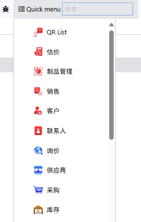
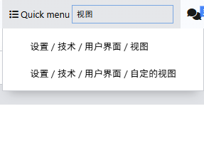
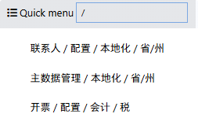

# 系统托盘：快速搜索菜单/Bookmark

步骤说明：

1. 定义新的Component：QuickMenuSystray
2. 编写template
3. 注册systray
4. 通过service.menu获取菜单
5. 通过Dropdown、DropdownItem渲染菜单项
6. 插入input标签，用于搜索
7. 根据输入的搜索内容过滤菜单项
8. 支持不同命名空间来搜索不同类型的项目("@"、"/")

书签管理：
1. 定义新的Component: QuickMenuMark，接收props: data (data接收来自于QuickMenuSystray的data，避免二次获取)
2. 编写托盘的template
3. 获取当前用户已保存的书签
4. 通过DropdownItem渲染已保存的书签
5. 编写书签管理器的click事件（用于打开书签管理器的Dialog）
6. 定义新的Dialog：QuickMenuMarkDialog，接收props：data (data接收来自于QuickMenuSystray的data，避免二次获取)、markedItems（QuickMenuMark查询的当前用户已保存的书签）
7. 编写Dialog的template
8. 分层级渲染所有menu，渲染已保存的书签
9. 编写添加书签跟移除书签的function
10. 编写保存书签的function
11. 编写全部书签的搜索功能
12. 编写已保存书签的拖拽排序功能

## 截图<!-- {docsify-ignore} -->

## 代码<!-- {docsify-ignore} -->
> [github](https://github.com/LucasLiu09/odoo-module-lucas/tree/16.0/quick_menu_systray)
