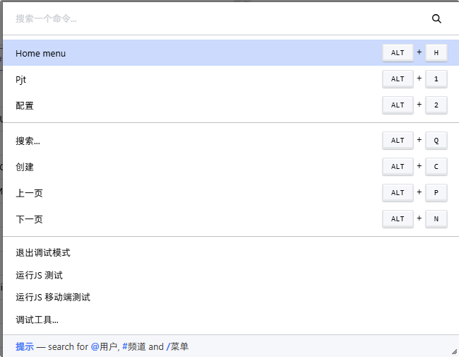

## CommandPalette<!-- {docsify-ignore} -->

:::info[版本]
当前只验证了Odoo16版本。16以前的版本不一定有，之后的版本也可能存在改名的情况。
:::

通过ctrl + K 调出的控制台。



Base组件：`CommandPalette`

在输入/时，可查询菜单。这一处理是通过registry.category("command_categories").add("menu_items", ...)注册的。源码路径：@web/webclient/menus/menu_providers.js

## menu_providers<!-- {docsify-ignore} -->

```javascript
/** @odoo-module **/

import { _lt } from "@web/core/l10n/translation";
import { registry } from "@web/core/registry";
import { fuzzyLookup } from "@web/core/utils/search";
import { computeAppsAndMenuItems } from "@web/webclient/menus/menu_helpers";

import { Component } from "@odoo/owl";

class AppIconCommand extends Component {}
AppIconCommand.template = "web.AppIconCommand";

const commandCategoryRegistry = registry.category("command_categories");
commandCategoryRegistry.add("apps", { namespace: "/" }, { sequence: 10 });
commandCategoryRegistry.add("menu_items", { namespace: "/" }, { sequence: 20 });

const commandSetupRegistry = registry.category("command_setup");
commandSetupRegistry.add("/", {
    emptyMessage: _lt("No menu found"),
    name: _lt("menus"),
    placeholder: _lt("Search for a menu..."),
});

const commandProviderRegistry = registry.category("command_provider");
commandProviderRegistry.add("menu", {
    namespace: "/",
    async provide(env, options) {
        const result = [];
        const menuService = env.services.menu;
        let { apps, menuItems } = computeAppsAndMenuItems(menuService.getMenuAsTree("root"));
        if (options.searchValue !== "") {
            apps = fuzzyLookup(options.searchValue, apps, (menu) => menu.label);

            fuzzyLookup(options.searchValue, menuItems, (menu) =>
                (menu.parents + " / " + menu.label).split("/").reverse().join("/")
            ).forEach((menu) => {
                result.push({
                    action() {
                        menuService.selectMenu(menu);
                    },
                    category: "menu_items",
                    name: menu.parents + " / " + menu.label,
                    href: menu.href || `#menu_id=${menu.id}&action_id=${menu.actionID}`,
                });
            });
        }

        apps.forEach((menu) => {
            const props = {};
            if (menu.webIconData) {
                const prefix = menu.webIconData.startsWith("P")
                    ? "data:image/svg+xml;base64,"
                    : "data:image/png;base64,";
                props.webIconData = menu.webIconData.startsWith("data:image")
                    ? menu.webIconData
                    : prefix + menu.webIconData.replace(/\s/g, "");
            } else {
                props.webIcon = menu.webIcon;
            }
            result.push({
                Component: AppIconCommand,
                action() {
                    menuService.selectMenu(menu);
                },
                category: "apps",
                name: menu.label,
                href: menu.href || `#menu_id=${menu.id}&action_id=${menu.actionID}`,
                props,
            });
        });

        return result;
    },
});
```

## 源码解析<!-- {docsify-ignore} -->

* 获取所有apps/menus

```javascript
import { computeAppsAndMenuItems } from "@web/webclient/menus/menu_helpers";
let { apps, menuItems } = computeAppsAndMenuItems(menuService.getMenuAsTree("root"));
```

* 跳转menu

```javascript
// menu为getMenuAsTree获取的数据。
menuService.selectMenu(menu);
```
