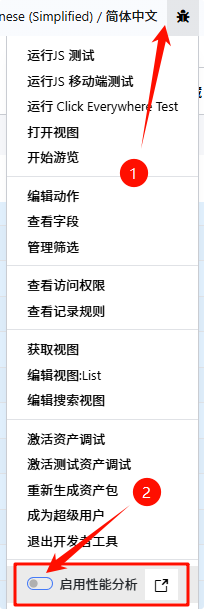
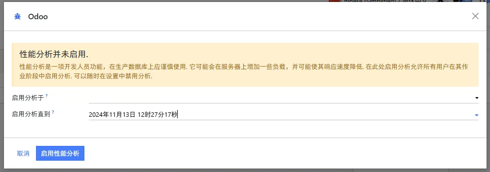
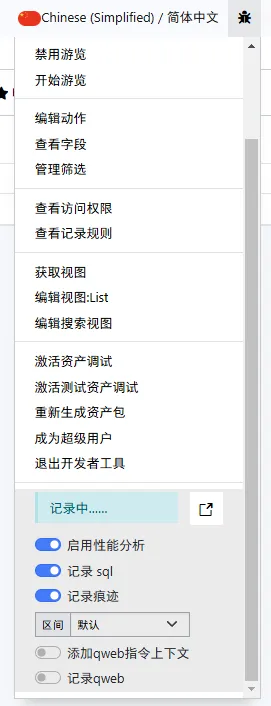
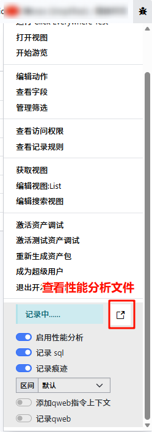
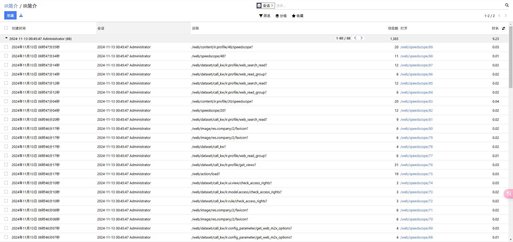
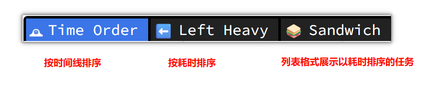
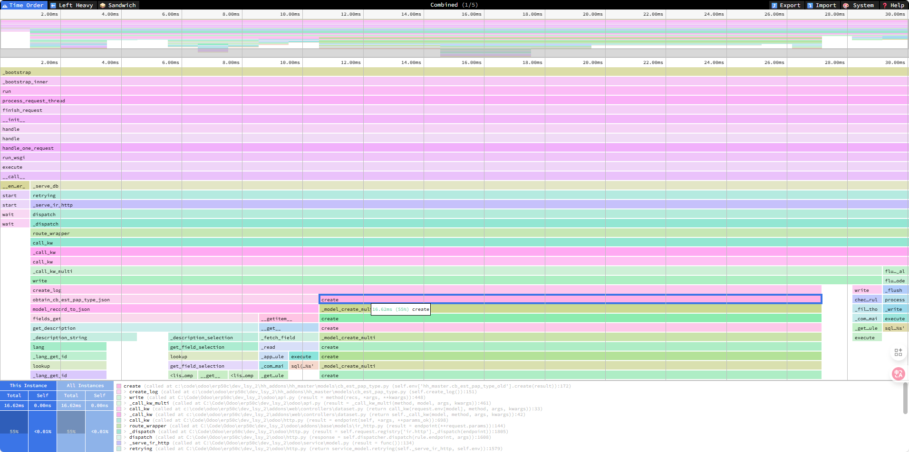
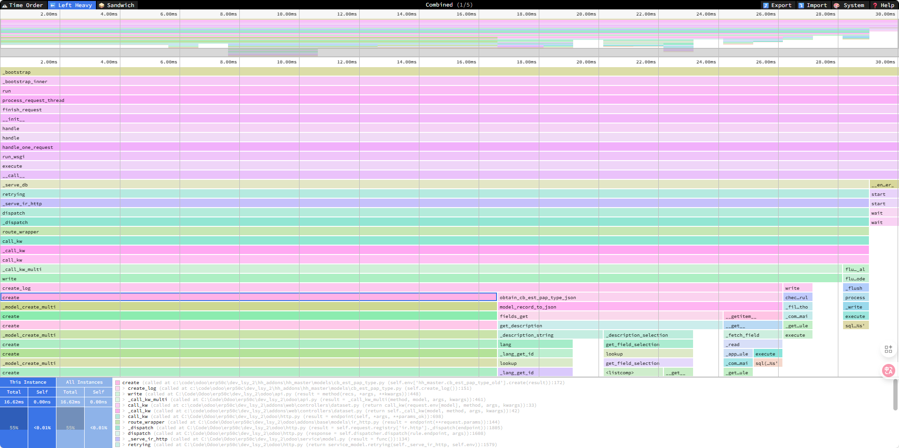
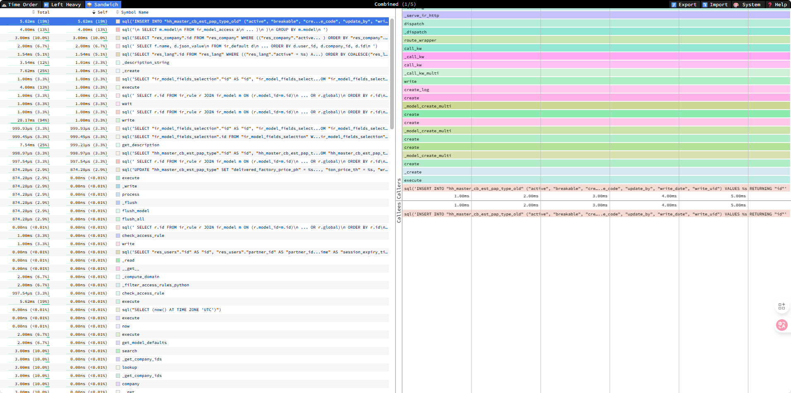

# 性能优化

:::info
通过ir.profile进行性能分析，一个快速，交互式，基于网络的性能分析工具。

- [Speedscope](https://www.speedscope.app/)
- [Github](https://github.com/jlfwong/speedscope)
:::

## 启用性能分析

第一次启用只是选择性能分析的持续时间，第二次启用才会对所有用户生效。



第一次启用弹出的窗口， 选择分析的持续时间。



第二次点击“启用性能分析”，出现以下效果时，才是真正启用了性能分析工具。



对需要分析的功能部分进行操作。

查看speedscope文件，进行分析





点击列表中的url连接，新窗口打开Speedscope文件。

## 分析

左上角的是Speedscope的选项卡：
- **Time Order***(时间排序): 火焰图，按时间线排序
- **Left Heavy**(左权重): 火焰图，按耗时排序
- **Sandwich**: 以列表的格式展示任务（默认以耗时排序）



### Time Order

以时间线的顺序从左往右展示调用堆栈。这个视图对于理解应用程序随时间变化的行为非常有帮助，比如 "首次从数据库获取到数据，然后为序列化准备数据，数据被序列化为JSON"。

横轴代表每个堆栈的“权重”（通常是 CPU 时间），纵轴显示采样时处于活动状态的堆栈。点击其中一帧，即可查看其统计摘要。




### Left Heavy

对堆栈进行排序，使每个父堆栈中最重的堆栈位于左侧——因此称为“左权重”。 这个视图对于理解在其他调用栈之间有成百上千个函数交错调用的情况下，时间都花费在了哪里很有用。



### Sandwich

Sandwich 是一个表格视图，你可以在其中找到所有函数及其相关时间的列表。您可以按自己的时间或总时间排序。 之所以称为"Sandwich"视图，是因为如果你选择表中的某一行，就可以看到所选对象的所有调用者和被调用者的火焰图 。




### 导航

一旦配置文件被加载，主视图就会被分成两部分:顶部区域是“迷你地图”，底部区域是“堆栈视图”。

#### 迷你地图导航

* 在任意一个轴上滚动以进行平移
* 单击并拖动可将视图缩小到特定范围

#### 堆栈视图

* 在任意一个轴上滚动以进行平移
* 缩放
* 按住 Cmd+Scroll 进行缩放
* 双击一帧以使视口适应
* 点击一个框以查看关于它的摘要统计

#### 键盘导航

* `+`: 放大
* `-`: 缩小
* `0`: 缩小以看到整体情况
* `w`/`a`/`s`/`d` 或者箭头键: pan around the profile
* `1`: 切换到 "Time Order" 视图
* `2`: 切换到 "Left Heavy" 视图
* `3`: 切换到 "Sandwich" 视图
* `r`: 在火焰图中折叠递归
* `Cmd+S`/`Ctrl+S` 保存现有文件
* `Cmd+O`/`Ctrl+O` 打开一个新文件
* `n`: 跳转到下一个文件/如果下一个文件存在
* `p`: 跳转到上一个文件/如果上一个文件存在
* `t`: 打开一个新文件/如果新文件存在
* `Cmd+F`/`Ctrl+F`: 打开搜索。打开时，按下 `Enter` and `Shift+Enter` 查看结果

## 在odoo shell调用性能分析工具

```shell
>>> from odoo.tools.profiler import Profiler
// 在with Profiler() as p底下编写需要进行分析的逻辑。
>>> with Profiler() as p:
...     so = env['hh_sale.cb_so_order_hd'].browse(48).read()
...
2024-11-13 00:43:19,060 33140 INFO test_cberp_sync5 odoo.tools.profiler: ir_profile 1 (2024-11-13 00:43:18 ) created
// 以上结果可以通过Odoo的性能分析列表看到，也可以将其写入json文件，然后通过speedscope查看结果
>>> with open('analyse.json', 'w') as f:
...     f.write(p.json())
...
23532
>>>
```