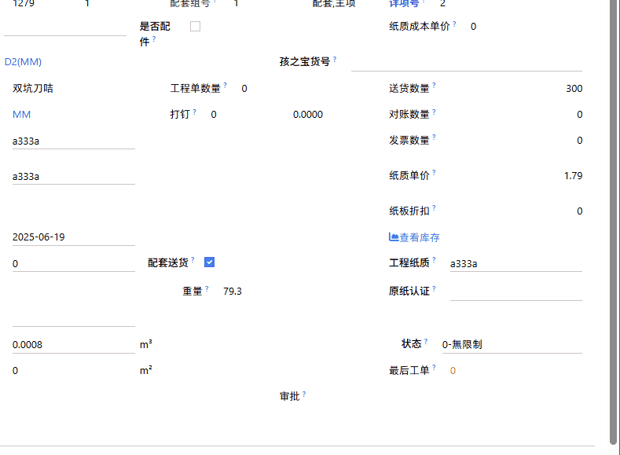

# custom_popover_widget

:::info[Note]
自定义Popover提示，可以固定提示语或从后端返回提示语。（在FormView可根据自定义设置在请求后端获取信息前保存Record）
> [Github](https://github.com/LucasLiu09/odoo-module-lucas/tree/16.0/custom_popover_widget)
:::

## 示意图



## 用法

Usage1:

```xml
<widget name="custom_popover_widget" icon="fa-search" text="查看库存" autoSave="True" attrs="{'invisible': [('id', '=', False)]}"/>
```

Usage2:

```xml
<widget name="custom_popover_widget" icon="fa-lightbulb-o" tooltip="这是tips" text="Popover"/>
```


## 参数说明

- icon: fa图标的class名称。(来源Font Awesome)
- text: icon后面显示的文本。
- tooltip: 弹出的气泡内的文本。(如果设置了tooltip就不会请求后端获取toolip信息)
- autoSave(default: False): 设置为True时会先调用Record.save()，如果save()返回的结果为True，才会进一步请求后端莫得行的get_tooltip()；如果autoSave=False则直接请求后端获取tooltip信息。
- options: 传递给后端get_tooltip()的参数。
- attrs: 与普通Field的attrs相同。

要从后端获取信息时在调用该`widget`的`Model`定义`get_tooltip()`，通过后端返回信息。

