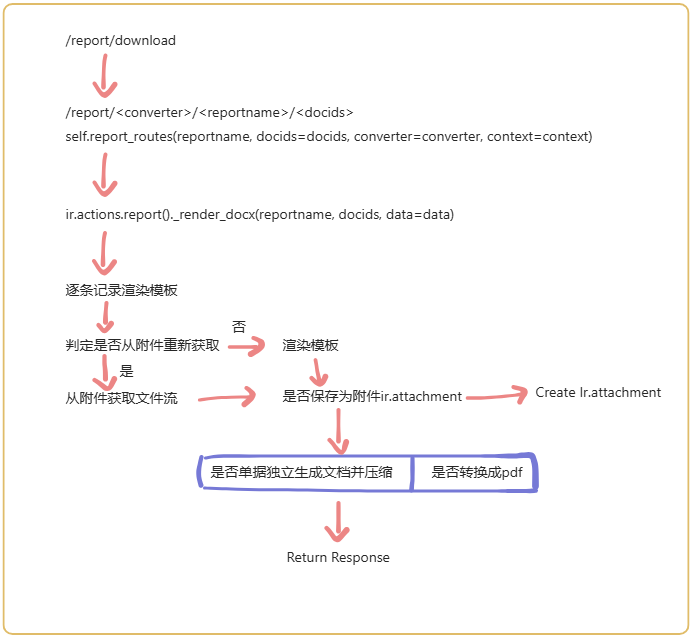

# ir.actions.report(docx)

:::info[Note]
继承ir.actions.report增强打印功能，基于docx模版打印。

-- odoo version: 16.0
-- 源码：github
:::



## 初始需求

通过上传带有模板语言的docx文档，绑定单据输出新的docx文档。

## 方案

1. 通过继承ir.actions.report模块，使用原生报告功能。该模块已完成以下功能：
- 绑定模型
- 权限组控制
- 控制上下文菜单显隐
- 文件名通过可执行代码输出(可使用操作单据的记录)
- 等等...
2. 继承ReportController重写report_routes、report_download
3. 二开补充功能
4. doc转pdf：
- windows：docx2pdf.convert
- linux：通过调用系统的libreoffice转换格式，存储到服务器后再进行读取，最后删除临时文件。

## 相关说明

Python依赖：

```python title="__manifest__"
{
    "external_dependencies": {"python": ["python-docx", "docxtpl", "docxcompose", "jinja2"]}
}
```

原生js存放路径(相对路径)：addons/web/static/src/webclient/actions

```
action_service (addons/web/static/src/webclient/actions/action_service.js)
```

**`do_action()`**


**`_executeReportAction()`**

执行报告打印action


:::tip[Tip]
此次需求主要是通过新增handler来处理额外的报告打印功能。
:::

## 实施步骤

1. 继承ir.actions.report模型(model.py)
2. 注册登记(action_docx_report.esm.js)
    - 在`ir.actions.report handlers`中新增`docx_handler`，在函数中通过判断`action`的`report_type`，调用自定义的函数`triggerDownload`，其中`triggerDownload`可参考`actionService._triggerDownload()`，相对应`_triggerDownload()`中的`_getReportUrl`也需要进行重新自定义。
    - 其中report_type需要在ir.actions.report模型中的report_type字段新增数据值(见model.py)。
```javascript
registry
    .category("ir.actions.report handlers")
    .add("docx_handler", async function (action, options, env) {
        if (action.report_type === "docx") {
            await triggerDownload(action, options, env);
            return true;
        }
        return false;
    });
```
3. 编写返回报告下载路由地址的函数(action_docx_report.esm.js)
4. 继承ReportController重写(controllers.py)
5. 增加视图(view.xml)

## Linux中安装Libreoffice

```shell
sudo apt update
sudo apt install libreoffice
```

## Libreoffice中文乱码问题

因linux系统中缺失中文字体，可以从windows中copy到linux中。

1. windows字体目录：C:\Windows\Fonts\
2. 将windows中的字体copy到一个新的文件夹中，会自动将字体的文件名转换成英文，便于copy到linux中。
3. 将上述文件上传到linux服务器的/usr/share/fonts/Fonts路径下，如果没有Fonts文件夹，则新建。
