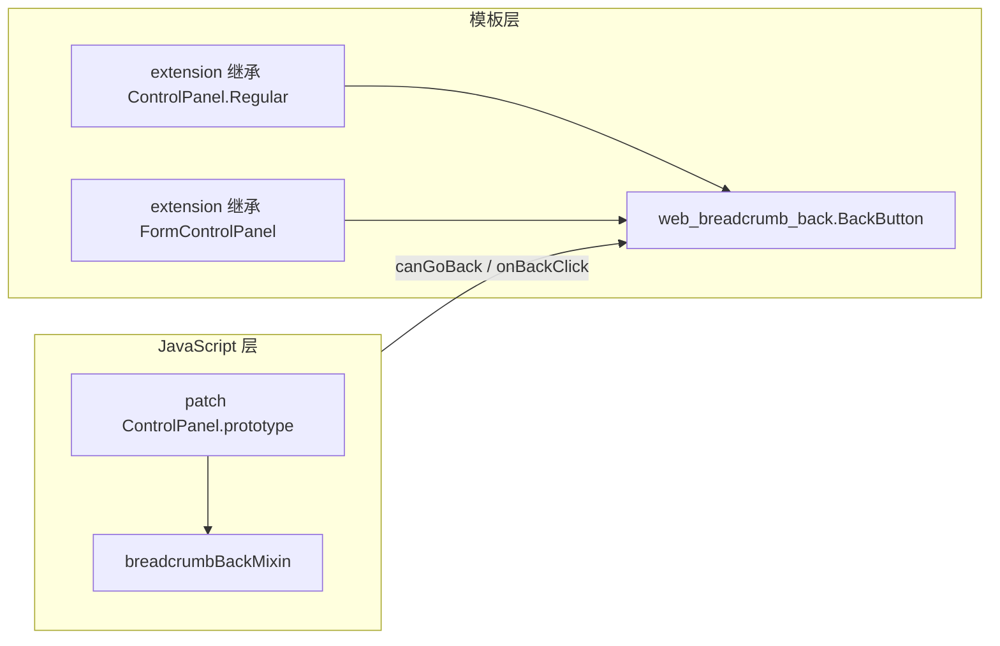
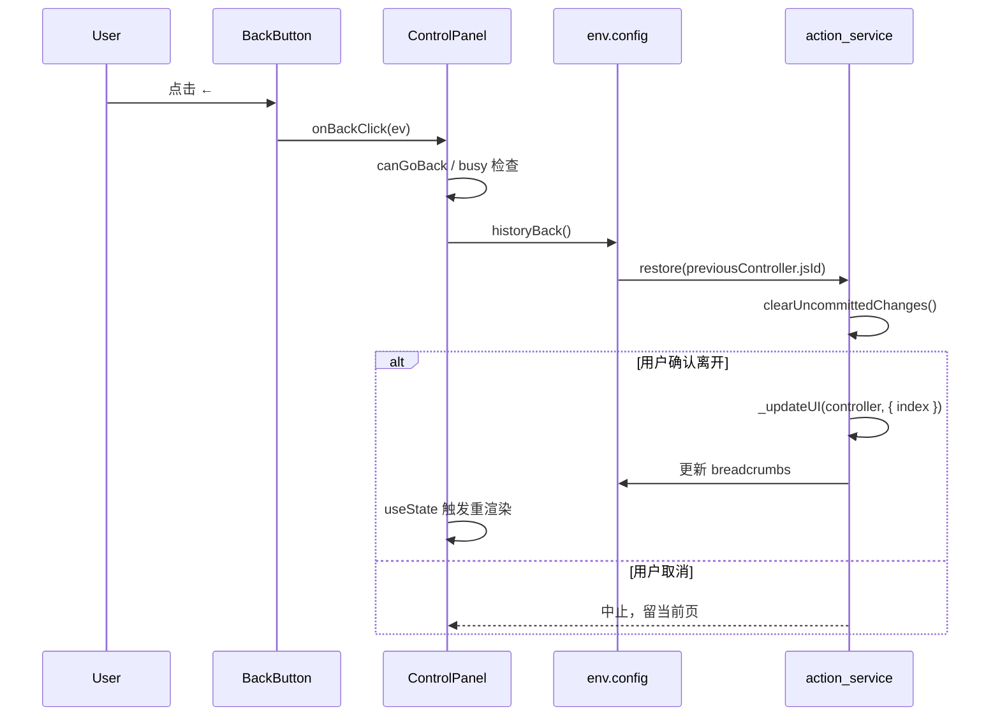

:::info[说明]
本文档专门描述 `web_breadcrumb_back` 模块，内容自洽，可独立阅读。
:::

# web_breadcrumb_back(导航栏回退)

## 1. 模块定位

| 项目 | 说明 |
|------|------|
| 模块名 | `web_breadcrumb_back` |
| 路径 | `web_breadcrumb_back/` |
| 依赖 | `web` |
| 生效方式 | **安装即全局生效**，无需修改业务视图 XML |
| 核心能力 | 在 Control Panel 面包屑左侧增加独立「返回上一层」按钮 |

设计目标：在 **不修改 `addons/web` 源码** 的前提下，补全 Odoo 16 原生面包屑在桌面端的返回入口不够直观的问题，并复用官方导航 API，保证与未保存变更检查等行为一致。

---

## 2. 原生设计分析

### 2.1 Breadcrumb 在 Odoo 16 中的角色

Odoo 16 Web 客户端的面包屑不是某个 View 的私有 UI，而是 **Action Manager 导航栈** 的可视化：

```
用户操作 doAction / 打开记录
        ↓
action_service 维护 controllerStack
        ↓
_getBreadcrumbs(stack) 生成数组
        ↓
写入 controller.config.breadcrumbs（reactive）
        ↓
ControlPanel 读取并渲染 web.Breadcrumbs 模板
```

关键源码位置（Odoo 原生）：

- 栈与 breadcrumb 数据：`addons/web/static/src/webclient/actions/action_service.js`
- UI 渲染：`addons/web/static/src/search/control_panel/control_panel.js` + `control_panel.xml`
- Form 标题更新：`addons/web/static/src/views/form/form_controller.js`

### 2.2 原生 Breadcrumb 数据结构

`_getBreadcrumbs` 将 controller 栈映射为：

```javascript
{
    jsId: controller.jsId,      // 用于 restore(jsId)
    get name() {
        return controller.displayName;
    },
}
```

- 过滤 `action.tag === "menu"` 的项
- `name` 为 getter，Form 页会通过 `setDisplayName` 动态更新为记录 `display_name`

### 2.3 原生返回机制

Odoo 已提供两层「返回」API，模块应复用而非重造：

| API | 定义位置 | 行为 |
|-----|----------|------|
| `actionService.restore(jsId)` | `action_service.js` | 恢复到栈中指定 controller；触发 `clearUncommittedChanges` |
| `env.config.historyBack()` | `_updateUI` 注入 | 有上一层 → `restore(上一层.jsId)`；否则 → 关闭 action/dialog |

原生 UI 上的返回入口：

**桌面端** — 倒数第二项面包屑带 class `o_back_button`，CSS 用左箭头替代文字，快捷键 `B`：

```xml
<!-- control_panel.xml: web.Breadcrumbs -->
<li t-att-class="{ o_back_button: isPenultimate}"
    t-att-data-hotkey="isPenultimate and 'b'"
    t-on-click.prevent="() => this.onBreadcrumbClicked(breadcrumb.jsId)">
```

**移动端** — `web.Breadcrumbs.Small` 显示独立返回块 + 当前标题。

### 2.4 原生设计的不足（模块动机）

| 问题 | 说明 |
|------|------|
| 桌面端返回入口不直观 | `o_back_button` 仅作用于倒数第二项，样式上是「面包屑的一项」而非独立按钮，用户不易发现 |
| 多层导航时层级文字占空间 | 完整 breadcrumb 链较长时，返回动作与路径展示混在一起 |
| 无独立 Tooltip | 原生面包屑项仅显示 action/记录名，没有明确的「返回至 XXX」提示 |
| Form 与 List 模板分离 | Form 使用 `web.FormControlPanel`，List 等使用 `web.ControlPanel.Regular`，扩展需覆盖两处 |

`web_breadcrumb_back` 的切入点：**保留原生数据与导航逻辑，只在 UI 层增加明确的返回按钮**。

---

## 3. 扩展实现思路

### 3.1 设计原则

1. **数据不动，UI 增强** — 不修改 `controllerStack` / `breadcrumbs` 生成逻辑
2. **导航走官方 API** — 点击按钮调用 `env.config.historyBack()`，间接使用 `restore` + 未保存检查
3. **全局生效、零配置** — 安装模块即可，业务模块无需改 XML
4. **可拆分复用** — mixin、模板、ControlPanel 子类分别导出，供其他模块继承

### 3.2 双轨扩展策略

本模块同时采用 Odoo 16 两种标准扩展手段：



| 轨道 | 手段 | 作用 |
|------|------|------|
| JS | `@web/core/utils/patch` | 给所有 ControlPanel 子类注入 `canGoBack`、`onBackClick` 等方法 |
| XML | `t-inherit-mode="extension"` | 在原生 `web.Breadcrumbs` 调用前插入按钮模板 |

**为何 patch 基类而非逐个替换 view 的 ControlPanel？**

- List、Kanban、Graph、Form 等视图的 ControlPanel 类不同（Form 为 `FormControlPanel`）
- 它们均继承自 `ControlPanel`，patch prototype 一次覆盖全部
- 避免在 `formView`、`listView` 等 registry 条目上逐一赋值

**为何用 extension 而非 primary 继承？**

- 本模块目标是**全局增强**原生模板，extension 直接修改 `web.ControlPanel.Regular` / `web.FormControlPanel` 的渲染结果
- 安装后所有使用原生 Control Panel 的视图自动出现按钮

---

## 4. 模块架构

### 4.1 目录结构

```
web_breadcrumb_back/
├── __init__.py
├── __manifest__.py
└── static/
    ├── description/
    │   └── index.html              # App 商店描述页
    └── src/
        ├── control_panel/
        │   ├── breadcrumb_back_mixin.js           # 核心逻辑（工具函数 + mixin）
        │   └── breadcrumb_back_control_panel.js   # 可继承的 ControlPanel 子类
        ├── patch/
        │   └── patch_control_panel.js             # 全局 patch 入口
        ├── xml/
        │   ├── breadcrumb_back_button.xml         # 独立按钮模板
        │   ├── control_panel.xml                  # 扩展 List 等视图 CP
        │   └── form_control_panel.xml             # 扩展 Form 视图 CP
        └── scss/
            └── breadcrumb_back_button.scss        # 按钮交互样式
```

### 4.2 Assets 加载顺序

```python
# __manifest__.py
"web.assets_backend": [
    ".../breadcrumb_back_button.scss",      # 1. 样式
    ".../breadcrumb_back_mixin.js",         # 2. 逻辑（无 patch 副作用）
    ".../breadcrumb_back_control_panel.js", # 3. 可选继承类
    ".../breadcrumb_back_button.xml",       # 4. 按钮模板（被 t-call）
    ".../control_panel.xml",                # 5. 扩展 Regular CP
    ".../form_control_panel.xml",           # 6. 扩展 Form CP
    ".../patch_control_panel.js",           # 7. 最后 patch，确保 ControlPanel 已加载
]
```

patch 文件放在最后，保证 `@web/search/control_panel/control_panel` 已完成模块初始化。

---

## 5. 核心实现解析

### 5.1 breadcrumb_back_mixin.js — 逻辑层

#### 显示条件：`canGoBack`

```javascript
export function canGoBack(panel) {
    return Boolean(panel.breadcrumbs && panel.breadcrumbs.length > 1);
}
```

与原生逻辑一致：只有导航栈深度 ≥ 2 时才有「上一层」可回。单层 action（如从菜单直接进入 List）不显示按钮。

#### 上一层信息：`getPreviousBreadcrumb`

```javascript
return panel.breadcrumbs[panel.breadcrumbs.length - 2];
```

用于 Tooltip 展示目标名称，**不参与**实际导航目标计算（导航由 `historyBack` 负责）。

#### 导航：`goBack`

```javascript
export function goBack(env) {
    if (typeof env.config.historyBack === "function") {
        env.config.historyBack();
    }
}
```

 deliberately 不直接调用 `actionService.restore()`，原因：

- `historyBack` 由 `action_service._updateUI` 按当前 context 注入
- Dialog 内 Form discard 等场景依赖 `historyBack` 的 close 分支
- 业务模块可在 Controller 中覆盖 `historyBack` 实现自定义返回目标

#### 点击防重复：`onBackClick`

```javascript
onBackClick(ev) {
    ...
    setBackButtonBusy(button, true);
    goBack(this.env);
    browser.setTimeout(() => { ... }, 350);
}
```

350ms 内 disabled + CSS `--busy` 动画，避免连续点击多次触发 `restore`。

#### Tooltip：`getBackButtonTooltip`

动态生成 `返回: {上一层 name}` 或 fallback `返回上一层`，配合 Odoo `data-tooltip` 服务。

### 5.2 patch_control_panel.js — 全局注入

```javascript
import { patch } from "@web/core/utils/patch";
import { ControlPanel } from "@web/search/control_panel/control_panel";
import { breadcrumbBackMixin } from "../control_panel/breadcrumb_back_mixin";

patch(ControlPanel.prototype, "web_breadcrumb_back.ControlPanel", breadcrumbBackMixin);
```

- patch 名 `web_breadcrumb_back.ControlPanel` 用于调试及避免重复 patch
- `FormControlPanel extends ControlPanel`，因此 Form 视图自动获得 mixin 方法，无需再 patch

### 5.3 XML 模板层

#### 独立按钮：`web_breadcrumb_back.BackButton`

```xml
<button t-if="canGoBack and !env.config.noBreadcrumbs"
        class="btn btn-light o_breadcrumb_back_btn"
        t-att-data-tooltip="backButtonTooltip"
        data-hotkey="b"
        t-on-click.prevent="onBackClick">
    <i class="fa fa-arrow-left o_breadcrumb_back_btn__icon"/>
</button>
```

| 属性 | 说明 |
|------|------|
| `canGoBack` | mixin getter，栈深度 ≥ 2 |
| `!env.config.noBreadcrumbs` | 尊重原生隐藏开关（action context `no_breadcrumbs`） |
| `data-hotkey="b"` | 与原生倒数第二项面包屑共用快捷键 B |
| `t-on-click.prevent` | 阻止默认，调用 `onBackClick` |

#### 插入位置

**List / Kanban 等** — extension 继承 `web.ControlPanel.Regular`：

```xml
<xpath expr="//t[@t-call='web.Breadcrumbs']" position="before">
    <t t-call="web_breadcrumb_back.BackButton"/>
</xpath>
```

必须 inherit `ControlPanel.Regular` 而非外层 `web.ControlPanel`，因为 `web.Breadcrumbs` 定义在 Regular 子模板内。

**Form** — extension 继承 `web.FormControlPanel`：

```xml
<xpath expr="//t[@t-call='web.Breadcrumbs']" position="before">
    <t t-call="web_breadcrumb_back.BackButton"/>
</xpath>
```

Form 桌面/移动均通过 FormControlPanel 内 slot 渲染 Breadcrumbs，一处 xpath 覆盖两种 `t-call`（`web.Breadcrumbs` / `web.Breadcrumbs.Small` 前的桌面分支）。

### 5.4 样式层

- 2rem 方形 `btn-light` 按钮，与 Odoo Control Panel 图标按钮风格一致
- Hover：主题色背景 + 箭头左移
- Active：scale 按压反馈
- Focus-visible：外发光（无障碍）
- 按钮与 breadcrumb 之间竖线分隔（`.o_breadcrumb_back_btn + .breadcrumb`）

---

## 6. 运行时数据流



---

## 7. 与原生机制的协作关系

### 7.1 尊重的原生开关

| 原生机制 | 模块行为 |
|----------|----------|
| `noBreadcrumbs` / `no_breadcrumbs` | 按钮不渲染 |
| `action.target === "new"` | breadcrumbs 为空 → `canGoBack` 为 false |
| Dialog 内 Form（Layout 隐藏 top-left） | 按钮随 breadcrumb 区域一起隐藏 |
| `clearUncommittedChanges` | 通过 `historyBack` 间接触发，无需模块处理 |

### 7.2 与原生 `o_back_button` 共存

安装本模块后，桌面端可能同时存在：

1. 新增的独立 ← 按钮
2. 倒数第二项面包屑的 `o_back_button` 样式

两者均调用 `restore`，功能重复但无害。若需去掉原生箭头，可在自定义 SCSS 中隐藏 `.breadcrumb-item.o_back_button:not(:last-child)`（本模块未默认隐藏，以保持与原生行为兼容）。

### 7.3 快捷键 B

原生倒数第二项与本模块按钮均设置 `data-hotkey="b"`。在 Odoo hotkey 服务下，通常只有一个元素生效；实际使用中以前景可聚焦元素为准。

---

## 8. 对外复用 API

其他模块可通过以下方式复用本模块能力：

### 8.1 继承 ControlPanel

```javascript
import { BreadcrumbBackControlPanel } from "@web_breadcrumb_back/control_panel/breadcrumb_back_control_panel";

export class MyControlPanel extends BreadcrumbBackControlPanel {
    // 自定义模板中 t-call="web_breadcrumb_back.BackButton"
}
MyControlPanel.template = "my_module.MyControlPanel";
```

适用于 **primary 替换了 FormControlPanel 模板** 的业务模块（如完全重写 CP 布局时，extension 继承不再生效，需手动 `t-call` 按钮模板）。

### 8.2 导入工具函数

```javascript
import { canGoBack, goBack, getBackButtonTooltip } from "@web_breadcrumb_back/control_panel/breadcrumb_back_mixin";
```

### 8.3 自定义返回逻辑

在 FormController（或其他 Controller）中：

```javascript
import { useSubEnv } from "@odoo/owl";

setup() {
    useSubEnv({
        config: {
            ...this.env.config,
            historyBack: () => {
                // 例如：跳过中间层，直接回列表
                const target = this.env.config.breadcrumbs[0];
                this.env.services.action.restore(target.jsId);
            },
        },
    });
    super.setup();
}
```

按钮仍调用 `goBack` → `historyBack`，无需改模块代码。

---

## 9. 边界情况与限制

| 场景 | 表现 |
|------|------|
| 单层 breadcrumb | 按钮隐藏（`canGoBack === false`） |
| 未保存 Form 点返回 | 原生确认框，取消则留当前页 |
| 完全自定义 ControlPanel（primary 替换） | extension xpath 不生效，需手动 `t-call` BackButton |
| Legacy 视图 | patch 仍生效（Legacy 也用 ControlPanel 或自有 breadcrumb）；Legacy adapter 有独立 `breadcrumb_clicked` 路径 |
| 与 `breadcrumb_back_views` 同装 | 可能出现两个返回按钮（全局 patch + 按需视图），建议二选一 |
| 修改 `addons/web` | 违反项目规范；应通过本模块 extension/patch 扩展 |

---

## 10. 安装与验证

### 安装

1. 更新应用列表，安装 **Web Breadcrumb Back Button**
2. 开发模式刷新或 `-u web_breadcrumb_back` 升级 assets

### 验证清单

- [ ] List → Form：Form 页面包屑左侧出现 ← 按钮
- [ ] 点击返回 List，URL 与视图正确恢复
- [ ] Form 编辑未保存点返回，弹出确认
- [ ] Hover 显示 Tooltip「返回: {上一层名称}」
- [ ] action context 设 `no_breadcrumbs: True` 后按钮消失
- [ ] Dialog 内 Form 无按钮（Layout 隐藏 breadcrumb 区）

---

## 11. 设计决策摘要

| 决策 | 选择 | 理由 |
|------|------|------|
| 全局 vs 按需 | 全局 patch + extension | 零配置、统一体验 |
| 导航 API | `historyBack()` 而非直接 `restore` | 兼容 Dialog、可覆盖 |
| JS 扩展 | patch prototype | 覆盖 FormControlPanel 等所有子类 |
| XML 扩展 | extension 两处模板 | Regular + Form 各一处 xpath |
| 按钮位置 | Breadcrumbs 之前 | 语义清晰，不影响最后一项标题 |
| busy 状态 | DOM class + setTimeout | patch 场景下不依赖 Owl useState |

---

## 12. 源码文件职责速查

| 文件 | 职责 |
|------|------|
| `breadcrumb_back_mixin.js` | `canGoBack`、`goBack`、`onBackClick`、Tooltip |
| `breadcrumb_back_control_panel.js` | 可继承 CP 类，委托 mixin |
| `patch_control_panel.js` | 模块加载时 patch `ControlPanel.prototype` |
| `breadcrumb_back_button.xml` | 按钮 OWL 模板 |
| `control_panel.xml` | 扩展 `web.ControlPanel.Regular` |
| `form_control_panel.xml` | 扩展 `web.FormControlPanel` |
| `breadcrumb_back_button.scss` | 按钮视觉与交互 |

---

## 13. 版本信息

- 模块版本：`16.0.1.0.0`
- 目标平台：Odoo 16 Community / Enterprise（Web 客户端）
- License：LGPL-3
