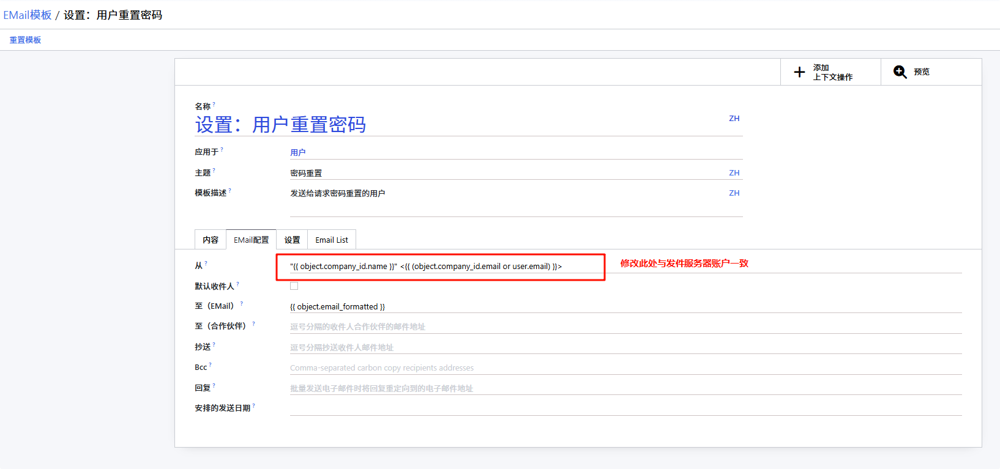

# 密码重置问题

如果在登录界面点击重置密码后，输入邮箱再点击密码重置按钮时，如果出现以下错误提示，可以通过对应的解决方法处理。

## 邮件地址为空

:::warning[错误信息]
无法发送邮件：用户`<user_name>`邮件地址为空。
:::

出现该提示时，是因为`res.users`表中此重置密码的用户没有维护`email`字段，补充后再重试即可。

## list index out of range

:::warning[错误信息]
list index out of range
:::

出现该提示时，可能的原因有：

- email模板中的发件人不正确。
- ...

首先按上面可能的原因逐个排查。

检查email模板，模板的xml_id：`auth_signup.set_password_email`, 尝试将发件人修改为发件服务器一致。

修改发件人后，再次重试“重置密码”操作。