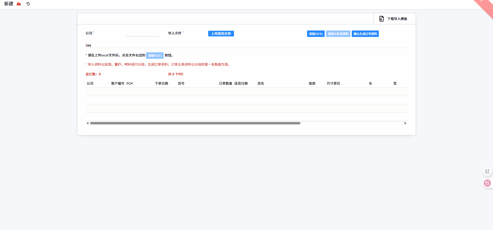

# Binary Field扩展

:::info[Note]
对Binary字段进行一些功能扩展

- 文件拖拽上传
:::

## 文件拖拽上传

:::info[Note]
实现Binary字段能够拖拽文件进行上传。
> [Github](https://github.com/LucasLiu09/odoo-module-lucas/tree/16.0/files_drop_upload)
:::

### 实现思路

通过对特定容器添加以下事件来实现需求：
- `dragover`
- `dragleave`
- `drop`

在`dragover`、`dragleave`事件中处理交互效果。

在`drop`事件中处理文件读取及更新。

### 示意图

