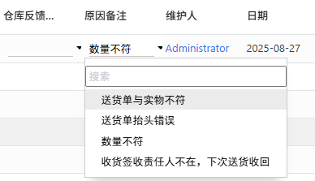

# Char field扩展

:::info[Note]
对Char字段进行一些功能扩展

- 支持下拉选择(可搜索)
:::


## 支持下拉选择

- version: odoo16

> [Github-char_and_selection](https://github.com/LucasLiu09/odoo-module-lucas/tree/16.0/Non_module/char_and_selection)
>
> [Github-char_and_selection_v2](https://github.com/LucasLiu09/odoo-module-lucas/tree/16.0/Non_module/char_and_selection_v2)

支持Char Field使用下拉选项，支持搜索



代码示例：
```xml
<field name="remark" widget="char_and_selection" options="{'optionList':[
'送货单与实物不符',
'送货单抬头错误',
'数量不符',
'收货签收责任人不在，下次送货收回']}"/>
```

:::note[TODO]
1. 支持下拉选择的选项从Model中查询。
:::

## 字母自动大写

- version: odoo16

为方便用户快速输入，自动将英文输入转为大写。

```javascript title="upper_charfield.js"
/** @odoo-module **/

import { registry } from "@web/core/registry";
import { CharField } from "@web/views/fields/char/char_field";

export class UpperCharField extends CharField {
    setup(){
        super.setup();
    }

    parse(value) {
        const valueUpper = value.toUpperCase();
        return super.parse(valueUpper);
    }
}

UpperCharField.template = "UpperCharField";

registry.category("fields").add("upper_char", UpperCharField);
```

```xml title="upper_charfield.xml"
<?xml version="1.0" encoding="UTF-8"?>
<templates xml:space="preserve">

    <t t-name="UpperCharField" owl="1" t-inherit="web.CharField" t-inherit-mode="primary">
        <xpath expr="//input" position="attributes">
            <attribute name="style">text-transform: uppercase;</attribute>
<!--            <attribute name="oninput">this.value = this.value.toUpperCase();</attribute>-->
        </xpath>
    </t>

</templates>
```
