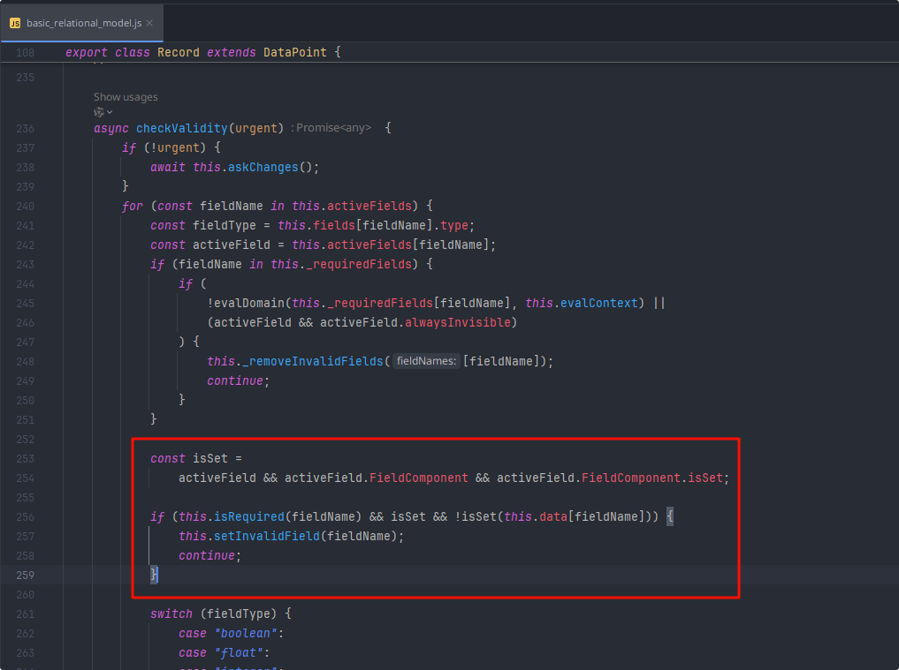

# Float Field扩展

:::info[Note]
对`FloatField`进行一些扩展以实现更多的功能

  1. `FloatFieldFormat`: 格式化数据显示及必填检查
  2. `FloatFieldFormatX`: 自定义整数数据的小数位数(即显示0的位数)（对于小数部分非0的时候，沿用digits处理，当小数部分为0的时候，可以单独设置保留位数。）

:::

## FloatFieldFormat 格式化数据显示及必填检查

:::info[Note]
FloatFieldFormat:
- 是否显示0(当value=0时，可显示为空白)
- 是否格式化（是否保留千分位、小数部分尾部多余的0）
- 必填时检查是否非0

:::

通过分析查找出`addons/web/static/src/views/basic_relational_model.js`以下位置的代码会处理数据的必填校验。
此处可以看出检查必填时是通过`FieldComponent.isSet`这个function处理。所以只需要做出以下修改(若需求为正数，也可通过修改此处实现)：
```javascript
FloatFieldFormat.isSet = (value) => value !== 0;
```


```javascript title="float_field_extend.js"
/** @odoo-module **/

import { registry } from "@web/core/registry";
import { standardFieldProps } from "@web/views/fields/standard_field_props";
import { archParseBoolean } from "@web/views/utils";
import { FloatField } from "@web/views/fields/float/float_field";
import { formatFloat } from "@web/views/fields/formatters";

/**
 * Usage:
 * widget="float_format" options="{'need_format': '1', 'show_zero': 'false'}"
 * need_format: 是否格式化数字（千分符、小数位保留）
 * show_zero: 是否显示0
 */

export class FloatFieldFormat extends FloatField {

    get formattedValue() {
        if (this.props.inputType === "number" && !this.props.readonly && this.props.value) {
            return this.props.value === 0 && !this.props.showZero ? '' : this.props.value;
        }
        // 0
        // format
        if(this.props.value === 0){
            return !this.props.showZero ? '' : this.props.needFormat ? formatFloat(this.props.value, {digits: this.props.digits}) : this.props.value;
        }else{
            return this.props.needFormat ? formatFloat(this.props.value, {digits: this.props.digits}) : this.props.value;
        }
    }
}

// 处理必填时验证数据非0
FloatFieldFormat.isSet = (value) => value !== 0;
FloatFieldFormat.props = {
    ...standardFieldProps,
    inputType: { type: String, optional: true },
    step: { type: Number, optional: true },
    digits: { type: Array, optional: true },
    placeholder: { type: String, optional: true },
    // new
    needFormat: { type: Boolean, optional: true },
    showZero: { type: Boolean, optional: true },
}

FloatFieldFormat.defaultProps = {
    inputType: "text",
};

FloatFieldFormat.extractProps = ({ attrs, field }) => {
    // Sadly, digits param was available as an option and an attr.
    // The option version could be removed with some xml refactoring.
    let digits;
    if (attrs.digits) {
        digits = JSON.parse(attrs.digits);
    } else if (attrs.options.digits) {
        digits = attrs.options.digits;
    } else if (Array.isArray(field.digits)) {
        digits = field.digits;
    }
    const need_format = archParseBoolean(attrs.options.need_format, true)
    const show_zero = archParseBoolean(attrs.options.show_zero, true)
    return {
        inputType: attrs.options.type,
        step: attrs.options.step,
        digits,
        placeholder: attrs.placeholder,
        needFormat: need_format,
        showZero: show_zero,
    };
};

registry.category("fields").add('float_format', FloatFieldFormat);
```

## FloatFieldFormatX 自定义整数数据的小数位数

:::info[Note]
FloatFieldFormatX:
- 自定义整数数据时显示0的位数（对于小数部分非0的时候，沿用digits处理，当小数部分为0的时候，可以单独设置保留位数。）
- 必填时检查是否非0

:::

```javascript
/** @odoo-module **/
import { registry } from "@web/core/registry";
import { standardFieldProps } from "@web/views/fields/standard_field_props";
import { FloatField } from "@web/views/fields/float/float_field";
import { archParseBoolean } from "@web/views/utils";
import { formatFloat } from "@web/views/fields/formatters";

/**
 * Usage:
 * widget="float_format_x" options="{'intShowDecimal': 'true', 'intDecimalDigits': 2}"
 * 参数:
 * intShowDecimal: 默认true, 在options中该值是string类型。
 *   - true: 当数值为整数时，按intDecimalDigits设置小数位，整数位数为digits[0]
 *   - false: 设置为false时，将以按digits格式化
 * intDecimalDigits: 当数值为整数时，保留的小数位数，默认0
 * 
 * ** 这里没有对数据=0时做空值显示处理，这个widget被当做纯粹的数字格式化widget使用，如果需要处理0值，请使用float_format **
 */

export class FloatFieldFormatX extends FloatField {

    get formattedValue() {
        if (this.props.inputType === "number" && !this.props.readonly && this.props.value) {
            return this.props.value;
        }
        
        if (Number.isInteger(this.props.value)) {
            // 避免this.props.digits[0]可能出现的问题，做一点额外处理。尽管formatFloat方法中不会对digits[0]做处理，但为了兼容性，还是做一下处理。
            const d = this.props.digits && Array.isArray(this.props.digits) ? this.props.digits[0] : undefined;
            return formatFloat(this.props.value, { digits: this.props.intShowDecimal ? [d, this.props.intDecimalDigits] : this.props.digits });
        }else{
            return formatFloat(this.props.value, { digits: this.props.digits });
        }
    }
}

// 处理必填时验证数据非0
FloatFieldFormatX.isSet = (value) => value !== 0;
FloatFieldFormatX.props = {
    ...standardFieldProps,
    inputType: { type: String, optional: true },
    step: { type: Number, optional: true },
    digits: { type: Array, optional: true },
    placeholder: { type: String, optional: true },
    // new
    intShowDecimal: { type: Boolean, optional: true },
    intDecimalDigits: { type: Number, optional: true },
}

FloatFieldFormatX.defaultProps = {
    inputType: "text",
};

FloatFieldFormatX.extractProps = ({ attrs, field }) => {
    // Sadly, digits param was available as an option and an attr.
    // The option version could be removed with some xml refactoring.
    let digits;
    if (attrs.digits) {
        digits = JSON.parse(attrs.digits);
    } else if (attrs.options.digits) {
        digits = attrs.options.digits;
    } else if (Array.isArray(field.digits)) {
        digits = field.digits;
    }
    const intShowDecimal = archParseBoolean(attrs.options.intShowDecimal, true);
    const intDecimalDigits = attrs.options.intDecimalDigits || 0;
    return {
        inputType: attrs.options.type,
        step: attrs.options.step,
        digits,
        placeholder: attrs.placeholder,
        intShowDecimal,
        intDecimalDigits,
    };
};

registry.category("fields").add('float_format_x', FloatFieldFormatX);
```
