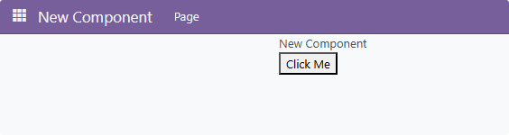
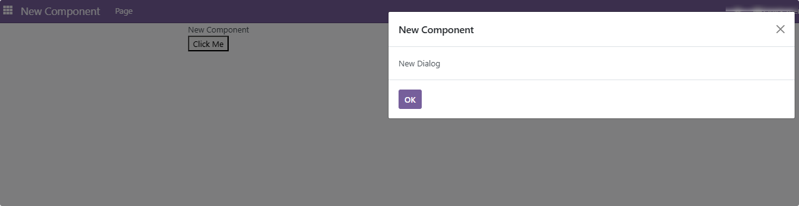

# 创建一个新的Dialog

:::info[Note]
从0开始创建一个新的Dialog弹窗
:::

步骤：
1. 编写组件
2. 编写模板

## 编写组件

1. 编写新的组件
2. 导入Dialog、将Dialog添加到组件的子组件中。

```javascript new_dialog.js
/** @odoo-module **/

import { Dialog } from "@web/core/dialog/dialog";
import { useChildRef } from "@web/core/utils/hooks"
import { Component } from "@odoo/owl";

export class NewDialog extends Component{

    setup(){
        this.modalRef = useChildRef();
    }

}

NewDialog.template = 'NewDialog';
NewDialog.components = { Dialog };
// 设计需要传递的参数
NewDialog.props = {
    close: Function,
    title: {
        validate: (m) => {
            return (
                typeof m === "string" || (typeof m === "object" && typeof m.toString === "function")
            );
        },
        optional: true,
    },
}

```

## 编写模板

```xml title="new_dialog.xml"
<?xml version="1.0" encoding="UTF-8" ?>
<templates xml:space="preserve">

    <t t-name="NewDialog" owl="1">
        <Dialog size="'md'" title="props.title" modalRef="modalRef">
            New Dialog
        </Dialog>
    </t>

</templates>
```

## 使用Dialog

这里通过[自定义界面](/odoo/dev_notes/front-end/owl_custom_page_simple.md)来调用创建的Dialog弹窗。

在NewComponent的组件中添加以下代码：
```xml
<?xml version="1.0" encoding="UTF-8" ?>
<templates xml:space="preserve">

    <t t-name="NewComponent" owl="1">
        <div class="container">
            <div class="row">
                <div>
                    New Component
                </div>
                <!-- 此处添加按钮，点击按钮调用Dialog弹窗 -->
                <div>
                    <button t-on-click="onCallDialog">Click Me</button>
                </div>
                <!-- 此处添加按钮，点击按钮调用Dialog弹窗 -->
            </div>
        </div>
    </t>

</templates>
```

```javascript
import { useOwnedDialogs } from "@web/core/utils/hooks";
import { NewDialog } from "./new_dialog";

export class NewComponent extends Component {
    setup(){
        this.useDialog = useOwnedDialogs();
    }
    onCallDialog(){
        this.useDialog(NewDialog, {
            title: "New Component",
        })
    }
}

```





:::tip[Note]
关于Dialog的解析见文档
:::