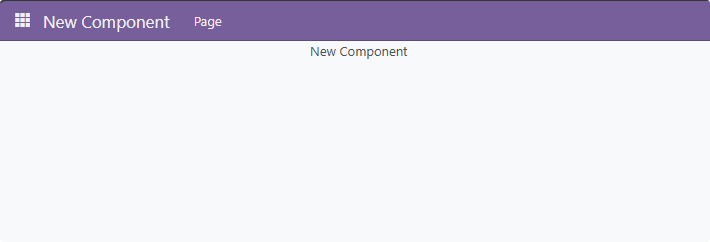

#  OWL - 自定义界面

:::info[Note]

:::

步骤：
1. 创建一个新模块
2. 编写组件
3. 编写模板
4. 注册action
5. 编写menu、action
6. 在__manifest__.py添加assets、data


## 创建新的模块

```shell
python odoo-bin scaffold new_component <addons_path>
```

## 编写组件

```javascript title="new_component.js"
/** @odoo-module **/

import { Component } from "@odoo/owl";

export class NewComponent extends Component {

}

NewComponent.template = "NewComponent";
```

## 编写模版

```xml title="new_component.xml"
<?xml version="1.0" encoding="UTF-8" ?>
<templates xml:space="preserve">

    <t t-name="NewComponent" owl="1">
        <div class="container">
            <div class="row">
                <div>
                    New Component
                </div>
            </div>
        </div>
    </t>

</templates>
```

## 注册action

```javascript title="new_component.js"
import { registry } from "@web/core/registry";

// ...

registry.category("actions").add('new_component', NewComponent);
```

## 编写menu、action

```xml title="view.xml"
<?xml version="1.0" encoding="UTF-8" ?>
<odoo>
    <data>

        <record id="new_component_action" model="ir.actions.client">
            <field name="name">New Component Page</field>
            <field name="tag">new_component</field>
        </record>

        <menuitem
            id="new_component.menu_root"
            name="New Component"
            sequence="99"/>

        <menuitem
            id="new_component_menu"
            name="Page"
            action="new_component_action"
            parent="new_component.menu_root"
            sequence="10"/>

    </data>
</odoo>
```

## 修改__manifest__.py

在__manifest__.py中插入/修改以下内容

```python
{
    # ...
    'data': [
        # ...
        'views/menu.xml',
    ],
    
    'assets': {
        'web.assets_backend': [
            'new_component/static/src/js/new_component.js',
            'new_component/static/src/css/new_component.css',
        ],
    },
}
```

## 截图

