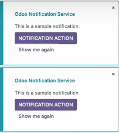

# Odoo原生Services

| Service | 描述 |
|---------|------|
| [notification service](#notification-service) | 显示通知消息，支持不同类型和自定义按钮 |
| [dialog service](#dialog-service) | 显示确认对话框和模态窗口 |
| [effect service](#effect-service) | 显示特殊视觉效果（如彩虹人动画） |
| [cookie service](#cookie-service) | 管理浏览器 Cookie，用于持久化用户偏好 |
| [http service](#http-service) | 执行 HTTP GET/POST 请求 |
| [rpc service](#rpc-service) | 调用后端 RPC 接口 |
| [orm service](#orm-service) | 执行 ORM 操作（searchRead 等） |
| [action service](#action-service) | 执行窗口动作，打开视图 |
| [router service](#router-service) | 管理路由和导航 |
| [user service](#user-service) | 获取当前用户信息和权限 |
| [company service](#company-service) | 获取公司相关信息 |
| [title service](#title-service) | 管理浏览器标签页标题 |

## notification service

``` javascript
import { useService } from '@web/core/utils/hooks'
...
setup(){
  this.notification = useService("notification")
}

showNotification(){
  // 两种使用方式。
  // 多次调用时使用setup初始化
  this.notification
  // 单次调用可以直接用下面这种方式
  this.env.services.notification
  const notification = this.env.services.notification
  notification.add("This is a sample nofication msg.", {
    title: "Odoo Notification Service",
    type: "info", // info, warning, danger, success
    sticky: true, // 设置手动单击关闭按钮才能使通知消失。
    className: "p-4",
    // 在通知处添加Button
    buttons: [
      {
        name: "Notification Action",
        onClick: () => {
          console.log("This is notification action")
        },
        primary: true,
      },
      {
        name: "Show me again",
        onClick: ()=>{
          this.showNotification()
        },
        primary: false
      }
    ]
  })
}
```



## dialog service

```javascript
import { ConfirmationDialog } from "@web/core/confirmation_dialog/confirmation_dialog"

...

setup(){
  this.dialog = useService("dialog")
}

showDialog(){
  
  this.dialog.add(ConfirmationDialog, {
                title: "Dialog Service",
                body: "Are you sure you want to continue this actions?",
                confirm: ()=>{
                  console.log("Dialog Confirmed.")
                },
                cancel: ()=>{
                  console.log("Dialog Cancelled.")
                }
              },{
                  onClose: ()=>{
                    // 不论是确认还是取消，都执行这里的function
                    console.log("Dialog service closed.")
                  }
              })
}
```

## effect service


```javascript
...
setup(){
  this.effect = useService("effect")
}
showEffect(){
  this.effect.add({
    type: "rainbow_man",
    message: "This is an awesome odoo effect service."
  })
}
```

## cookie service

```javascript
...
setup(){
  this.cookieService = useService("cookie")
  // this.cookieService
  // .current: 当前cookie
  // .deleteCookie: Delete cookie
  // .setCookie: Set cookie
  // e.g. set dark theme
  if (this.cookieService.cuurent.dark_theme == undefined){
    this.cookieService.serCookie("dark_theme", false)
  }
  this.state = useState({
    dark_theme: this.cookieService.current.dark_theme
  })
}

setCookieService(){
  if (this.cookieService.current.dark_theme == 'false'){
    this.cookieService.setCookie("dark_theme", true)
  } else{
    this.cookieService.setCookie("dark_theme", false)
  }

  this.state.dark_theme = this.cookieService.current.dark_theme
}
```

## http service

```javascript
...

setup(){
  this.http = useService("http")
  this.state = useState({
    get_http_data: [],
    post_http_data: [],
  })
}

async getHttpService(){
  // http.get
  const data = await this.http.get("https://dummyjson.com/products")
  console.log(data)
  this.state.get_http_data = data
}

async postHttpService(){
  // http.post
  const data = await this.http.post("https://dummyjson.com/products/add", {title: 'PNW Pencil'})
  console.log(data)
  this.state.post_http_data = data
}
```

## rpc service

```javascript
...
setup(){
  this.rpc = useService("rpc")
}

async getRpcService(){
  const data = await this.rpc("/xx/route", {})
}
```

## orm service

```javascript
...
setup(){
  this.orm = useService("orm")
}

async getOrmService(){
  const data = this.orm.searchRead("res.partner", [], ['name', 'email'])
  console.log(data)
}
```

## action service

```javascript
...
setup(){
  this.actionService = useService("action")
}

getActionService(){
  // action.doAction传参跟python返回ir.actions相同。
  this.action.doAction({
    type: "ir.actions.act_window",
    name: "Action Service",
    res_model: "res.partner",
    domain: [],
    context: {},
    views:[
      [false, "list"],
      [false, "form"]
    ],
    view_mode: "list,form",
    target: "new", // new、current、...
  })
}
```

## router service

```javascript
import { routeToUrl } from "@web/core/borwser/router_service"
import { browser } from "@web/core/browser/browser"

...
setup(){
  this.router = useService("router")
  // router.current: 当前路由信息
  // router.current.hash: 路由中#后的数据
  // router.current.pathname: 路由
  // router.current.search: 路由中?后的查询数据
  
}

getRouterService(){
  console.log(this.router.current)
  let { search } = this.router.current
  browser.location.href = browser.location.origin + routeToUrl(this.router.current)
}
```

## user service

```javascript
...
setup(){
  this.userService = useService("user")
}

getUserService(){
  console.log(this.userService)
}
```

## company service

```javascript
...
setup(){
  this.companyService = useService("company")
}

getCompanyService(){
  console.log(this.companyService)
}
```

## title service

```javascript
...
setup(){
  const titleService = useService("title")
  // titleService.current: 当前标题
  // titleService.getParts: 
  // titleService.setParts:
  console.log(titleService.getParts())
  // {sopenerp: 'Odoo'}
  titleService.setParts({zopenerp: "My Title", odoo: 'Odoo', any: 'anything'})
  console.log(titleService.getParts())
}
```