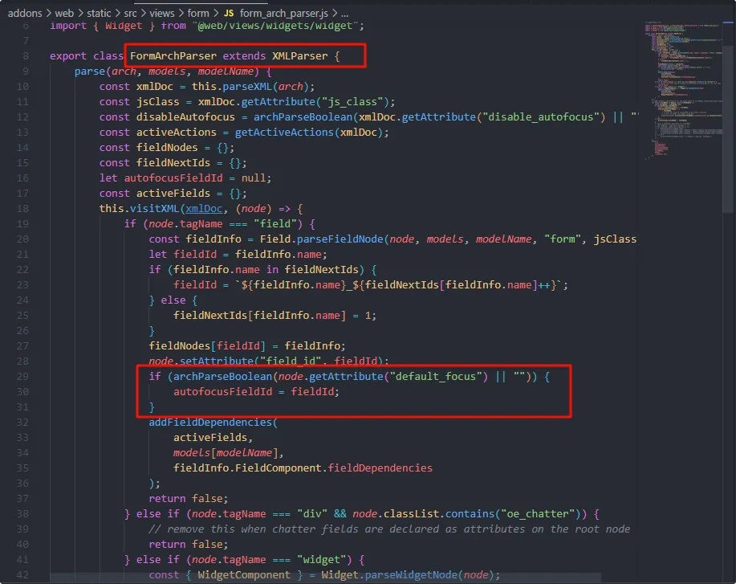
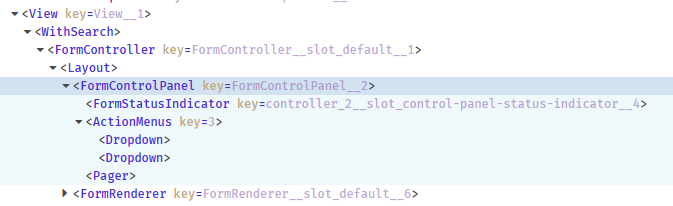
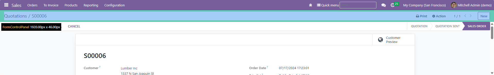
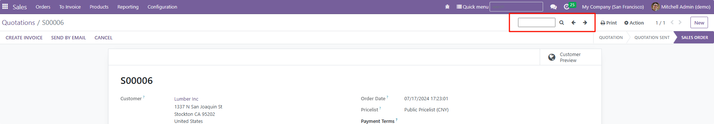

import Tabs from '@theme/Tabs';
import TabItem from '@theme/TabItem';

# Form View的一些玩法

:::info[Note]
介绍一些关于FormView的玩法。
> 如无特殊说明，默认使用16的版本。

:::

## FormView打开时自动聚焦于Field

在FormView中，在需要自动聚焦的字段标签内设置`default_foucs="1"`.

<details>
  <summary>查看源码</summary>



```javascript title="addons\web\static\src\views\form\form_arch_parser.js"
/** @odoo-module **/

import { addFieldDependencies, archParseBoolean, getActiveActions } from "@web/views/utils";
import { Field } from "@web/views/fields/field";
import { XMLParser } from "@web/core/utils/xml";
import { Widget } from "@web/views/widgets/widget";

export class FormArchParser extends XMLParser {
    parse(arch, models, modelName) {
        const xmlDoc = this.parseXML(arch);
        const jsClass = xmlDoc.getAttribute("js_class");
        const disableAutofocus = archParseBoolean(xmlDoc.getAttribute("disable_autofocus") || "");
        const activeActions = getActiveActions(xmlDoc);
        const fieldNodes = {};
        const fieldNextIds = {};
        let autofocusFieldId = null;
        const activeFields = {};
        this.visitXML(xmlDoc, (node) => {
            if (node.tagName === "field") {
                const fieldInfo = Field.parseFieldNode(node, models, modelName, "form", jsClass);
                let fieldId = fieldInfo.name;
                if (fieldInfo.name in fieldNextIds) {
                    fieldId = `${fieldInfo.name}_${fieldNextIds[fieldInfo.name]++}`;
                } else {
                    fieldNextIds[fieldInfo.name] = 1;
                }
                fieldNodes[fieldId] = fieldInfo;
                node.setAttribute("field_id", fieldId);
                if (archParseBoolean(node.getAttribute("default_focus") || "")) {
                    autofocusFieldId = fieldId;
                }
                addFieldDependencies(
                    activeFields,
                    models[modelName],
                    fieldInfo.FieldComponent.fieldDependencies
                );
                return false;
            } else if (node.tagName === "div" && node.classList.contains("oe_chatter")) {
                // remove this when chatter fields are declared as attributes on the root node
                return false;
            } else if (node.tagName === "widget") {
                const { WidgetComponent } = Widget.parseWidgetNode(node);
                addFieldDependencies(
                    activeFields,
                    models[modelName],
                    WidgetComponent.fieldDependencies
                );
            }
        });
        // TODO: generate activeFields for the model based on fieldNodes (merge duplicated fields)
        for (const fieldNode of Object.values(fieldNodes)) {
            const fieldName = fieldNode.name;
            if (activeFields[fieldName]) {
                const { alwaysInvisible } = fieldNode;
                activeFields[fieldName] = {
                    ...fieldNode,
                    // a field can only be considered to be always invisible
                    // if all its nodes are always invisible
                    alwaysInvisible: activeFields[fieldName].alwaysInvisible && alwaysInvisible,
                };
            } else {
                activeFields[fieldName] = fieldNode;
            }
            // const { onChange, modifiers } = fieldNode;
            // let readonly = modifiers.readonly || [];
            // let required = modifiers.required || [];
            // if (activeFields[fieldNode.name]) {
            //     activeFields[fieldNode.name].readonly = Domain.combine([activeFields[fieldNode.name].readonly, readonly], "|");
            //     activeFields[fieldNode.name].required = Domain.combine([activeFields[fieldNode.name].required, required], "|");
            //     activeFields[fieldNode.name].onChange = activeFields[fieldNode.name].onChange || onChange;
            // } else {
            //     activeFields[fieldNode.name] = { readonly, required, onChange };
            // }
        }
        return {
            arch,
            activeActions,
            activeFields,
            autofocusFieldId,
            disableAutofocus,
            fieldNodes,
            xmlDoc,
            __rawArch: arch,
        };
    }
}

```

</details>

## 修改FormControlPanel，增加可用Slot

> 这里示例的版本为16。

<details>
    <summary>源码</summary>
    
    <Tabs>
        
        <TabItem value="form_view_js" label="form_view.js">
            
```javascript title="addons/web/static/src/views/form/form_view.js"
/** @odoo-module **/

import { registry } from "@web/core/registry";
import { FormRenderer } from "./form_renderer";
import { RelationalModel } from "../basic_relational_model";
import { FormArchParser } from "./form_arch_parser";
import { FormController } from "./form_controller";
import { FormCompiler } from "./form_compiler";
import { FormControlPanel } from "./control_panel/form_control_panel";

export const formView = {
    type: "form",
    display_name: "Form",
    multiRecord: false,
    searchMenuTypes: [],
    ControlPanel: FormControlPanel,
    Controller: FormController,
    Renderer: FormRenderer,
    ArchParser: FormArchParser,
    Model: RelationalModel,
    Compiler: FormCompiler,
    buttonTemplate: "web.FormView.Buttons",

    props: (genericProps, view) => {
        const { ArchParser } = view;
        const { arch, relatedModels, resModel } = genericProps;
        const archInfo = new ArchParser().parse(arch, relatedModels, resModel);

        return {
            ...genericProps,
            Model: view.Model,
            Renderer: view.Renderer,
            buttonTemplate: genericProps.buttonTemplate || view.buttonTemplate,
            Compiler: view.Compiler,
            archInfo,
        };
    },
};

registry.category("views").add("form", formView);

```
            
        </TabItem>
    
        <TabItem value="form_controller_xml" label="form_controller.xml">
            
```xml title="addons/web/static/src/views/form/form_controller.xml"
<?xml version="1.0" encoding="UTF-8"?>
<templates xml:space="preserve">

    <t t-name="web.FormView" owl="1">
        <div t-att-class="className" t-ref="root">
            <div class="o_form_view_container">
                <Layout className="model.useSampleModel ? 'o_view_sample_data' : ''" display="display">
                    <t t-set-slot="layout-buttons">
                        <t t-if="footerArchInfo and env.inDialog">
                            <t t-component="props.Renderer" record="model.root" Compiler="props.Compiler" archInfo="footerArchInfo" enableViewButtons.bind="enableButtons" disableViewButtons.bind="disableButtons"/>
                        </t>
                        <t t-else="">
                            <t t-call="{{ props.buttonTemplate }}"/>
                        </t>
                    </t>
                    <t t-set-slot="control-panel-action-menu">
                        <t t-if="props.info.actionMenus">
                            <ActionMenus
                                getActiveIds="() => model.root.isVirtual ? [] : [model.root.resId]"
                                context="props.context"
                                items="getActionMenuItems()"
                                isDomainSelected="model.root.isDomainSelected"
                                resModel="model.root.resModel"
                                domain="props.domain"
                                onActionExecuted="() => model.load({ resId: model.root.resId, resIds: model.root.resIds })"
                                shouldExecuteAction.bind="shouldExecuteAction"
                            />
                        </t>
                    </t>
                    <t t-set-slot="control-panel-status-indicator">
                        <t t-if="canEdit">
                            <FormStatusIndicator model="model" discard.bind="discard" save.bind="saveButtonClicked" isDisabled="state.isDisabled" fieldIsDirty="state.fieldIsDirty" />
                        </t>
                    </t>
                    <t t-set-slot="control-panel-create-button">
                        <t t-if="canCreate">
                            <button type="button" class="btn btn-outline-primary o_form_button_create" data-hotkey="c" t-on-click.stop="create" t-att-disabled="state.isDisabled">New</button>
                        </t>
                    </t>
                    <t t-component="props.Renderer" record="model.root" Compiler="props.Compiler" archInfo="archInfo" setFieldAsDirty.bind="setFieldAsDirty" enableViewButtons.bind="enableButtons" disableViewButtons.bind="disableButtons" onNotebookPageChange.bind="onNotebookPageChange" activeNotebookPages="props.state and props.state.activeNotebookPages"/>
                </Layout>
            </div>
        </div>
    </t>

    <t t-name="web.FormView.Buttons" owl="1">
        <div class="o_cp_buttons" role="toolbar" aria-label="Main actions" t-ref="cpButtons">
            <div t-if="model.root.isInEdition" class="o_form_buttons_edit">
                <button type="button" class="btn btn-primary o_form_button_save" data-hotkey="s" t-on-click.stop="() => this.saveButtonClicked({closable: true})">
                    Save
                </button>
                <button type="button" class="btn btn-secondary o_form_button_cancel" data-hotkey="j" t-on-click.stop="discard">
                    Discard
                </button>
                <button t-if="props.removeRecord" class="btn btn-secondary o_form_button_remove" t-on-click="props.removeRecord" data-hotkey="x">
                    Remove
                </button>
            </div>
            <div t-elif="canCreate" class="o_form_buttons_view">
                <button type="button" class="btn btn-secondary o_form_button_create" data-hotkey="c" t-on-click.stop="create">
                    New
                </button>
            </div>
        </div>
    </t>
</templates>

```
            
        </TabItem>

        <TabItem value="layout_xml" label="layout.xml">
            
```xml title="addons/web/static/src/search/layout.xml"
<?xml version="1.0" encoding="UTF-8"?>
<templates xml:space="preserve">

    <t t-name="web.Layout" owl="1">
        <t t-if="env.inDialog" t-portal="'#' + env.dialogId + ' .modal-footer'">
            <t t-slot="layout-buttons"/>
        </t>
        <t t-component="components.ControlPanel" slots="controlPanelSlots" t-if="display.controlPanel" display="display.controlPanel"/>
        <t t-component="components.Banner" t-if="display.banner"/>
        <div t-ref="content" class="o_content" t-attf-class="{{props.className}}" t-att-class="{ o_component_with_search_panel: display.searchPanel }">
            <t t-component="components.SearchPanel" t-if="display.searchPanel"/>
            <t t-slot="default" contentRef="contentRef" />
        </div>
    </t>

</templates>

```
            
        </TabItem>

        <TabItem value="form_control_panel_xml" label="form_control_panel.xml">
            
```xml title="addons/web/static/src/views/form/control_panel/form_control_panel.xml"
<?xml version="1.0" encoding="UTF-8"?>
<templates xml:space="preserve">

    <t t-name="web.FormControlPanel" owl="1">
        <div class="o_control_panel" t-ref="root">
            <div t-if="display['top']" class="o_cp_top" t-att-class="{ 'flex-wrap': env.isSmall }">
                <div class="o_cp_top_left d-flex flex-grow-1 align-items-center" t-att-class="{ 'w-100': env.isSmall }">
                    <t t-if="display['top-left']">
                        <t t-slot="control-panel-breadcrumb">
                            <t t-if="env.isSmall">
                                <t t-call="web.Breadcrumbs.Small" t-if="!env.config.noBreadcrumbs"/>
                            </t>
                            <t t-else="">
                                <t t-call="web.Breadcrumbs" t-if="!env.config.noBreadcrumbs"/>
                            </t>
                        </t>
                    </t>
                </div>
                <div class="o_cp_bottom_right w-auto flex-shrink-0 justify-content-between align-items-center"
                     t-att-class="{ 'flex-grow-1' : env.isSmall }">
                    <t t-if="env.isSmall">
                        <t t-slot="control-panel-status-indicator" />
                    </t>
                    <t t-slot="control-panel-action-menu" t-if="display['bottom-left']"/>
                    <div t-if="pagerProps and pagerProps.total > 0" class="o_cp_pager" role="search">
                        <Pager t-props="pagerProps"/>
                    </div>
                    <t t-slot="control-panel-create-button" />
                </div>
            </div>
        </div>
    </t>

</templates>

```
            
        </TabItem>

    </Tabs>
    
</details>

首先来看FormView的组成结构：



-> FormController

----> Layout

------> FormControlPanel

------> FormRenderer

主体内容通过`Layout`渲染.

:::note[Note]

Layout的组成结构：

- t-slot: layout-buttons
- t-component: components.ControlPanel (slots="controlPanelSlots")
- t-component: components.Banner
- t-component: components.SearchPanel
- t-slot: dafault

:::

在`FormView`中，顶部内容属于`ControlPanel`，如下图所示：


`ControlPanel`: `FormControlPanel`.

那么接下来看`FormControlPanel`:

`FormControlPanel`有以下几个可用的Slot：
- control-panel-breadcrumb
- control-panel-status-indicator
- control-panel-action-menu
- control-panel-create-button

此处展示在`FormControlPanel`的**Slot(control-panel-action-menu)**前面插入一个**Slot**以供后续使用。

```xml title="form_control_panel_inherit.xml"
<?xml version="1.0" encoding="UTF-8"?>
<templates xml:space="preserve">

    <t t-name="form_view_search.FormControlPanel" owl="1" t-inherit="web.FormControlPanel" t-inherit-mode="extension">
        <xpath expr="//t[@t-slot='control-panel-action-menu']" position="before">
            <t t-slot="control-panel-search"/>
        </xpath>
    </t>

</templates>
```

下面给出一个示例，在新增的Slot中设置内容(此处用的是自定义组件FormViewSearch)：

```xml title="form_controller_inherit.xml"
<?xml version="1.0" encoding="UTF-8"?>
<templates xml:space="preserve">

    <t t-name="form_view_search.FormView" owl="1" t-inherit="web.FormView" t-inherit-mode="extension">
        <xpath expr="//Layout" position="inside">
            <t t-set-slot="control-panel-search">
                <t t-if="props.archInfo.enableFormViewSearch">
                    <FormViewSearch model="model" domain="props.domain"
                                    enableFormViewSearch="archInfo.enableFormViewSearch"
                                    formViewSearchCode="archInfo.formViewSearchCode"/>
                </t>
            </t>
        </xpath>
    </t>

</templates>
```

效果图如下：



## FormView隐藏顶部ControlPanel

```xml
<form>
    <script>
        $(document).ready(function(){
        $(".o_control_panel").hide();
        });
    </script>
    <!-- ... fields -->
</form>

```

## Form View中的x2many明细行禁止打开详情页

在v16版本及后续版本，可以直接在x2many field的子视图`<tree>`标签内设置属性`no_open="1"`.

旧版本可能需要自行修改ListRenderer, 通常可以按以下方式处理：

```javascript
var ListRenderer = require('web.ListRenderer');
ListRenderer.include({
	_onRowClicked: function () {
		var context = this.state.context;
		if(!context["disable_open"]){
			self._super.apply(self, arguments);
		}
	}
})
```

```xml
<field name="" context="{'disable_open': True}">
	<tree></tree>
</field>

```

---

## Form View面包屑保留第一个与最后一个

:::note
背景：如果代码中存在返回action(target=current)的情况，会导致面包屑越来越长。为精简面包屑，此处提供思路实现保留第一个与最后一个。
:::

以下两种方式均可实现：
1. 从模板xml入手，修改`web.Breadcrumbs`模板，仅显示第一项与最后一项。
2. 从`FormController`组件入手，通过修改`env.config.breadcrumbs`属性，提取第一项与最后一项。

不过，以上的两种方式均需要通过useSubEnv来修改`env.config.historyBack`，对于一些特殊情况进行处理（跳转回第一个面包屑的页面）。

### 修改web.Breadcrumbs

> 若非必要，不建议直接修改`web.Breadcrumbs`模板或`inherit-mode="extension"`。

编写新的模板，并在原来`web.FormControlPanel`中，将`t-call="web.Breadcrumbs"`替换成新的模板。

```xml
<t t-name="BreadcrumbsMini" owl="1">
    <ol class="breadcrumb">
        <t t-foreach="breadcrumbs" t-as="breadcrumb" t-key="breadcrumb.jsId">
            <t t-set="isPenultimate" t-value="breadcrumb_index === breadcrumbs.length - 2"/>
            <t t-if="breadcrumb_first">
                <li t-if="breadcrumbs.length === 1" class="breadcrumb-item" t-att-data-hotkey="isPenultimate and 'b'" t-att-class="{ o_back_button: isPenultimate}">
                    <t t-if="breadcrumb.name" t-esc="breadcrumb.name"/>
                    <em t-else="" class="text-warning">Unnamed</em>
                </li>
                <li t-else="" class="breadcrumb-item" t-att-data-hotkey="isPenultimate and 'b'" t-att-class="{ o_back_button: isPenultimate}" t-on-click.prevent="() => this.onBreadcrumbClicked(breadcrumb.jsId)">
                    <a href="#">
                        <t t-if="breadcrumb.name" t-esc="breadcrumb.name"/>
                        <em t-else="" class="text-warning">Unnamed</em>
                    </a>
                </li>
            </t>
            <li t-elif="breadcrumb_last" class="breadcrumb-item active d-flex align-items-center">
                <span class="text-truncate" t-if="breadcrumb.name" t-esc="breadcrumb.name"/>
                <em t-else="" class="text-warning">Unnamed</em>
                <t t-slot="control-panel-status-indicator" />
            </li>
            <t t-else=""></t>
        </t>
    </ol>
</t>
```

### 修改FormController

> 若非必要，不建议直接修改`FormController`或进行`patch`。

```javascript
export class FormControllerBreadcrumbsMini extends FormController{
    setup(){
        const breadcrumbs = this.env.config.breadcrumbs;
        // 提取第一项与最后一项
        const newBreadcrumbs = breadcrumbs.length > 2 ? [breadcrumbs[0], breadcrumbs[breadcrumbs.length-1]] : breadcrumbs;
        // 通过useSubEnv修改子级的env。
        useSubEnv({
            config: {
                ...this.env.config,
                breadcrumbs: newBreadcrumbs,
                historyBack: ()=>{
                    // 回退到第一个面包屑的Controller.
                    this.env.services.action.restore(breadcrumbs[0].jsId);
                }
            }
        })
        super.setup();
        // console.log(this.env.config.breadcrumbs);
    }
}


export const formViewBreadcrumbsMini = {
    ...formView,
    // ControlPanel: FormControlPanelBreadcrumbsMini,
    Controller: FormControllerBreadcrumbsMini,
}

registry.category("views").add("form_breadcrumbs_mini", formViewBreadcrumbsMini);
```

## FormView刷新页面不自动保存

:::info[Note]
在Form视图中，离开页面或页面刷新时，不自动保存单据。
- version: odoo16
:::

在Odoo16中，由于小版本的差异需要差异化处理，需查看`addons/web/static/src/views/form/form_controller.js`文件。

在odoo16中，是通过`useSetupView`来处理页面离开的操作，所以我们只需要重写`beforeLeave`、`beforeUnload`函数，将内部关于存储的逻辑取消或进行有条件的处理。

```javascript
useSetupView({
	rootRef,
	beforeLeave: () => this.beforeLeave(),
	beforeUnload: (ev) => this.beforeUnload(ev),
	getLocalState: () => {
		// TODO: export the whole model?
		return {
			activeNotebookPages: !this.model.root.isNew && activeNotebookPages,
			resId: this.model.root.resId,
		};
	},
});
```

对于稍旧的版本，需要额外做一些处理，在`onRendered`中调用`this.env.__beforeLeave__.remove(this)`。

```javascript
onRendered(()=>{
	if (this.env.__beforeLeave__){
		this.env.__beforeLeave__.remove(this)   // 离开页面不保存, 避免直接跳过额外处理的逻辑。
	}
})
```

## FormView的保存/丢弃

FormView的保存/丢弃按钮是`FormStatusIndicator`组件，如果要修改或者替换该组件，就需要在`FormController`或`FormStatusIndicator`进行修改或替换。

