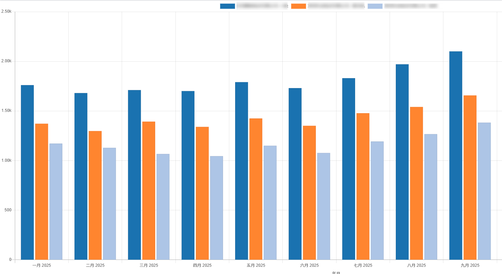
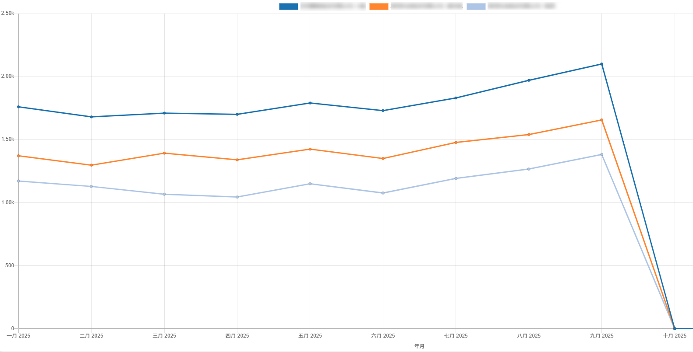
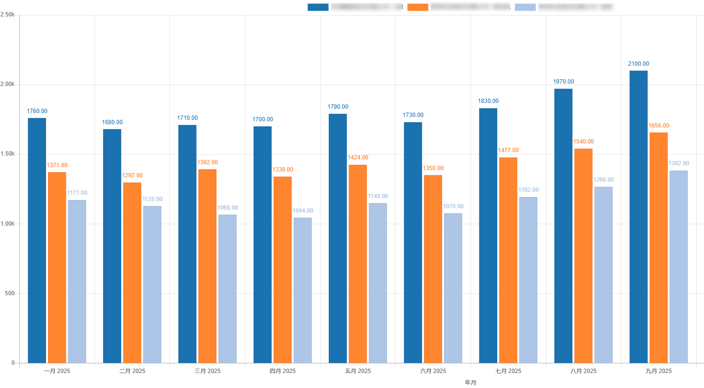
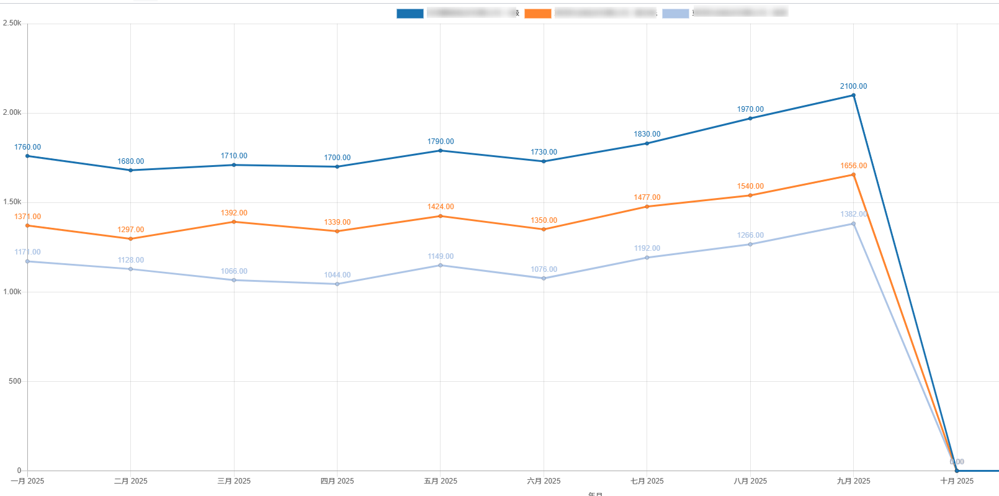

# Graph View 扩展

## 绘制数据label

### 背景

:::info[Note]

因为`chartjs`默认不显示数据的标签，所以需要额外处理。

:::





### 分析、修改

本文将对`Graph View`进行扩展，以支持绘制数据的标签。（以`odoo16`为例，`chartjs`版本为`2.9.3`）


`chartjs`默认需要鼠标移动到图标上才会显示数值，这种方式不够直观，而且当用户下载图表时就无法查看数值了。

实现这个需求将涉及到`options.animation.onComplete`.

> [`animation.onComplete`](https://www.chartjs.org/docs/2.9.4/configuration/animations.html#animation-callbacks): 动画结束时调用的回调。这个回调可以传递`Chart.Animation`实例。

找到`GraphRenderer`中渲染图表的部分：`renderChart() -> getChartConfig() -> prepareOptions()`;

以下对`GraphRenderer.prepareOptions()`进行修改，在`options`中加上`animation`的部分：

```javascript

function drawDataLabels(){
    var chartInstance = this.chart,
        ctx = chartInstance.ctx;

    // 这版本仅对柱状图和折现图进行绘制
    if (!['bar', 'line'].includes(chartInstance.config.type)) {
        return;
    }

    ctx.font = Chart.helpers.fontString(
        Chart.defaults.global.defaultFontSize,
        Chart.defaults.global.defaultFontStyle,
        Chart.defaults.global.defaultFontFamily
    );
    ctx.textAlign = 'center';
    ctx.textBaseline = 'bottom';

    const chartLegendItems = chartInstance.legend.legendItems;  //获取图例

    this.data.datasets.forEach(function (dataset, i) {
        var meta = chartInstance.controller.getDatasetMeta(i);

        meta.data.forEach(function (bar, index) {
            if (chartLegendItems[i].hidden === false) {    //当图例隐藏时不显示数值
                var data = Number(dataset.data[index]).toFixed(2); //保留两位小数
                ctx.fillStyle = dataset.backgroundColor || dataset.pointBackgroundColor;    //设置数值字体颜色为柱状图/曲线颜色
                ctx.fillText(data, bar._model.x, bar._model.y - 8);
            }
        });
    });
}

export class GraphRendererDrawDataLabel extends GraphRenderer{

  prepareOptions(){
    const options = super.prepareOptions();
    Object.assign(options, {
        hover: {
          animationDuration: 0  // 防止鼠标移上去，数字闪烁
        },
        animation: {           // 这部分是数值显示的功能实现
            onComplete: drawDataLabels,
        }
    });
    return options;
  }
  
}

```

### 更新后效果图





:::tip[TIPS]

chartjs版本大于3.x时，可以使用插件[chartjs-plugin-datalabels](https://github.com/chartjs/chartjs-plugin-datalabels)实现。

:::
