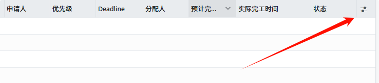

# ListRenderer可自定义显示及顺序

:::tip

- [ListRenderer分析文档](/docs/odoo/dev_notes/source_code_analysis/views/list_renderer_analysis)
- [SortableJS](https://github.com/SortableJS/Sortable)
:::




涉及改动的模板内容(局部)：

```xml title="list_renderer.xml"
<th t-if="displayOptionalFields or activeActions.onDelete" t-on-keydown="(ev) => this.onCellKeydown(ev)" class="o_list_controller o_list_actions_header position-static" style="width: 32px; min-width: 32px">  
	<!-- highlight-start -->
    <Dropdown t-if="displayOptionalFields"  
        class="'o_optional_columns_dropdown border-top-0 text-center'"  
        togglerClass="'btn p-0'"  
        skipTogglerTabbing="true"  
        position="'bottom-end'">  
        <t t-set-slot="toggler">  
            <i class="o_optional_columns_dropdown_toggle oi oi-fw oi-settings-adjust"/>  
        </t>  
  
        <t t-foreach="getOptionalFields" t-as="field" t-key="field_index">  
            <DropdownItem parentClosingMode="'none'" onSelected="() => this.toggleOptionalField(field.name)">  
                <CheckBox  
                    onChange="() => this.toggleOptionalField(field.name)"  
                    value="field.value"  
                    name="field.name"  
                >  
                    <t t-esc="field.label"/> <t t-if="env.debug" t-esc="' (' + field.name + ')'" />  
                </CheckBox>  
            </DropdownItem>  
        </t>  
    </Dropdown>  
    <!-- highlight-end -->
</th>
```

## `ListRenderer`部分逻辑解析

| name | 说明 |
|---|---|
| `this.allColumns` | 在`setup`中赋值，来源于`this.props.archInfo.columns`。一般在上层已处理，移除了 **(column_)invisible** 的节点（包括 fields/buttons）。 |
| `this.state.columns` | 在 **ListRenderer** 模板中遍历`this.state.columns`来渲染列。 |
| `this.optionalActiveFields` | `Object({field_name: value})`，存储了所有列的显示状态。 |
| `displayOptionalFields` | **Getter**，是否存在可选列（**optional field**）配置项。 |
| `getOptionalFields` | **Getter**，返回一个 Array，包含在 xml 中设置了 optional 属性的列（`label`、`name`、`value`），其中 value 是该字段显示状态；`setup` 中先判断 localStorage 是否有缓存，有则用缓存状态赋值给 value。 |
| `toggleOptionalField(fieldName)` | 切换可选列（**optional field**）显示/隐藏：先更新`this.optionalActiveFields`，再用`this.getActiveColumns(this.props.list)`结果更新`this.state.columns`触发列表重渲染，最后更新`browser.localStorage`。 |
| `getOptionalActiveFields()` | 在`setup()`中调用，更新`this.optionalActiveFields`；若`browser.localStorage`有缓存则从中更新激活状态，否则显示状态由 xml 中`field`的`optional`属性控制。 |
| `getActiveColumns(list)` | 根据配置（如可选列）获取当前应显示的列定义，用于更新`this.state.columns`；原生逻辑：若 xml 中`field`未设置`optional`属性，或`this.optionalActiveFields`里对应`col.name`的值为`true`，则属于应显示的列。 |
| `createKeyOptionalFields` | 生成用于本地存储（`browser.localStorage`）可选列配置的唯一键名。 |
| `saveOptionalActiveFields()` | 将调用该函数时`this.optionalActiveFields`值为`true`的所有列名存储到`browser.localStorage`。 |

---

## 实现思路

从以上xml模板的代码来看，列表最尾部的设置可选列显示的图标是由`displayOptionalFields`来控制是否显示的。然后通过`DropDown`组件的点击来展示所有的可选项列及其显示状态。所有可选项列通过`getOptionalFields`来获取。

所以我们此次的需求就考虑从此处入手，替换模版此处的内容，修改显示设置图标的条件，修改所有可操作的列。


此次修改设计部分：

|                         | 修改后                                                                                                                                   |
| ----------------------- | ------------------------------------------------------------------------------------------------------------------------------------- |
| setup                   |                                                                                                                                       |
| getOptionalFields       | 移除`filter`只提取设置`col.optional`属性的逻辑，让其能拿到所有的列                                                                                          |
| getOptionalActiveFields | 对this.optionalActiveFields更新时，修改了对col.optional的判断，从`col.optional==='show'`才视为activeField 改为 `!(col.optional==='hide')`就视为activeField. |
| getActiveColumns        | 对filter的逻辑进行了修改，将原来"或"条件下的 `!col.optional`判定移除.                                                                                       |
| toggleOptionalField     | 在调用`this.saveOptionalActiveFields`时，对`this.allColumns.filter`的逻辑进行了修改，将原来"且"条件下的`col.optional`判定移除.                                   |


