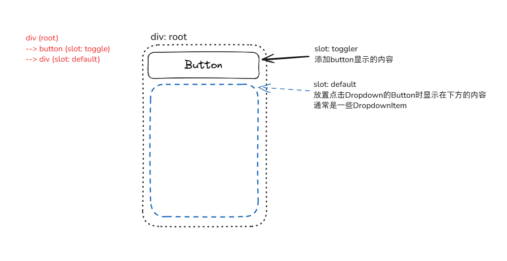

# Dropdown / DropdownItem

:::info[Note]
深入解析Odoo组件：Dropdown、DropdownItem。

-- version: odoo16
:::

## Dropdown

### template

首先来看下Dropdown的template(`"web.Dropdown"`)：

主要内容有`Slot(toggler)`、`Slot(default)`：

- `**Slot(toggler)**`：位于Button的内部，可自定义按钮显示的内容。(也可以在其中设置`<input>`标签来实现一些需要输入的组件)
- `**Slot(default)**`：可自定义点击`Dropdown`时，显示在下方(默认，可通过`props.position`修改)的内容。(通常是一些`DropdownItem`)

其结构如下：



<details>
    <summary>**源码：dropdown.xml**</summary>

```xml title="dropdown.xml"
<?xml version="1.0" encoding="UTF-8" ?>
<templates xml:space="preserve">

  <t t-name="web.Dropdown" owl="1">
    <div
      class="o-dropdown dropdown"
      t-att-class="props.class"
      t-attf-class="
        {{ directionCaretClass || ''}}
        {{ state.open ? 'show' : ''}}
        {{ !showCaret ? 'o-dropdown--no-caret' : '' }}
      "
      t-ref="root"
    >
      <button
        t-if="props.toggler !== 'parent'"
        class="dropdown-toggle"
        t-attf-class="
          {{props.togglerClass || ''}}
          {{parentDropdown ? 'dropdown-item' : ''}}
        "
        t-on-click.stop="onTogglerClick"
        t-on-mouseenter="onTogglerMouseEnter"
        t-att-title="props.title"
        t-att-data-hotkey="props.hotkey"
        t-att-data-tooltip="props.tooltip"
        t-att-tabindex="props.skipTogglerTabbing ? -1 : 0"
        t-att-aria-expanded="state.open ? 'true' : 'false'"
        t-ref="togglerRef"
      >
        <t t-slot="toggler" />
      </button>
      <div
        t-if="state.open"
        class="o-dropdown--menu dropdown-menu d-block"
        t-att-class="props.menuClass"
        role="menu"
        t-ref="menuRef"
      >
        <t t-slot="default" />
      </div>
    </div>
  </t>

</templates>

```
</details>


### Component

接着来看下Dropdown的Component：

<details>
    <summary>**源码：dropdown.js**</summary>

```javascript
/** @odoo-module **/

import { useBus, useService } from "@web/core/utils/hooks";
import { usePosition } from "../position_hook";
import { useDropdownNavigation } from "./dropdown_navigation_hook";
import { localization } from "../l10n/localization";

import {
    Component,
    EventBus,
    onWillStart,
    status,
    useEffect,
    useExternalListener,
    useRef,
    useState,
    useChildSubEnv,
} from "@odoo/owl";

const DIRECTION_CARET_CLASS = {
    bottom: "dropdown",
    top: "dropup",
    left: "dropstart",
    right: "dropend",
};

export const DROPDOWN = Symbol("Dropdown");

/**
 * @typedef DropdownState
 * @property {boolean} open
 * @property {boolean} groupIsOpen
 */

/**
 * @typedef DropdownStateChangedPayload
 * @property {Dropdown} emitter
 * @property {DropdownState} newState
 */

/**
 * @extends Component
 */
export class Dropdown extends Component {
    setup() {
        this.state = useState({
            open: this.props.startOpen,
            groupIsOpen: this.props.startOpen,
        });
        this.rootRef = useRef("root");

        // Set up beforeOpen ---------------------------------------------------
        onWillStart(() => {
            if (this.state.open && this.props.beforeOpen) {
                return this.props.beforeOpen();
            }
        });

        // Set up dynamic open/close behaviours --------------------------------
        if (!this.props.manualOnly) {
            // Close on outside click listener
            useExternalListener(window, "click", this.onWindowClicked, { capture: true });
            // Listen to all dropdowns state changes
            useBus(Dropdown.bus, "state-changed", ({ detail }) =>
                this.onDropdownStateChanged(detail)
            );
        }

        // Set up UI active element related behavior ---------------------------
        this.ui = useService("ui");
        useEffect(
            () => {
                Promise.resolve().then(() => {
                    this.myActiveEl = this.ui.activeElement;
                });
            },
            () => []
        );

        // Set up nested dropdowns ---------------------------------------------
        this.parentDropdown = this.env[DROPDOWN];
        useChildSubEnv({
            [DROPDOWN]: {
                close: this.close.bind(this),
                closeAllParents: () => {
                    this.close();
                    if (this.parentDropdown) {
                        this.parentDropdown.closeAllParents();
                    }
                },
            },
        });

        // Set up key navigation -----------------------------------------------
        useDropdownNavigation();

        // Set up toggler and positioning --------------------------------------
        /** @type {string} **/
        const position =
            this.props.position || (this.parentDropdown ? "right-start" : "bottom-start");
        let [direction] = position.split("-");
        if (["left", "right"].includes(direction) && localization.direction === "rtl") {
            direction = direction === "left" ? "right" : "left";
        }
        const positioningOptions = {
            popper: "menuRef",
            position,
        };
        this.directionCaretClass = DIRECTION_CARET_CLASS[direction];
        this.togglerRef = useRef("togglerRef");
        if (this.props.toggler === "parent") {
            // Add parent click listener to handle toggling
            useEffect(
                () => {
                    const onClick = (ev) => {
                        if (this.rootRef.el.contains(ev.target)) {
                            // ignore clicks inside the dropdown
                            return;
                        }
                        this.toggle();
                    };
                    if (this.rootRef.el.parentElement.tabIndex === -1) {
                        // If the parent is not focusable, make it focusable programmatically.
                        // This code may look weird, but an element with a negative tabIndex is
                        // focusable programmatically ONLY if its tabIndex is explicitly set.
                        this.rootRef.el.parentElement.tabIndex = -1;
                    }
                    this.rootRef.el.parentElement.addEventListener("click", onClick);
                    return () => {
                        this.rootRef.el.parentElement.removeEventListener("click", onClick);
                    };
                },
                () => []
            );

            useEffect(
                (open) => {
                    this.rootRef.el.parentElement.ariaExpanded = open ? "true" : "false";
                },
                () => [this.state.open]
            );

            // Position menu relatively to parent element
            usePosition(() => this.rootRef.el.parentElement, positioningOptions);
        } else {
            // Position menu relatively to inner toggler
            const togglerRef = useRef("togglerRef");
            usePosition(() => togglerRef.el, positioningOptions);
        }
    }

    // -------------------------------------------------------------------------
    // Private
    // -------------------------------------------------------------------------

    /**
     * Changes the dropdown state and notifies over the Dropdown bus.
     *
     * All state changes must trigger on the bus, except when reacting to
     * another dropdown state change.
     *
     * @see onDropdownStateChanged()
     *
     * @param {Partial<DropdownState>} stateSlice
     */
    async changeStateAndNotify(stateSlice) {
        if (stateSlice.open && this.props.beforeOpen) {
            await this.props.beforeOpen();
            if (status(this) === "destroyed") {
                return;
            }
        }
        // Update the state
        Object.assign(this.state, stateSlice);
        // Notify over the bus
        /** @type DropdownStateChangedPayload */
        const stateChangedPayload = {
            emitter: this,
            newState: { ...this.state },
        };
        Dropdown.bus.trigger("state-changed", stateChangedPayload);
    }

    /**
     * Closes the dropdown.
     *
     * @returns {Promise<void>}
     */
    close() {
        return this.changeStateAndNotify({ open: false, groupIsOpen: false });
    }

    /**
     * Opens the dropdown.
     *
     * @returns {Promise<void>}
     */
    open() {
        return this.changeStateAndNotify({ open: true, groupIsOpen: true });
    }

    /**
     * Toggles the dropdown open state.
     *
     * @returns {Promise<void>}
     */
    toggle() {
        const toggled = !this.state.open;
        return this.changeStateAndNotify({ open: toggled, groupIsOpen: toggled });
    }

    get showCaret() {
        return this.props.showCaret === undefined ? this.parentDropdown : this.props.showCaret;
    }

    // -------------------------------------------------------------------------
    // Handlers
    // -------------------------------------------------------------------------

    /**
     * Dropdowns react to each other state changes through this method.
     *
     * All state changes must trigger on the bus, except when reacting to
     * another dropdown state change.
     *
     * @see changeStateAndNotify()
     *
     * @param {DropdownStateChangedPayload} args
     */
    onDropdownStateChanged(args) {
        if (!this.rootRef.el || this.rootRef.el.contains(args.emitter.rootRef.el)) {
            // Do not listen to events emitted by self or children
            return;
        }

        // Emitted by direct siblings ?
        if (args.emitter.rootRef.el.parentElement === this.rootRef.el.parentElement) {
            // Sync the group status
            this.state.groupIsOpen = args.newState.groupIsOpen;

            // Another dropdown is now open ? Close myself without notifying siblings.
            if (this.state.open && args.newState.open) {
                this.state.open = false;
            }
        } else {
            // Another dropdown is now open ? Close myself and notify the world (i.e. siblings).
            if (this.state.open && args.newState.open) {
                this.close();
            }
        }
    }

    /**
     * Toggles the dropdown on its toggler click.
     */
    onTogglerClick() {
        this.toggle();
    }

    /**
     * Opens the dropdown the mouse enters its toggler.
     * NB: only if its siblings dropdown group is opened and if not a sub dropdown.
     */
    onTogglerMouseEnter() {
        if (this.state.groupIsOpen && !this.state.open) {
            this.togglerRef.el.focus();
            this.open();
        }
    }

    /**
     * Return true if both active element are same.
     */
    isInActiveElement() {
        return this.ui.activeElement === this.myActiveEl;
    }

    /**
     * Used to close ourself on outside click.
     *
     * @param {MouseEvent} ev
     */
    onWindowClicked(ev) {
        // Return if already closed
        if (!this.state.open) {
            return;
        }
        // Return if it's a different ui active element
        if (!this.isInActiveElement()) {
            return;
        }

        if (ev.target.closest(".bootstrap-datetimepicker-widget")) {
            return;
        }

        // Close if we clicked outside the dropdown, or outside the parent
        // element if it is the toggler
        const rootEl =
            this.props.toggler === "parent" ? this.rootRef.el.parentElement : this.rootRef.el;
        const gotClickedInside = rootEl.contains(ev.target);
        if (!gotClickedInside) {
            this.close();
        }
    }
}
Dropdown.bus = new EventBus();
Dropdown.props = {
    class: {
        type: String,
        optional: true,
    },
    toggler: {
        type: String,
        optional: true,
        validate: (prop) => ["parent"].includes(prop),
    },
    skipTogglerTabbing: {
        type: Boolean,
        optional: true,
    },
    startOpen: {
        type: Boolean,
        optional: true,
    },
    manualOnly: {
        type: Boolean,
        optional: true,
    },
    menuClass: {
        type: String,
        optional: true,
    },
    beforeOpen: {
        type: Function,
        optional: true,
    },
    togglerClass: {
        type: String,
        optional: true,
    },
    hotkey: {
        type: String,
        optional: true,
    },
    tooltip: {
        type: String,
        optional: true,
    },
    title: {
        type: String,
        optional: true,
    },
    position: {
        type: String,
        optional: true,
    },
    slots: {
        type: Object,
        optional: true,
    },
    showCaret: {
        type: Boolean,
        optional: true,
    },
};
Dropdown.template = "web.Dropdown";

```
</details>

#### props
:::tip[Dropdown.props]
- **`class`**(string): div-root标签的class属性。
- **`toggler`**(string): 触发dropdown的元素。若不设置该props，则默认使用div-root内的button作为触发元素。可以设置`toggler="'parent'"`，则变成div-root的父标签作为触发元素，组件会在`this.rootRef.el.parentElement`添加click监听事件。
- **`skipTogglerTabbing`**(boolean): 是否将toggler Button设置为不可通过tab键获得焦点。未设置视为可通过tab键聚焦。
- **`startOpen`**(boolean): 是否默认打开dropdown。未设置则默认为false。
- **`manualOnly`**(boolean): 是否只通过手动打开/关闭dropdown(即点击Dropdown以外元素不会关闭Dropdown显示的内容，只能通过点击Dropdown的toggler button或选中内部元素执行的变化来打开/关闭)。未设置则默认视为自动。
- **`menuClass`**(string): dropdown-menu标签的class属性。
- **`beforeOpen`**(function): dropdown打开前的回调函数。(通常可以做一些预处理操作)
- **`togglerClass`**(string): toggler按钮的class属性。
- **`hotkey`**(string): 触发dropdown的快捷键。
- **`tooltip`**(string): 鼠标移入dropdown时显示的提示信息(tooltip)，tooltip优先级高于title。
- **`title`**(string): 鼠标移入dropdown时显示的提示信息(title)。
- **`position`**(string): dropdown打开内容的位置。
- **`slots`**(object): dropdown的插槽。(用法可见[动态slots](/docs/odoo/dev_notes/front-end/some_owl_usages#%E5%8A%A8%E6%80%81slots))
- **`showCaret`**(boolean): 是否显示下拉箭头。
:::

## DropdownItem

### template

主体内容为`<span>`或`<a>`标签。

```xml title="dropdown_item.xml"
<?xml version="1.0" encoding="UTF-8" ?>
<templates xml:space="preserve">

  <t t-name="web.DropdownItem" owl="1">
    <t
      t-tag="props.href ? 'a' : 'span'"
      t-att-href="props.href"
      class="dropdown-item"
      t-att-class="props.class"
      role="menuitem"
      t-on-click.stop="onClick"
      t-att-title="props.title"
      t-att-data-hotkey="props.hotkey"
      t-att="dataAttributes"
      tabindex="0"
    >
      <t t-slot="default" />
    </t>
  </t>

</templates>

```

### Component

核心逻辑在于`props.onSelected`，在点击DropdownItem时，其click事件绑定的function中会调用`props.onSelected()`。

如果`props.href`设置了值，则DropdownItem会渲染为`<a>`标签，否则渲染为`<span>`标签。

<details>
    <summary>**源码：dropdown_item.js**</summary>

```javascript title="dropdown_item.js"
/** @odoo-module **/
import { DROPDOWN } from "./dropdown";

import { Component } from "@odoo/owl";

/**
 * @enum {string}
 */
const ParentClosingMode = {
    None: "none",
    ClosestParent: "closest",
    AllParents: "all",
};

export class DropdownItem extends Component {
    /**
     * Tells the parent dropdown that an item was selected and closes the
     * parent(s) dropdown according the parentClosingMode prop.
     *
     * @param {MouseEvent} ev
     */
    onClick(ev) {
        const { href, onSelected, parentClosingMode } = this.props;
        if (href) {
            ev.preventDefault();
        }
        if (onSelected) {
            onSelected();
        }
        const dropdown = this.env[DROPDOWN];
        if (!dropdown) {
            return;
        }
        const { ClosestParent, AllParents } = ParentClosingMode;
        switch (parentClosingMode) {
            case ClosestParent:
                dropdown.close();
                break;
            case AllParents:
                dropdown.closeAllParents();
                break;
        }
    }
    get dataAttributes() {
        const { dataset } = this.props;
        if (this.props.dataset) {
            const attributes = Object.entries(dataset).map(([key, value]) => {
                return [`data-${key.replace(/[A-Z]/g, (char) => `-${char.toLowerCase()}`)}`, value];
            });
            return Object.fromEntries(attributes);
        }
        return {};
    }
}
DropdownItem.template = "web.DropdownItem";
DropdownItem.props = {
    onSelected: {
        type: Function,
        optional: true,
    },
    class: {
        type: [String, Object],
        optional: true,
    },
    parentClosingMode: {
        type: ParentClosingMode,
        optional: true,
    },
    hotkey: {
        type: String,
        optional: true,
    },
    href: {
        type: String,
        optional: true,
    },
    slots: {
        type: Object,
        optional: true,
    },
    title: {
        type: String,
        optional: true,
    },
    dataset: {
        type: Object,
        optional: true,
    },
};
DropdownItem.defaultProps = {
    parentClosingMode: ParentClosingMode.AllParents,
};

```
</details>

#### props
:::tip[DropdownItem.props]
- **`onSelected`**(Function): 点击DropdownItem时调用的function。
- **`class`**(string): DropdownItem标签的class属性。
- **`parentClosingMode`**(string): 父级Dropdown关闭方式。(可选值：None/ClosestParent/AllParents， 默认：AllParents)
- **`hotkey`**(string): 触发DropdownItem的快捷键。
- **`href`**(string): DropdownItem的href属性。
- **`slots`**(object): DropdownItem的插槽。(用法可见[动态slots](/docs/odoo/dev_notes/front-end/some_owl_usages#%E5%8A%A8%E6%80%81slots))
- **`title`**(string): 鼠标移入DropdownItem时显示的提示信息(title)。
- **`dataset`**(object): DropdownItem的data-*属性。
:::
