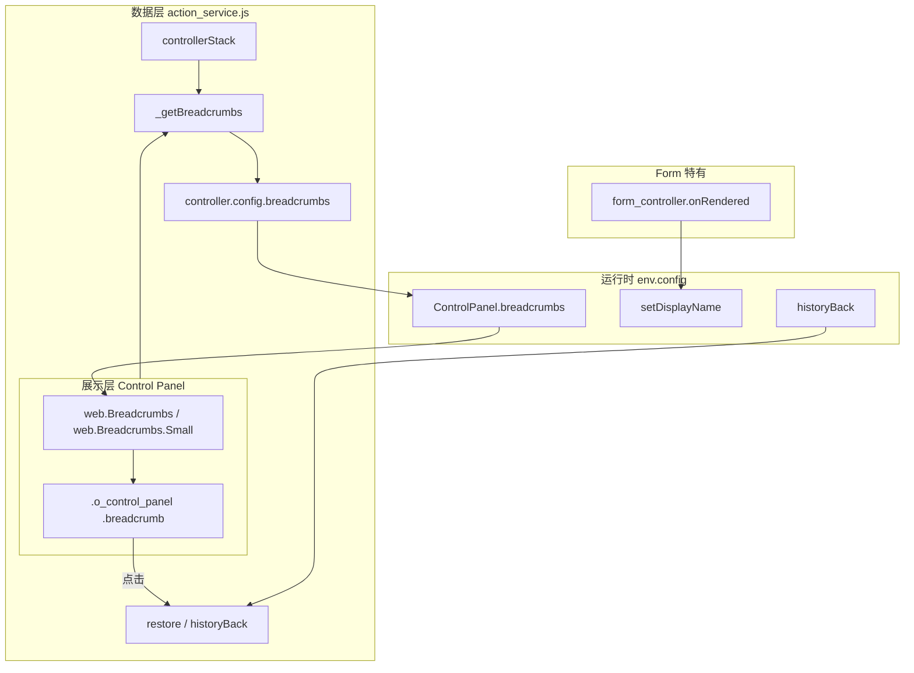

:::info[说明]
本文档仅基于 Odoo 16 原生 `addons/web` 源码整理，不涉及任何自定义模块。
:::

# Breadcrumb 源码解析

## 总览

Odoo 16 Web 客户端的面包屑（Breadcrumb）不是 Form View 独有功能，而是 **Action 导航栈（controller stack）** 在 UI 上的投影：

- **数据层**：`action_service.js` 维护 `controllerStack`，并在 `_updateUI` 时计算 `config.breadcrumbs`
- **展示层**：各视图的 **Control Panel** 读取 `env.config.breadcrumbs`，渲染 `web.Breadcrumbs` 模板
- **交互层**：点击面包屑项 → `actionService.restore(jsId)` → 恢复到栈中对应 controller

Form View 的特殊之处仅在于：**当前页标题**（面包屑最后一项）由 `form_controller.js` 通过 `setDisplayName()` 更新为记录的 `display_name`。

---

## 架构关系



---

## 核心文件索引

| 文件 | 职责 |
|------|------|
| `addons/web/static/src/webclient/actions/action_service.js` | 维护 controller 栈、生成 breadcrumbs、restore/historyBack |
| `addons/web/static/src/search/control_panel/control_panel.js` | 读取 breadcrumbs、处理点击 |
| `addons/web/static/src/search/control_panel/control_panel.xml` | `web.Breadcrumbs` / `web.Breadcrumbs.Small` 模板 |
| `addons/web/static/src/search/control_panel/control_panel.scss` | 面包屑与 `o_back_button` 样式 |
| `addons/web/static/src/views/form/control_panel/form_control_panel.xml` | Form 专用 Control Panel 模板 |
| `addons/web/static/src/views/view.js` | `env.config` 默认结构、`noBreadcrumbs` 传递 |
| `addons/web/static/src/views/form/form_controller.js` | Form 记录名 → `setDisplayName` |
| `addons/web/static/src/search/layout.js` | Dialog 内隐藏 breadcrumb 区域 |
| `addons/web/static/src/legacy/backend_utils.js` | `breadcrumbsToLegacy` 新旧架构桥接 |
| `addons/web/static/src/legacy/action_adapters.js` | Legacy 视图 breadcrumb 点击 / history_back 事件 |

---

## 数据结构

### Controller（action 栈元素）

每个打开的动作/视图在栈中对应一个 **controller** 对象，关键字段：

| 字段 | 说明 |
|------|------|
| `jsId` | 栈内唯一 ID，如 `controller_1`；面包屑点击时用于 `restore` |
| `action` | 当前 ir.actions.* 描述对象 |
| `view` | 当前视图描述（type、multiRecord 等） |
| `displayName` | 面包屑显示名称 |
| `config` | 注入子组件 env 的配置，含 `breadcrumbs`、`setDisplayName`、`historyBack` |
| `props` | 传给 View/Controller 的 props（resId、resModel 等） |
| `exportedState` | 离开 controller 时导出的状态，restore 时用于恢复 resId 等 |

### Breadcrumb 项

`_getBreadcrumbs(stack)` 将栈映射为 UI 数组：

```262:272:addons/web/static/src/webclient/actions/action_service.js
    function _getBreadcrumbs(stack) {
        return stack
            .filter((controller) => controller.action.tag !== "menu")
            .map((controller) => {
                return {
                    jsId: controller.jsId,
                    get name() {
                        return controller.displayName;
                    },
                };
            });
    }
```

要点：

- 过滤 `action.tag === "menu"` 的 controller（菜单项不进面包屑）
- `name` 是 **getter**，读取时动态取 `controller.displayName`，因此 Form 改名会实时反映
- 数组长度 = 当前可见导航层级数

### env.config 相关 API

`view.js` 中 `getDefaultConfig()` 定义了 standalone 视图的默认 config；正常 action 流程下由 `action_service` 在 `_updateUI` 中覆盖：

| API | 作用 |
|-----|------|
| `breadcrumbs` | 响应式数组（`reactive`），供 Control Panel 渲染 |
| `getDisplayName()` | 返回当前 controller 的 displayName |
| `setDisplayName(name)` | 更新 displayName，并 hack 触发 breadcrumbs 响应式更新 |
| `historyBack()` | 返回上一层；无上一层或 Dialog 场景下执行 close |
| `noBreadcrumbs` | 为 `true` 时不渲染面包屑 |

---

## controllerStack 与栈操作

### 栈的维护时机

`_updateUI(controller, options)` 是核心入口：

1. 通过 `_computeStackIndex(options)` 计算新 controller 插入位置
2. `nextStack = controllerStack.slice(0, index).concat(controllerArray)`
3. 计算 `breadcrumbs` 并写入 `controller.config`
4. Controller 挂载完成后：`controllerStack = nextStack`（commit 栈）

### `_computeStackIndex` 选项

| options | 行为 |
|---------|------|
| `clearBreadcrumbs: true` | `index = 0`，清空栈，从新 action 开始 |
| `stackPosition: "replaceCurrentAction"` | 替换当前 action 在栈中第一次出现的位置 |
| `stackPosition: "replacePreviousAction"` | 替换上一个不同 action 的位置 |
| `index`（显式指定） | 截断到 `index` 后追加（restore 时使用） |
| 默认 | `index = controllerStack.length`，即 **push 到栈顶** |

### 何时清空面包屑

- 从 URL / 菜单 **首次加载** action：`_getActionParams()` 默认 `clearBreadcrumbs: true`
- `doAction` 时：`action.target === "main"` 会强制 `clearBreadcrumbs`
- 也可在 `doAction(action, { clearBreadcrumbs: true })` 显式传入

```1213:1217:addons/web/static/src/webclient/actions/action_service.js
    async function doAction(actionRequest, options = {}) {
        ...
        options.clearBreadcrumbs = action.target === "main" || options.clearBreadcrumbs;
```

### switchView 与栈

`switchView(viewType)` **不增加栈深度**：在同一 action 内切换 list/form/kanban，通常替换栈顶 controller 或复用已缓存的 view controller，breadcrumb 层级不变，变的只是最后一项的 displayName 和视图类型。

---

## _updateUI：注入 config

```596:620:addons/web/static/src/webclient/actions/action_service.js
        controller.config.breadcrumbs = reactive(
            action.target === "new" ? [] : _getBreadcrumbs(nextStack)
        );
        controller.config.getDisplayName = () => controller.displayName;
        controller.config.setDisplayName = (displayName) => {
            controller.displayName = displayName;
            ...
            if (action.target !== "new") {
                controller.config.breadcrumbs.push(undefined);
                controller.config.breadcrumbs.pop();
            }
        };
        controller.config.historyBack = () => {
            const previousController = controllerStack[controllerStack.length - 2];
            if (previousController && !dialog) {
                restore(previousController.jsId);
            } else {
                _executeCloseAction();
            }
        };
```

说明：

- **`target === "new"`**（Dialog action）：breadcrumbs 为空数组，Dialog 内不显示面包屑
- **`setDisplayName` 的 push/pop**：强制触发 Owl 响应式更新（breadcrumb 的 `name` getter 本身不触发数组变更）
- **`historyBack`**：有上一层且非 dialog → `restore`；否则 → 关闭 action/dialog

---

## 导航：restore 与未保存变更

### 点击面包屑

```128:130:addons/web/static/src/search/control_panel/control_panel.js
    onBreadcrumbClicked(jsId) {
        this.actionService.restore(jsId);
    }
```

### restore 流程

```1406:1431:addons/web/static/src/webclient/actions/action_service.js
    async function restore(jsId) {
        await keepLast.add(Promise.resolve());
        ...
        index = controllerStack.findIndex((controller) => controller.jsId === jsId);
        ...
        if (controller.action.type === "ir.actions.act_window") {
            ...
            if (exportedState && "resId" in exportedState) {
                props.resId = exportedState.resId;
            }
            Object.assign(controller, _getViewInfo(view, action, views, props));
        }
        const canProceed = await clearUncommittedChanges(env);
        if (canProceed) {
            return _updateUI(controller, { index });
        }
    }
```

要点：

1. **`clearUncommittedChanges`**：触发 `CLEAR-UNCOMMITTED-CHANGES` 总线，收集各 controller 的 `__beforeLeave__` 回调；Form 在此检查 dirty 状态
2. 用户取消离开 → `restore` 中止，留在当前页
3. **`exportedState.resId`**：恢复到离开该 controller 时的记录 ID（例如 form 翻页后返回）

---

## UI 渲染

### Control Panel 读取数据

```31:31:addons/web/static/src/search/control_panel/control_panel.js
        this.breadcrumbs = useState(this.env.config.breadcrumbs);
```

Control Panel 通过 `useState` 包装 `env.config.breadcrumbs`，栈更新后 UI 自动刷新。

### 桌面端：`web.Breadcrumbs`

```173:189:addons/web/static/src/search/control_panel/control_panel.xml
    <t t-name="web.Breadcrumbs" owl="1">
        <ol class="breadcrumb">
            <t t-foreach="breadcrumbs" t-as="breadcrumb" t-key="breadcrumb.jsId">
                <t t-set="isPenultimate" t-value="breadcrumb_index === breadcrumbs.length - 2"/>
                <li t-if="!breadcrumb_last" class="breadcrumb-item"
                    t-att-data-hotkey="isPenultimate and 'b'"
                    t-att-class="{ o_back_button: isPenultimate}"
                    t-on-click.prevent="() => this.onBreadcrumbClicked(breadcrumb.jsId)">
                    <a href="#">...</a>
                </li>
                <li t-else="" class="breadcrumb-item active">...</li>
            </t>
        </ol>
    </t>
```

行为：

| 元素 | 说明 |
|------|------|
| 非最后一项 | 可点击链接，点击 → `restore(jsId)` |
| 最后一项 | `active`，不可点击，显示当前页标题 |
| 倒数第二项 | 额外 class `o_back_button`：CSS 用 FontAwesome 左箭头替代文字（桌面端视觉上的「返回」） |
| 倒数第二项 | `data-hotkey="b"`，快捷键 **B** 返回上一层 |

### 移动端：`web.Breadcrumbs.Small`

```192:205:addons/web/static/src/search/control_panel/control_panel.xml
    <t t-name="web.Breadcrumbs.Small" owl="1">
        <ol class="breadcrumb">
            <t t-if="breadcrumbs.length > 1">
                <li class="breadcrumb-item o_back_button btn btn-secondary"
                    t-on-click.prevent="() => this.onBreadcrumbClicked(breadcrumb.jsId)" />
            </t>
            <li class="breadcrumb-item active">当前页标题</li>
        </ol>
    </t>
```

移动端只显示：**返回按钮 + 当前页标题**，中间层级省略。

### Form View 的 Control Panel

Form 使用独立模板 `web.FormControlPanel`（`form_control_panel.xml`），面包屑区域逻辑与 Regular Control Panel 相同，但布局适配 Form（pager、status indicator、action menu 等）。

挂载链：

```
FormController → Layout → FormControlPanel → web.Breadcrumbs
```

List/Kanban 等视图：

```
*Controller → Layout → ControlPanel (web.ControlPanel.Regular) → web.Breadcrumbs
```

### 隐藏面包屑的条件

1. **`env.config.noBreadcrumbs === true`**
   - 来源：action context 的 `no_breadcrumbs`（在 `_getViewInfo` 中读取并 delete）
   - `view.js` 的 `loadView` 也会写入 `env.config.noBreadcrumbs`

2. **Dialog 内 Form**：`layout.js` 在 `env.inDialog` 时将 control panel 的 `top-left` 设为 `false`

```27:39:addons/web/static/src/search/layout.js
    get display() {
        const { controlPanel } = this.props.display;
        if (!controlPanel || !this.env.inDialog) {
            return this.props.display;
        }
        return {
            ...this.props.display,
            controlPanel: {
                ...controlPanel,
                "top-left": false,
                "bottom-left-buttons": false,
            },
        };
    }
```

3. **`target === "new"`** 的 action：breadcrumbs 直接设为 `[]`

---

## Form View：displayName 更新

Form 面包屑最后一项显示记录名，而非 action 名：

```234:261:addons/web/static/src/views/form/form_controller.js
        onRendered(() => {
            this.env.config.setDisplayName(this.displayName());
        });
    ...
    displayName() {
        return this.model.root.data.display_name || this.env._t("New");
    }
```

每次 render 后同步记录 `display_name`；新建记录无 ID 时显示 **New**。

### Form 中调用 historyBack 的场景

| 场景 | 代码位置 |
|------|----------|
| Discard 新建/Dialog 内记录 | `form_controller.discard()` → `historyBack()` |
| 删除记录后无 resId | `form_controller.deleteRecord()` confirm 回调 |

---

## displayName 初始值来源

| Action 类型 | 初始 displayName |
|-------------|------------------|
| `ir.actions.act_window` | `action.display_name \|\| action.name` |
| `ir.actions.client` | 同上 |
| Form 渲染后 | 被 `setDisplayName(record.display_name)` 覆盖 |

窗口标题（浏览器 Tab）同步：`titleService.setParts({ action: controller.displayName })` 在 `_updateUI` 挂载时和 `setDisplayName` 时更新。

---

## Legacy 视图兼容

旧版 `web.Widget` 视图通过 `legacy_views.js` / `action_adapters.js` 桥接：

```273:279:addons/web/static/src/legacy/backend_utils.js
export function breadcrumbsToLegacy(breadcrumbs) {
    if (!breadcrumbs) {
        return;
    }
    return breadcrumbs.slice(0, -1).map((bc) => {
        return { title: bc.name, controllerID: bc.jsId };
    });
}
```

- Legacy 面包屑 **不含当前页**（`slice(0, -1)`），最后一项由 legacy controller 自行追加
- Legacy 点击：`breadcrumb_clicked` 事件 → `actionService.restore(controllerID)`
- Legacy `history_back` 事件 → `env.config.historyBack()`

---

## 典型场景时序

### List → Form

```
1. doAction(销售订单 action)     → clearBreadcrumbs, 栈: [List]
   breadcrumb: ["销售订单"]

2. 点击某行打开 Form             → push, 栈: [List, Form]
   breadcrumb: ["销售订单", "SO001"]

3. 点击「销售订单」或按 B       → restore(List.jsId)
   → clearUncommittedChanges → 回到 List
```

### Form → 关联 Form（Many2one 打开）

```
1. 栈: [客户 Form, 订单 Form]
   breadcrumb: ["客户 A", "订单 B"]

2. 点击「客户 A」→ restore(客户 Form.jsId)
```

### 从菜单重新进入

```
doAction(..., { clearBreadcrumbs: true })
→ 栈重置为单层，旧 breadcrumb 全部清除
```

---

## 扩展点（二次开发参考）

| 需求 | 推荐切入点 |
|------|------------|
| 改面包屑 UI | 继承 `ControlPanel` 模板，或 xpath 修改 `web.Breadcrumbs` |
| 改当前页标题 | 在 Controller 中调用 `env.config.setDisplayName()` |
| 自定义返回行为 | 覆盖 `env.config.historyBack`（通过 `useSubEnv`） |
| 禁用面包屑 | action context 传 `no_breadcrumbs: true`，或设 `viewProps.noBreadcrumbs` |
| 裁剪/合并层级 | 修改 `env.config.breadcrumbs` 数组（需在 Controller setup 中谨慎处理） |
| 清空历史栈 | `doAction(action, { clearBreadcrumbs: true })` |

注意：

- 应优先使用 **`restore` / `historyBack`**，不要手动改 URL，否则与 `controllerStack` 不同步
- 修改 `breadcrumbs` 只影响展示，**不改变**实际导航栈；返回行为仍取决于 `controllerStack`
- `setDisplayName` 的 push/pop hack 若被绕过，可能导致 UI 不刷新

---

## DOM 与 CSS 参考

| 选择器 | 含义 |
|--------|------|
| `.o_control_panel .breadcrumb` | 面包屑容器 |
| `.breadcrumb-item` | 单项 |
| `.breadcrumb-item.active` | 当前页（最后一项） |
| `.breadcrumb-item.o_back_button` | 桌面端倒数第二项 / 移动端返回按钮 |
| `$o-cp-breadcrumb-height` | 面包屑行高变量（`primary_variables.scss`，默认 30px） |

`o_back_button` 桌面端样式（`control_panel.scss`）：用 `::before` 渲染 `fa-arrow-left`，并 `display: none` 隐藏内部 `<a>` 文字。

---

## 与 URL / Session 的关系

- **`pushState(controller)`**：每次栈 commit 后更新 router hash（action、model、view_type、id 等）
- **`sessionStorage.current_action`**：保存当前 action JSON，用于从 URL 仅含 model/view_type 时恢复 list action
- **`loadState()`**：页面刷新或 hash 变化时，决定 `doAction` 还是 `switchView`

面包屑本身 **不持久化**；刷新后由 URL + sessionStorage 重建 controller 栈，breadcrumb 随之重新计算。

---

## 调试建议

1. **开发者工具 Console**：
   ```javascript
   odoo.__DEBUG__.services["action"].currentController.config.breadcrumbs
   ```
2. 观察 `controllerStack` 需在内层 closure，通常通过 breadcrumb 项的 `jsId` 反推
3. 检查 `noBreadcrumbs`、`env.inDialog`、`action.target === "new"` 三个隐藏条件
4. 返回无效时确认是否被 `clearUncommittedChanges` 拦截（有未保存表单）

---

## 参考阅读顺序

1. `action_service.js` — `_getBreadcrumbs`、`_updateUI`、`restore`、`doAction`
2. `control_panel.xml` — `web.Breadcrumbs` 模板
3. `control_panel.js` — `onBreadcrumbClicked`
4. `form_controller.js` — `setDisplayName`
5. `view.js` — `getDefaultConfig`、`noBreadcrumbs`
6. `legacy/backend_utils.js` — `breadcrumbsToLegacy`

---

## 版本说明

- 基于 **Odoo 16** `addons/web` 源码
- OWL 2 + 新 Action Service 架构；Legacy 视图仍通过 adapter 层共存
