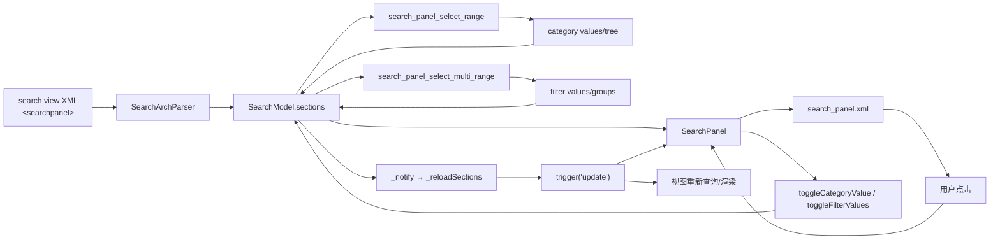
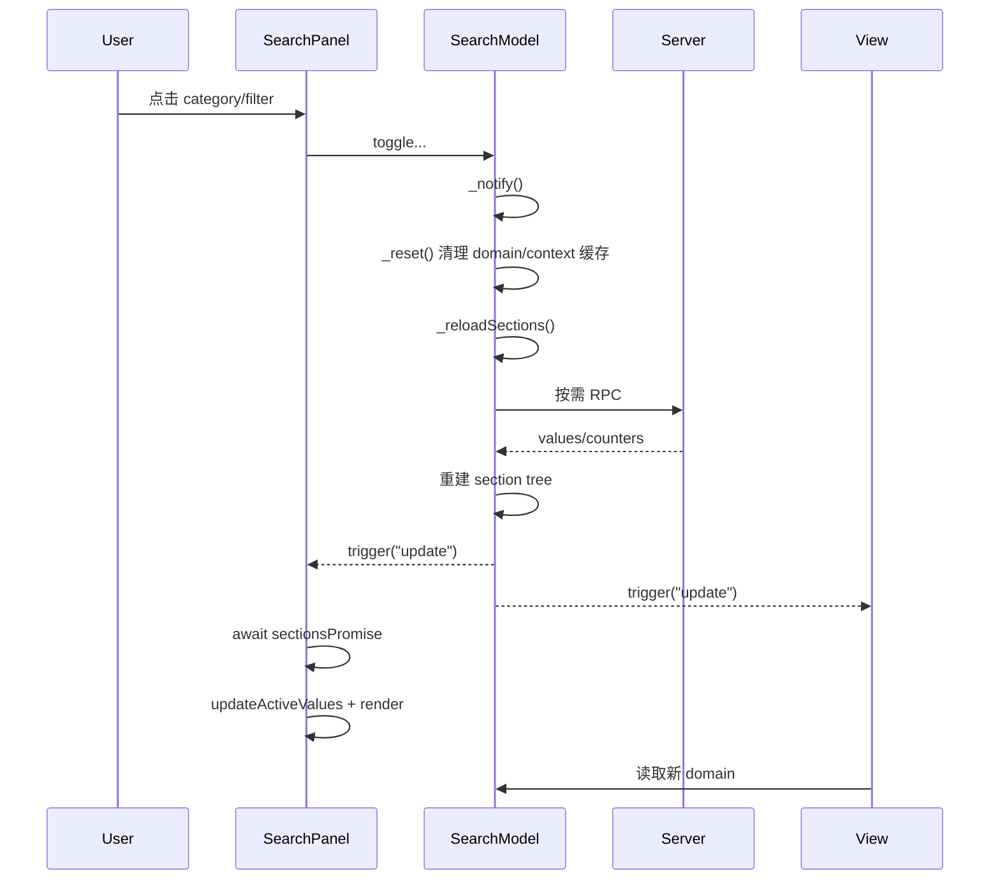

import Tabs from '@theme/Tabs';

import TabItem from '@theme/TabItem';

# Odoo 16 SearchPanel 技术解析与扩展指南

## 1. 文档目标

本文围绕 Odoo 16 Web 客户端的 `SearchPanel` 组件，解释搜索面板从 XML 架构解析、数据加载、domain 生成，到 OWL 渲染和用户交互的完整链路，并整理后续二次开发时可采用的扩展方式与高风险点。

核心源码目录：

```text
addons/web/static/src/search/search_panel/
├── search_panel.js
├── search_panel.xml
├── search_panel.scss
├── search_panel.variables.scss
└── search_view.scss
```

必须结合阅读的核心依赖：

```text
addons/web/static/src/search/search_arch_parser.js
addons/web/static/src/search/search_model.js
addons/web/static/src/search/layout.js
addons/web/static/src/search/layout.xml
addons/web/static/src/search/with_search/with_search.js
addons/web/static/src/views/view.js
addons/web/models/models.py
```

> `SearchPanel` 本身主要负责展示和交互。section 的定义、选中状态、RPC 数据、domain 计算与刷新策略，事实来源是 `SearchModel`；服务端候选值和计数的事实来源是 `addons/web/models/models.py`。

## 2. 整体架构

### 2.1 分层职责

| 层级 | 核心对象 | 职责 |
| --- | --- | --- |
| 搜索视图声明 | `<searchpanel>` | 声明字段、单选/多选、计数、分组、层级、图标和显示视图 |
| 架构解析 | `SearchArchParser` | 将 XML 节点转换为 category/filter section 配置 |
| 搜索状态模型 | `SearchModel` | 保存 section 数据和选中状态，生成 domain，发起 ORM 调用并触发 `update` |
| UI 组件 | `SearchPanel` | 读取 section，维护展开状态和 UI 镜像状态，响应点击并调用 `SearchModel` |
| 布局 | `Layout` | 根据 `display.searchPanel` 决定是否挂载面板 |
| 服务端 | `BaseModel` 搜索面板方法 | 查询候选值、层级、分组和计数 |

### 2.2 主数据流




关键设计原则是单向数据流：

1. XML 只定义 section 配置。
2. `SearchModel` 持有业务状态。
3. `SearchPanel` 将模型状态映射为 UI。
4. 用户操作回写 `SearchModel`。
5. 模型重新计算 domain、按需刷新候选值，再广播 `update`。

## 3. 搜索视图 XML 配置

典型配置：

```xml
<search>
    <searchpanel class="my_search_panel" view_types="list,kanban">
        <field name="department_id"
               string="Department"
               icon="fa-users"
               select="one"
               enable_counters="1"
               hierarchize="1"
               expand="0"
               limit="200"/>
        <field name="tag_ids"
               string="Tags"
               icon="fa-tags"
               color="#875A7B"
               select="multi"
               groupby="category_id"
               domain="[('active', '=', True)]"
               enable_counters="1"
               expand="1"/>
    </searchpanel>
</search>
```

### 3.1 `<searchpanel>` 属性

| 属性 | 默认值 | 作用 |
| --- | --- | --- |
| `class` | 空字符串 | 附加到面板根节点，可用于样式定制 |
| `view_types` | 框架默认值 | 限制面板在哪些视图类型中显示，使用逗号分隔 |

`SearchModel._getDisplay()` 还会结合以下条件决定最终是否显示：

- 至少存在一个 section；
- 当前 `viewType` 位于 `view_types`；
- 调用方没有显式设置 `display.searchPanel = false`。

### 3.2 `<field>` 属性

| 属性 | 默认值 | 说明 |
| --- | --- | --- |
| `name` | 必填 | 当前模型上的字段名 |
| `string` | 字段描述 | section 标题 |
| `select` | `one` | `one` 解析为 category，`multi` 解析为 filter |
| `icon` | category 为 `fa-folder`；filter 为 `fa-filter` | Font Awesome 图标类 |
| `color` | `null` | 图标颜色 |
| `enable_counters` | `0` | 是否显示每个值对应的记录数 |
| `expand` | `0` | 是否加载完整值域，而不只加载当前数据 domain 中出现的值 |
| `limit` | `200` | 服务端最多读取的候选值数量 |
| `hierarchize` | `1` | category 是否根据 comodel 的 `_parent_name` 构造树 |
| `domain` | `[]` | filter 候选值的 comodel domain，可引用当前 category 值 |
| `groupby` | `null` | filter 候选值按 comodel 上的字段分组 |
| `invisible` | `false` | 后处理结果为真时，解析器忽略该 section |

字段类型限制：

- category：`many2one`、`selection`；
- filter：`many2one`、`many2many`、`selection`。

### 3.3 默认值

action context 中以 `searchpanel_default_` 开头的键会被提取：

```python
{
    "searchpanel_default_department_id": 3,
    "searchpanel_default_tag_ids": [4, 7],
}
```

- category 默认值是单个 ID；
- filter 默认值是 ID 数组；
- 提取后，这些键会从 `globalContext` 删除，避免继续污染普通业务 context。

## 4. SearchArchParser

`SearchArchParser.visitSearchPanel()` 是 XML 配置进入前端运行时的入口。

### 4.1 解析结果

解析器生成：

```js
searchPanelInfo = {
    className: "",
    viewTypes: [...],
};

section = {
    id,
    type,
    fieldName,
    description,
    icon,
    color,
    enableCounters,
    expand,
    limit,
    values: new Map(),
};
```

category 额外字段：

```js
{
    activeValueId,
    hierarchize,
}
```

filter 额外字段：

```js
{
    domain,
    groupBy,
}
```

section ID 按 XML 中字段顺序从 `1` 递增，因此 `SearchModel.getSections()` 可以通过解析时记录的顺序稳定展示。

### 4.2 “All” 虚拟值

每个 category 在解析阶段都会加入 ID 为 `false` 的值：

```js
{
    id: false,
    display_name: "All",
    parentId: false,
    childrenIds: [],
    bold: true,
}
```

因此：

- `activeValueId === false` 表示不使用该 category 限制 domain；
- `false` 不是数据缺失，而是有业务语义的保留 ID；
- 扩展排序、序列化和 Map key 时不能把 `false` 当作无效项过滤掉。

### 4.3 已知配置约束

当同时出现以下配置时：

- 任一 category 启用 `enable_counters`；
- 任一 filter 使用非空 `domain`；

解析器会关闭所有 category counter，并输出 `console.warn`。这是 Odoo 16 为规避计数不一致所做的保护，不是前端样式问题。

## 5. SearchModel：业务状态事实来源

### 5.1 section 数据结构

`SearchModel.sections` 是：

```js
Map<sectionId, Section>
```

常用派生数据：

```js
get categories() {
    return [...this.sections.values()].filter((s) => s.type === "category");
}

get filters() {
    return [...this.sections.values()].filter((s) => s.type === "filter");
}
```

`getSections(predicate)` 返回 section 的浅拷贝，并动态增加：

```js
{
    empty: !hasValues(section)
}
```

`SearchPanel.sections` 会过滤 `empty` section，因此没有候选值的 section 不渲染。

注意这是浅拷贝：`values`、`groups` 等嵌套 Map 仍引用模型内的数据。

### 5.2 category 运行时结构

服务端数据经 `_createCategoryTree()` 转换后，category 主要包含：

```js
{
    id,
    type: "category",
    fieldName,
    activeValueId,
    parentField,
    rootIds: [false, ...],
    values: Map<valueId, {
        id,
        display_name,
        __count,
        parentId,
        childrenIds,
    }>,
}
```

树构造分三步：

1. 将服务端 values 写入 `category.values`；
2. 根据 `parentField` 填充每个父节点的 `childrenIds`；
3. 收集无父节点值形成 `rootIds`，并把 `false` 的 “All” 放在首位。

### 5.3 filter 运行时结构

未分组 filter：

```js
{
    id,
    type: "filter",
    fieldName,
    values: Map<valueId, {
        id,
        display_name,
        checked,
        __count,
    }>,
}
```

有 `groupby` 的 filter：

```js
{
    values: Map<valueId, Value>,
    groups: Map<groupId, {
        id,
        name,
        tooltip,
        sequence,
        hex_color,
        values: Map<valueId, Value>,
    }>,
    sortedGroupIds: [...],
}
```

这里存在两份索引：

- `filter.values`：所有值的扁平索引，供状态更新和 ID 查找使用；
- `group.values`：按组渲染和生成组内 domain 使用。

它们保存的是相同 value 对象引用，不应分别创建互不关联的副本。

### 5.4 初始加载

`SearchModel.load()` 的 SearchPanel 相关流程：

1. 从 context 提取普通搜索默认值和 SearchPanel 默认值；
2. `SearchArchParser.parse()` 生成 sections；
3. 保存 `searchPanelInfo` 与 `sections`；
4. `_getDisplay()` 判断面板是否启用；
5. 计算不含 SearchPanel 的基础 `searchDomain`；
6. `_fetchSections(categories, filters)`；
7. category 使用 `search_panel_select_range`；
8. filter 使用 `search_panel_select_multi_range`；
9. 应用 filter 默认选中值。

`sectionsPromise` 表示当前 section 数据加载任务。`SearchPanel` 在生命周期和模型更新回调中等待它，避免根据旧候选值渲染。

## 6. 服务端 RPC

### 6.1 category

前端调用：

```python
model.search_panel_select_range(field_name, **kwargs)
```

主要参数：

| 参数 | 来源 | 作用 |
| --- | --- | --- |
| `category_domain` | 其他 category | category 之间相互约束，但排除当前 category |
| `filter_domain` | 当前 filters | filter 对 category 候选值和计数的约束 |
| `search_domain` | 搜索栏、收藏、外部 domain | 主搜索条件 |
| `enable_counters` | XML | 是否计算 `__count` |
| `expand` | XML | 返回完整值域还是 domain image |
| `hierarchize` | XML | 是否读取父子关系 |
| `limit` | XML | 候选值上限 |

返回值：

```js
{
    parent_field: "parent_id" || false,
    values: [
        {
            id,
            display_name,
            __count,
            parent_id,
        },
    ],
}
```

达到 `limit` 时，服务端返回 `error_msg`，前端 section 将显示警告而不是值列表。

### 6.2 filter

前端调用：

```python
model.search_panel_select_multi_range(field_name, **kwargs)
```

除公共参数外，还包括：

| 参数 | 作用 |
| --- | --- |
| `comodel_domain` | XML `domain` 求值后的候选值约束 |
| `group_by` | XML `groupby` |
| `group_domain` | 分组计数时排除当前组自身影响所需的辅助 domain |

返回 value 在分组场景中还可能包含：

```js
{
    group_id,
    group_name,
    group_tooltip,
    group_sequence,
    group_hex_color,
}
```

### 6.3 `expand` 的语义

`expand="0"`：

- 候选值通常来自当前 `search_domain` 的字段映像；
- 没有数据命中的值可被隐藏；
- 搜索条件变化时更可能需要重新加载。

`expand="1"`：

- 尝试从字段完整值域或 comodel 中加载候选值；
- 配合 counter 时允许展示计数为 0 的值；
- 候选集合通常更稳定，但数据量和计算成本可能更高。

`expand` 不是 UI 的“展开/折叠”；category 树的折叠状态由 `SearchPanel.state.expanded` 控制。

## 7. SearchPanel 组件

### 7.1 类概览

| 成员 | 类型 | 职责 |
| --- | --- | --- |
| `setup()` | 生命周期入口 | 初始化 UI 状态、订阅模型、等待 section 数据 |
| `sections` | getter | 读取并过滤非空 section |
| `exportState()` | public | 导出树展开状态和滚动位置 |
| `importState()` | public | 恢复展开状态和滚动位置 |
| `expandDefaultValue()` | protected | 首次进入时展开默认 category 的祖先链 |
| `getAncestorValueIds()` | protected | 递归取得 category 值祖先 |
| `getCategorySelection()` | protected | 生成移动端 category 摘要 |
| `getFilterSelection()` | protected | 生成移动端 filter 摘要 |
| `toggleCategory()` | protected | 展开/折叠并切换单选值 |
| `toggleFilterGroup()` | protected | 整组全选或取消 |
| `toggleFilterValue()` | protected | 切换单个 filter 值 |
| `updateActiveValues()` | protected | 将模型选中状态同步到本地响应式镜像 |
| `updateGroupHeadersChecked()` | protected | 设置组头 checkbox 的 checked/indeterminate |

组件 props 只有：

```js
{
    importedState: { type: String, optional: true }
}
```

业务数据不通过 props 传递，而是来自：

```js
this.env.searchModel
```

### 7.2 本地状态

```js
this.state = useState({
    active: {},
    expanded: {},
    showMobileSearch: false,
});
```

| 状态 | 含义 | 是否业务事实来源 |
| --- | --- | --- |
| `active` | 模型选中状态的 UI 镜像 | 否 |
| `expanded` | category 节点展开状态 | 是，仅属于组件 UI |
| `showMobileSearch` | 移动端全屏面板开关 | 是，仅属于组件 UI |

`active` 的形态随 section 类型不同：

```js
// category
state.active[section.id] = activeValueId;

// filter
state.active[section.id] = {
    [valueId]: checked,
};
```

扩展代码不能假定 `state.active[sectionId]` 永远是对象。

### 7.3 生命周期

#### `setup`

初始化顺序：

1. 创建响应式状态；
2. 建立根 DOM ref；
3. 导入可选 UI 状态；
4. 订阅 `searchModel` 的 `update`；
5. 注册 `onWillStart`；
6. 注册 `onWillUpdateProps`；
7. 注册 `onMounted`。

#### `onWillStart`

```text
等待 sectionsPromise
→ 展开默认 category 的祖先
→ 同步 active
→ 首次渲染
```

#### 模型 `update`

```text
SearchModel 触发 update
→ 等待最新 sectionsPromise
→ updateActiveValues()
→ render()
```

必须先等待 `sectionsPromise`。原因是 `_notify()` 可能触发异步 RPC；如果先渲染，UI 会短暂使用旧 values，甚至访问已被重建的 group/value。

#### `onMounted`

处理两个无法纯靠模板稳定完成的 DOM 状态：

- 计算 group header checkbox 的 `checked` / `indeterminate`；
- 恢复导入状态中的滚动位置。

### 7.4 状态导入导出

导出格式：

```json
{
  "expanded": {
    "1": {
      "10": true
    }
  },
  "scrollTop": 240
}
```

只保存 UI 状态，不保存业务选中值。业务选中值由 `SearchModel.exportState()` 单独负责。

需要注意新 OWL 视图栈中的实际接线情况：`Layout` 挂载 `<SearchPanel/>` 时没有传递 `importedState`。当前 action 状态机制会在 `action_hook.js` 中直接保存和恢复 SearchPanel DOM 的滚动位置，因此滚动位置不依赖上述 prop；但 `expanded` 的导入导出接口主要是组件能力，不能假定它在所有新视图切换场景中都会自动接线。若业务要求持久化树展开状态，需要显式补齐状态传递并编写切换视图测试。

当前实现直接调用 `JSON.parse()`，没有格式校验和异常兜底。自定义调用方传入损坏字符串会阻止组件初始化。

### 7.5 category 点击逻辑

`toggleCategory(category, value)` 同时处理树展开和业务选择。

有子节点时：

- 已展开且当前值也是 active：折叠；
- 其他情况：展开。

业务状态方面：

- 点击不同值：调用 `searchModel.toggleCategoryValue()`；
- 再次点击当前值：不重复调用模型；
- 点击 “All”：将 `activeValueId` 设置为 `false`，移除该 category domain。

这里“展开状态”和“选中状态”不是同一件事。扩展成独立的折叠按钮时，应避免折叠按钮事件冒泡导致同时选中分类。

### 7.6 filter 点击逻辑

单值切换：

```text
读取 currentTarget.checked
→ 更新 state.active
→ 更新组头 checkbox DOM
→ searchModel.toggleFilterValues(sectionId, [valueId])
```

整组切换：

1. 判断组内值是否全部 active；
2. 全部 active 时整组取消，否则整组勾选；
3. 乐观更新 `state.active`；
4. 调用 `toggleFilterValues(filterId, valueIds, !checked)` 强制模型使用目标值。

使用 `forceTo` 很重要。如果只逐项取反，一个部分选中的组会变成“反选”，而不是“全选”。

## 8. 模板结构

### 8.1 模板清单

| 模板 | 职责 |
| --- | --- |
| `web.SearchPanel` | 根据 `env.isSmall` 选择桌面端或移动端 |
| `web.SearchPanelContent` | section 公共主体 |
| `web.SearchPanel.Regular` | 桌面端主体 |
| `web.SearchPanel.Small` | 移动端摘要和全屏 Portal |
| `web.SearchPanel.Category` | 递归渲染 category 树 |
| `web.SearchPanel.FiltersGroup` | 渲染 filter checkbox 列表 |

### 8.2 桌面端

`web.SearchPanel.Regular` 以 primary inheritance 复用 `SearchPanelContent`。

每个 section 的模板分支：

```text
section.errorMsg
├─ true  → warning
└─ false
   ├─ category       → Category
   ├─ filter.groups  → 组头 + FiltersGroup
   └─ filter.values  → FiltersGroup
```

category 通过 `value.childrenIds` 递归调用自身模板，仅在：

```js
value.childrenIds.length && state.expanded[section.id][valueId]
```

成立时渲染子树。

### 8.3 移动端

收起状态只显示摘要按钮：

- 无选择时显示 `All`；
- category 显示祖先路径，例如 `Company/Department/Team`；
- filter 显示已选值名称。

展开状态通过 `t-portal="'body'"` 将全屏面板挂到 `body`，避免受原视图容器的 overflow 和层叠上下文影响。

`SEE RESULT` 只关闭面板。实际搜索在点击选项时已由 `SearchModel` 触发，并不是点击 footer 后才提交。

### 8.4 可替换子模板

组件通过静态映射间接调用两个模板：

```js
SearchPanel.subTemplates = {
    category: "web.SearchPanel.Category",
    filtersGroup: "web.SearchPanel.FiltersGroup",
};
```

这提供了细粒度扩展能力：自定义 `SearchPanel` 子类可以替换 category 或 filter 的渲染模板，而不复制整个主体模板。

## 9. domain 组合规则

### 9.1 category

每个 active category 生成一个条件：

```js
[fieldName, operator, activeValueId]
```

operator：

- 普通 category：`=`；
- `many2one` 且存在 `parentField`：`child_of`。

多个 category 条件使用 AND。

### 9.2 filter

同一个 group 内多个值使用 OR，表示为：

```js
[fieldName, "in", [id1, id2, ...]]
```

不同 group 之间通过 domain 条件拼接形成 AND。

例：标签 filter 按“类别”分组：

```text
颜色组：[红, 蓝]
尺寸组：[大, 中]
```

得到的语义：

```text
tag_ids in [红, 蓝]
AND
tag_ids in [大, 中]
```

未分组 filter 的所有已选值被视为同一个隐式 group，因此彼此为 OR。

### 9.3 最终 domain

`SearchModel._getDomain()` 最终合并：

```text
global domain
AND 搜索栏/过滤器/收藏夹 domain
AND 外部 domain parts
AND SearchPanel category domain
AND SearchPanel filter domain
```

只有 `display.searchPanel` 为真且调用方未设置 `withSearchPanel: false` 时，SearchPanel domain 才加入最终结果。

RPC 刷新候选值时会主动排除某些自身条件：

- 刷新 category 时，`category_domain` 排除当前 category；
- 刷新 filter 时，`filter_domain` 排除当前 filter；
- 分组计数还会构造 `group_domain`，降低当前组已选值对同组其他值计数的干扰。

## 10. 更新与并发

### 10.1 通知链




### 10.2 按需刷新

`_reloadSections()` 主要在以下情况重新请求 section：

- 不含 SearchPanel 的基础搜索 domain 发生变化；
- `searchPanelInfo.shouldReload` 为真；
- section 启用 counter；
- 基础 domain 变化且 section 未启用 `expand`。

面板当前未显示时不会立即拉取，而是设置 `shouldReload`，待面板再次可见时补拉。

### 10.3 等待策略

`_shouldWaitForData()` 决定模型更新是否必须等待 RPC：

- 同时有 category，且 filter 的 `domain` 依赖 category 时必须等待；
- 没有基础搜索 domain 时通常不等待；
- 基础 domain 变化且存在 `expand="0"` section 时等待。

扩展异步加载时，应维持“最新 `sectionsPromise` 表示当前有效加载”的约定，否则 SearchPanel 与主视图可能看到不同批次的数据。

## 11. 样式与响应式布局

### 11.1 尺寸变量

默认 SCSS 变量：

```scss
$o-search-panel-width: 200px;
$o-search-panel-font-size: 1em;
```

组件通过 CSS custom properties 使用它们：

```scss
.o_search_panel {
    width: var(--SearchPanel-width, #{$o-search-panel-width});
    font-size: var(--SearchPanel-fontSize, #{$o-search-panel-font-size});
}
```

因此业务模块优先覆盖：

```scss
.my_search_panel {
    --SearchPanel-width: 260px;
    --SearchPanel-fontSize: 0.95rem;
}
```

通常不需要修改 Odoo 核心变量。

### 11.2 与 renderer 的布局

`Layout` 在显示 SearchPanel 时，为内容容器增加：

```text
o_component_with_search_panel
```

该容器使用 flex：

- SearchPanel 固定宽度、独立滚动；
- renderer 占据剩余空间、独立滚动；
- 中小屏切换为纵向布局；
- 移动端 SearchPanel 宽度覆盖为 `100%`。

## 12. 推荐扩展方式

### 12.1 仅修改外观

优先使用 `<searchpanel class="...">` 配合模块 SCSS：

```xml
<searchpanel class="my_search_panel">
    ...
</searchpanel>
```

适用于：

- 宽度、字号、间距；
- section 标题样式；
- 选中项颜色；
- counter 样式。

这是风险最低的扩展方式。

### 12.2 模板继承

通过 QWeb/OWL template inheritance 插入额外内容：

```xml
<t t-name="my_module.SearchPanel"
   t-inherit="web.SearchPanelContent"
   t-inherit-mode="extension"
   owl="1">
    <xpath expr="//div[contains(@class, 'o_search_panel')]" position="inside">
        <!-- 自定义内容 -->
    </xpath>
</t>
```

适用于不改变模型协议的展示增强。XPath 应锚定语义稳定的 class，避免依赖列表层级或 Bootstrap 工具类的精确组合。

### 12.3 替换子模板

自定义组件可复用主体，只替换 category/filter 模板：

```js
export class MySearchPanel extends SearchPanel {}

MySearchPanel.subTemplates = {
    ...SearchPanel.subTemplates,
    category: "my_module.SearchPanel.Category",
};
```

之后需要让自定义 view 描述的 `SearchPanel` 指向该组件。`View` 会把 view descriptor 中的布局组件写入 `env.config`，`Layout` 再动态挂载。

适用于：

- category 节点增加图标、按钮或辅助信息；
- filter value 使用自定义行布局；
- 保留原始交互方法和模型协议。

### 12.4 子类化组件

当需要改变点击行为或摘要数据时，可继承 `SearchPanel`：

```js
export class MySearchPanel extends SearchPanel {
    async toggleCategory(category, value) {
        // 自定义前置逻辑
        return super.toggleCategory(category, value);
    }
}

MySearchPanel.template = SearchPanel.template;
MySearchPanel.subTemplates = {
    ...SearchPanel.subTemplates,
};
```

应保留：

- `sectionsPromise` 等待；
- 由 `SearchModel` 保存业务状态；
- `updateActiveValues()` 的同步过程；
- `toggleFilterValues(..., forceTo)` 的整组语义。

### 12.5 扩展 SearchModel

适用于：

- 增加 section 类型；
- 改变 domain 组合；
- 增加 RPC 参数；
- 自定义候选值刷新策略。

这属于高影响扩展。组件、parser、model、服务端和测试通常需要一起调整，不能只在 `SearchPanel` 中改 UI。

### 12.6 扩展服务端

可以在业务模型中覆盖：

```python
@api.model
def search_panel_select_range(self, field_name, **kwargs):
    result = super().search_panel_select_range(field_name, **kwargs)
    # 按 field_name 做最小范围增强
    return result
```

或：

```python
@api.model
def search_panel_select_multi_range(self, field_name, **kwargs):
    result = super().search_panel_select_multi_range(field_name, **kwargs)
    return result
```

注意：

- 这是当前业务模型上的公开 RPC，不是 comodel 上的方法；
- 必须保持原返回结构；
- 记录规则、公司 context 和访问权限仍应生效；
- 对 many2many 逐值 `search_count` 的路径可能很昂贵，新增计算要做数据量测试；
- 不要为了 UI 文案直接绕过 ORM 权限读取 comodel。

## 13. 常见陷阱

### 13.1 把组件本地状态当成业务状态

错误做法是只修改：

```js
state.active[sectionId][valueId]
```

这只会短暂改变 checkbox，最终 domain 不会更新，下一次模型同步还会覆盖它。业务变更必须调用 `SearchModel`。

### 13.2 混淆 `expand`

XML 的 `expand` 控制服务端候选值范围，不控制 category 树节点是否展开。树节点 UI 状态是 `state.expanded`。

### 13.3 忽略 `false` ID

`false` 同时用于：

- category 的 “All”；
- 分组 filter 的 “Not Set”/无分组键。

使用 `if (id)`、`filter(Boolean)` 或对象 key 字符串化时容易破坏语义。

### 13.4 Map 与普通对象混用

section 的 `values` 和 `groups` 是 `Map`：

```js
groups.get(groupId)
values.get(valueId)
```

不能按普通对象使用：

```js
groups[groupId]
Object.keys(groups)
```

核心代码的 `getFilterSelection()` 对 grouped filter 使用了 `Object.keys(groups)`，而模型构造的是 `Map`。按标准 JavaScript 语义这不会枚举 Map entries；如果扩展移动端 grouped-filter 摘要，应先针对当前运行时验证，并优先改为：

```js
[...groups.values()]
```

### 13.5 直接替换 `filter.values`

模型在 RPC 返回后会重建 `filter.values`，同时尽量恢复旧 `checked`。外部代码保存某个旧 Map 或 value 引用，刷新后可能失效。长期状态应保存 ID，不应保存内部对象引用。

### 13.6 group header 的 indeterminate

HTML `indeterminate` 是 DOM property，不是普通布尔 attribute，因此模板不能只靠 `t-att-indeterminate`。当前组件使用 `querySelectorAll()` 后直接设置 DOM property。

替换 group 模板时必须保留以下 class 约定，或同步重写 `updateGroupHeadersChecked()`：

```text
o_search_panel_filter_group
o_search_panel_group_header
o_search_panel_filter_value
```

### 13.7 递归祖先链假设

`getAncestorValueIds()` 假定：

- 当前 value 存在；
- 每个 `parentId` 都能在 `category.values` 中找到；
- 层级中没有环。

自定义服务端构造 category 树时必须满足这些约束，否则会出现空引用或无限递归。

### 13.8 counter 性能

以下组合成本较高：

- 多个 section 全部启用 counter；
- many2many filter；
- `expand="1"`；
- 高基数字段；
- filter 分组；
- 复杂记录规则和 domain。

性能优化优先级：

1. 限制 `limit`；
2. 非必要不开 counter；
3. 高基数字段避免 `expand="1"`；
4. 检查服务端生成 SQL；
5. 最后才考虑覆盖底层搜索面板方法。

### 13.9 导入状态不可信

`importState()` 没有 schema 校验，而且新 OWL `Layout` 默认没有向 SearchPanel 传递 `importedState`。若扩展跨版本持久化展开状态，应先补齐调用链，再增加版本字段和兼容迁移，不要长期依赖当前 JSON 形状。滚动位置已有 action hook 独立处理，避免再实现一套相互竞争的恢复逻辑。

### 13.10 移动端摘要 key

`getCategorySelection()` / `getFilterSelection()` 当前返回对象没有显式 `id`，模板却使用 `category.id` / `filter.id` 作为 `t-key`。扩展摘要或出现多 section 重排问题时，建议在返回对象中补充稳定 section ID，并增加移动端测试。

## 14. 测试策略

核心测试文件：

```text
addons/web/static/tests/search/search_panel_tests.js
addons/web/static/tests/mobile/search/search_panel_tests.js
addons/web/static/tests/legacy/views/search_panel_tests.js
```

扩展至少覆盖：

| 场景 | 断言重点 |
| --- | --- |
| 基础渲染 | section 顺序、标题、图标、颜色 |
| category | “All”、单选、父子树、展开/折叠 |
| filter | 单值、多值、整组、部分选中 indeterminate |
| domain | 同组 OR、跨组 AND、category 的 `child_of` |
| RPC | 参数中排除当前 section、自定义 domain 求值 |
| counter | 启用/禁用、0 值、分组计数 |
| 状态恢复 | active 由 SearchModel 恢复；scrollTop 由 action hook 恢复；若自定义接入 importedState，再测试 expanded |
| 并发 | 延迟 RPC、乱序响应、切换值后最终状态 |
| 移动端 | 摘要、Portal、关闭按钮、grouped filter |
| 错误 | 达到 limit 时显示 `errorMsg` |

并发测试尤其重要，因为 SearchPanel 的正确性依赖 `sectionsPromise`、模型通知顺序和 section 重建。

## 15. 调试路径

当“点击后主视图没有变化”时：

1. 检查模板事件是否调用 `toggleCategory()` / `toggleFilterValue()`；
2. 检查是否进入 `SearchModel.toggle...()`；
3. 检查 `_notify()` 是否被 `blockNotification` 提前返回；
4. 检查 `_getSearchPanelDomain()` 结果；
5. 检查 `display.searchPanel` 是否为真；
6. 检查视图读取的最终 `searchModel.domain`。

当“候选值或计数不正确”时：

1. 检查 XML 的 `expand`、`domain`、`groupby` 和 `enable_counters`；
2. 检查 RPC 参数中的 `search_domain`、`category_domain`、`filter_domain`；
3. 检查服务端返回的 `values`、`parent_field`、`error_msg`；
4. 检查 `_createCategoryTree()` / `_createFilterTree()` 后的 Map；
5. 检查记录规则、公司 context 和 comodel domain。

当“UI 选中状态错误”时：

1. 比较模型中的 `activeValueId` / `value.checked`；
2. 比较 `state.active`；
3. 检查是否等待最新 `sectionsPromise`；
4. grouped filter 再检查 DOM 的 `checked` 和 `indeterminate` property。

## 16. 建议阅读顺序

1. `search_panel.xml`：先理解最终 UI 和事件绑定。
2. `search_panel.js`：理解本地状态、生命周期和模型调用。
3. `search_arch_parser.js` 的 `visitSearchPanel()`：理解 XML 如何变成 section。
4. `search_model.js` 的以下方法：
   - `load`
   - `getSections`
   - `toggleCategoryValue`
   - `toggleFilterValues`
   - `_createCategoryTree`
   - `_createFilterTree`
   - `_fetchCategories`
   - `_fetchFilters`
   - `_getCategoryDomain`
   - `_getFilterDomain`
   - `_reloadSections`
5. `addons/web/models/models.py`：
   - `search_panel_select_range`
   - `search_panel_select_multi_range`
6. 搜索面板测试：通过场景确认配置组合和并发边界。

## 17. 总结

`SearchPanel` 不是独立的筛选控件，而是 Odoo 搜索体系的一层 UI：

- `SearchArchParser` 定义 section 结构；
- `SearchModel` 管理真实状态、domain 和刷新；
- `SearchPanel` 管理渲染、交互和局部 UI 状态；
- `BaseModel` 负责候选值、层级、分组和计数；
- `Layout` 决定它是否出现在当前视图中。

二次开发时最重要的边界是：

1. UI 状态留在组件，业务选择留在 `SearchModel`；
2. 保持 category/filter 的数据结构和 `false` ID 语义；
3. 异步刷新必须服从 `sectionsPromise`；
4. 修改 domain 或 RPC 时前后端协议一起测试；
5. counter、many2many、groupby 和 expand 的组合必须评估性能。
