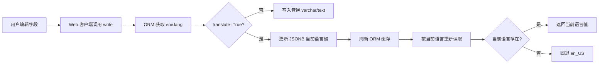
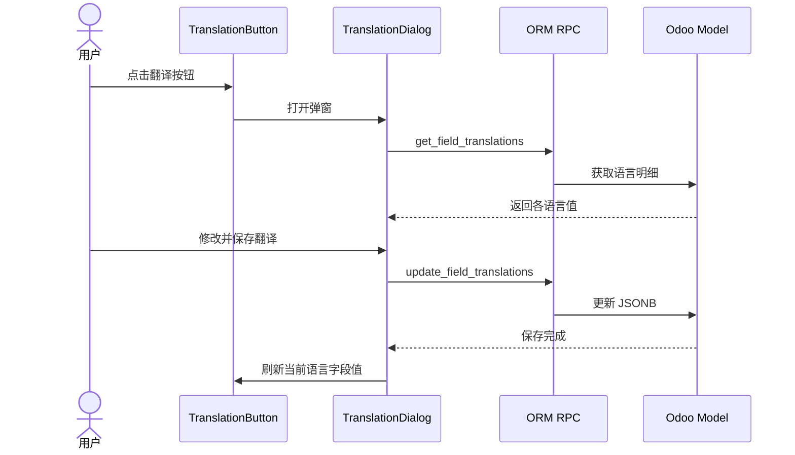

import Tabs from '@theme/Tabs';
import TabItem from '@theme/TabItem';


# Odoo 翻译字段机制

> 以Odoo16版本进行解析

## 1. 概述

Odoo 16 将 `translate=True` 的模型字段以 PostgreSQL `JSONB` 保存。每个语言代码对应一个字段值，ORM 根据 `env.lang` 选择当前语言，并在缺少翻译时回退到 `en_US`。

```python
name = fields.Char(translate=True)
```

典型数据库值：

```json
{
  "en_US": "White Cardboard",
  "zh_CN": "白卡纸",
  "vi_VN": "Bìa cứng trắng"
}
```

## 2. 核心源码

| 位置 | 关键代码 | 职责 |
| --- | --- | --- |
| `odoo/fields.py:1617` | `_String` | 字符串翻译字段的基础实现 |
| `odoo/fields.py:1653` | `convert_to_column()` | 首次写入时构造语言字典 |
| `odoo/fields.py:1740` | `_get_stored_translations()` | 读取数据库中的完整 JSONB |
| `odoo/fields.py:1750` | `write()` | 按当前语言更新字段缓存 |
| `odoo/fields.py:1851` | `Char.column_type` | 将可翻译 Char 定义为 JSONB |
| `odoo/models.py:2446` | 字段 SQL 表达式 | 当前语言读取及 `en_US` 回退 |
| `odoo/models.py:2996` | `update_field_translations()` | 批量更新指定语言 |
| `odoo/models.py:3075` | `get_field_translations()` | 获取字段的语言明细 |
| `addons/web/static/src/views/fields/translation_dialog.js` | `TranslationDialog` | 前端翻译弹窗及 RPC 调用 |

## 3. 写入机制

### 3.1 首次写入

`_String.convert_to_column()` 根据当前环境语言构造字典：

```python
if self.translate:
    cache_value = {
        'en_US': cache_value,
        record.env.lang or 'en_US': cache_value,
    }
```

例如越南语环境首次写入 `Bìa cứng trắng`：

```json
{
  "en_US": "Bìa cứng trắng",
  "vi_VN": "Bìa cứng trắng"
}
```

Odoo 同时建立 `en_US` 值，保证后续读取存在统一回退值。这并不代表 Odoo 自动完成了英文翻译。

### 3.2 修改已有记录

`_String.write()` 通过 `records.env.lang` 确定本次修改所属语言：

```python
lang = records.env.lang or 'en_US'
```

正常修改只更新当前语言，其他语言保持不变：

```python
record.with_context(lang='zh_CN').write({
    'name': '白卡纸',
})
```

等价于更新 JSONB 中的 `zh_CN` 键。

> 将字段写为 `False` 或 `None` 会进入普通清空逻辑，应避免把“删除当前语言翻译”和“清空整个字段”混为一谈。

## 4. 读取与回退

`odoo/models.py` 为可翻译字段生成以下 SQL：

```sql
COALESCE(
    field_name->>'当前语言',
    field_name->>'en_US'
)
```

读取顺序：

1. 读取 `env.lang` 对应的值；
2. 当前语言不存在时读取 `en_US`；
3. 两者都不存在时返回空值。

查询、排序和普通字段读取均使用相同的语言上下文。

## 5. 调用流程



## 6. 翻译弹窗

前端 `TranslationDialog` 的主要流程：

1. 调用 `get_field_translations()` 获取已安装语言及其字段值；
2. 用户修改一个或多个语言；
3. 调用 `update_field_translations()` 批量保存；
4. 若当前用户语言被修改，同步刷新表单字段。

后端调用示例：

```python
record.update_field_translations(
    'name',
    {
        'en_US': 'White Cardboard',
        'zh_CN': '白卡纸',
        'vi_VN': 'Bìa cứng trắng',
    },
)
```

对于 `translate=True` 字段，参数格式为：

```python
{语言代码: 新字段值}
```

## 7. 使用边界

- `translate=True` 负责多语言存储和读取，不负责机器翻译。
- `env.lang` 通常来自用户语言，也可以被 `with_context(lang=...)` 覆盖。
- 普通 Char 字段不会自动同步到另一个可翻译字段。
- 直接执行 SQL 会绕过 ORM 缓存和翻译写入逻辑。
- 业务代码需要复制完整翻译时，应使用 `_get_stored_translations()` 和 `update_field_translations()`，不要只复制当前语言显示值。

## 8. `TranslationDialog` 前端实现

源码位置：

- `addons/web/static/src/views/fields/translation_button.js`
- `addons/web/static/src/views/fields/translation_dialog.js`

### 8.1 打开弹窗

`TranslationButton` 只在系统启用多语言时显示。用户点击按钮后，`useTranslationDialog()` 创建翻译弹窗。

若当前记录尚未保存，前端会先执行：

```javascript
record.save({ stayInEdition: true })
```

翻译数据依赖真实的 `resId`，因此新记录必须先保存才能编辑翻译。

### 8.2 加载翻译

弹窗初始化时先加载已安装语言，再通过 ORM RPC 获取字段翻译：

```javascript
this.orm.call(this.props.resModel, "get_field_translations", [
    [this.props.resId],
    this.props.fieldName,
]);
```

当前用户语言优先使用表单中尚未提交的字段值，其他语言使用后端返回值，避免打开弹窗时丢失当前表单修改。

### 8.3 保存翻译

弹窗只收集实际发生变化的语言，并调用：

```javascript
this.orm.call(this.props.resModel, "update_field_translations", [
    [this.props.resId],
    this.props.fieldName,
    translations,
]);
```

普通 `translate=True` 字段提交的数据结构如下：

```javascript
{
    en_US: "White Cardboard",
    zh_CN: "白卡纸",
}
```

后端按语言分别更新 JSONB。若保存内容包含当前用户语言，弹窗还会调用 `updateField()` 刷新原表单中的显示值。



