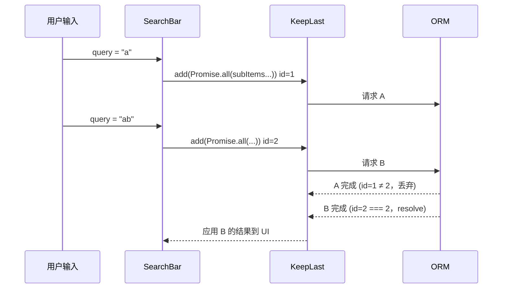

:::info[说明]
Odoo 16 Concurrency 并发原语源码解析（KeepLast / Mutex / Race）
:::

# KeepLast

## 总览

`KeepLast` 定义于 `addons/web/static/src/core/utils/concurrency.js`，是 Odoo 16 Web 客户端中的**并发原语**：管理一组异步任务，但**只保留最后一个任务的结果生效**。

典型场景：用户连续触发搜索、切换视图、执行 Action、刷新 Model 数据时，前一次请求可能比后一次更晚返回。若仍用旧结果更新 UI/状态，就会出现“闪回”或脏数据。`KeepLast` 通过内部递增 ID，丢弃过期 Promise 的 resolve/reject，保证**只有最新一次 `add` 的 Promise 能把结果交给调用方**。

它与同文件中的 `Mutex`、`Race` 互补：

| 类 | 策略 | 适用问题 |
| --- | --- | --- |
| `KeepLast` | 只认最新任务；旧任务结果被静默丢弃 | 快速连续请求，只关心最后一次 |
| `Mutex` | 串行排队，全部执行 | 共享状态写操作不能交错 |
| `Race` | 动态 Promise.race，任一先完成即结束本轮 | “谁先到用谁”，不区分新旧 |

---

## 类概览

| 项目 | 说明 |
| --- | --- |
| 类名 | `KeepLast` |
| 路径 | `@web/core/utils/concurrency` → `addons/web/static/src/core/utils/concurrency.js` |
| 职责 | 包装 Promise，使只有“当前最新”任务的结果向外传递 |
| 状态 | `_id`：单调递增的任务世代号 |
| 核心 API | `add(promise)` → 返回新的 `Promise` |
| 副作用 | **不取消**底层请求；只是不把旧结果 resolve/reject 给调用方 |

---

## 源码解释

```7:36:addons/web/static/src/core/utils/concurrency.js
export class KeepLast {
    constructor() {
        this._id = 0;
    }
    /**
     * Register a new task
     *
     * @template T
     * @param {Promise<T>} promise
     * @returns {Promise<T>}
     */
    add(promise) {
        this._id++;
        const currentId = this._id;
        return new Promise((resolve, reject) => {
            promise
                .then((value) => {
                    if (this._id === currentId) {
                        resolve(value);
                    }
                })
                .catch((reason) => {
                    // not sure about this part
                    if (this._id === currentId) {
                        reject(reason);
                    }
                });
        });
    }
}
```

### 状态：`_id`

- 构造时为 `0`。
- 每次 `add` 先 `this._id++`，再把当前值闭包为 `currentId`。
- `_id` 表示“世代”：更大的 `_id` 代表更新的任务；旧任务的 `currentId` 不再等于 `this._id`。

### 方法：`add(promise)`

1. **登记新任务**：递增 `_id`，记下本任务的 `currentId`。
2. **返回包装 Promise**：调用方 `await`/`then` 的是这个新 Promise，而不是原始 `promise`。
3. **完成时校验世代**：
   - 原始 Promise **成功**且 `this._id === currentId` → `resolve(value)`。
   - 原始 Promise **失败**且仍是最新 → `reject(reason)`。
   - 若期间又调用了 `add`，`this._id` 已变大 → **既不 resolve 也不 reject**（该包装 Promise 永远挂起）。

### 关键行为（与单元测试一致）

测试见 `addons/web/static/tests/core/utils/concurrency_tests.js`：

| 场景 | 结果 |
| --- | --- |
| 单个 Promise resolve | 包装 Promise 正常 resolve |
| 单个 Promise reject | 包装 Promise 正常 reject |
| 先后 `add(def1)`、`add(def2)`，先 resolve def1 | def1 的 then **不执行** |
| 同上，再 resolve def2 | 只有 def2 的 then 执行 |
| 先 resolve def2，再 resolve def1 | 同样只有 def2 生效；def1 被丢弃 |

### 边界与注意事项

1. **不取消 RPC/网络请求**  
   旧 Promise 仍会跑完；`KeepLast` 只屏蔽结果。带宽与服务端负载仍在，只是 UI/状态不会被旧结果污染。

2. **过期 Promise 永久 pending**  
   若 `await keepLast.add(oldProm)`，而之后又有新的 `add`，则该 `await` **可能永远等不到**。常见写法是：每次操作只 await **自己这次** `add` 的返回值，并且业务上接受“被更新的请求顶掉”。

3. **reject 策略**  
   源码注释写了 `// not sure about this part`：目前对最新任务的 reject 会向外抛；对过期任务的 reject 同样被吞掉。若需统一错误处理，调用方应自己保证只处理最新世代。

4. **实例作用域**  
   每个 `new KeepLast()` 独立计数。全局一个实例会跨功能互相顶掉；按组件/Model/服务建实例更常见。

---

## 功能说明

一句话：**在并发完成的异步任务中，只让“最后登记”的那一次结果生效。**

解决的问题：

```
时间线：
  add(请求A) ─── 较慢 ───► A 完成（应被忽略）
       └─ add(请求B) ─ 较快 ─► B 完成（应更新状态）
```

没有 `KeepLast` 时：A 若后返回，可能覆盖 B 的正确状态。  
有 `KeepLast` 时：A 完成时 `_id` 已指向 B，A 的结果被丢弃。

---

## 使用用途（项目中的典型场景）

### 1. Action 服务：连续 doAction / 切视图 / 恢复面包屑

`action_service.js` 在 ActionManager 内维护**单例** `keepLast`，包裹：

- 加载 Action / 加载视图描述
- `doAction`、`doActionButton`
- `switchView`、`restore`（甚至 `await keepLast.add(Promise.resolve())` 作为“等当前世代空闲/占位”）

目的：用户连点菜单、快速切换 Action 时，只让最后一次导航相关异步结果继续往下执行，避免旧 Action 抢占控制器栈。

### 2. 搜索栏：展开字段时的子项异步计算

`search_bar.js`：用户改 query / 展开搜索项时，`computeState` 用 `keepLast.add(Promise.all(...))`。只应用最后一次输入对应的子项结果，避免下拉建议闪回。

### 3. 命令面板：多 Provider 并行搜索

`command_palette.js`：输入变化时对各 provider `Promise.all`，再 `keepLast.add`。只展示最后一次搜索词的命令列表。

### 4. View / Model：加载与刷新

| 位置 | 用法 |
| --- | --- |
| `view.js` | `useSubEnv({ keepLast: new KeepLast() })`，供子组件（如 `useActionLinks`）协调点击 |
| `relational_model.js` / `basic_relational_model.js` | `load`、resequence、`fetchCount`、分组 toggle 等 |
| `calendar_model.js` / `graph_model.js` / `pivot_model.js` | 数据刷新只保留最新一次 |
| `kanban_model.js` | `tooltipKeepLast` 专门管 tooltip 的 read，避免悬停切换时旧 tooltip 覆盖新的 |

### 5. Action 链接点击协调

`view_hook.js` 的 `useActionLinks` 要求 `env.keepLast` 存在，用 `keepLast.add(orm.call(...))` / `keepLast.add(doAction(...))` 协调 onboarding banner 等链接的连续点击。

---

## 使用方法

### 基本写法

```js
import { KeepLast } from "@web/core/utils/concurrency";

class MyComponent extends Component {
    setup() {
        this.keepLast = new KeepLast();
    }

    async reload(params) {
        // 只有最后一次 reload 的结果会走进后续逻辑
        const data = await this.keepLast.add(this.fetchData(params));
        this.state.data = data;
    }
}
```

### 与 Mutex 组合

需要“只关心最新一次加载”，同时又要“同一时刻写状态不交错”时：

```js
await this.keepLast.add(this.mutex.exec(() => record.load()));
```

`relational_model` 创建记录时即采用这种模式：`KeepLast` 丢弃过期加载，`Mutex` 保证加载内的临界区串行。

### 放入 Owl 环境供子树共享

```js
useSubEnv({
    keepLast: new KeepLast(),
});

// 子组件
const keepLast = useComponent().env.keepLast;
await keepLast.add(doAction(...));
```

### 推荐与不推荐

| 推荐 | 不推荐 |
| --- | --- |
| 搜索、筛选、视图切换、导航等“只看最新”的读操作 | 期望每个请求都必须处理结果的写操作（用 `Mutex` 更合适） |
| 每个业务域一个实例（Model / 组件 / Service） | 把互不相关的流程塞进同一个 `KeepLast` |
| `await` **本次** `add` 的返回值 | 长期持有旧 `add` 的 Promise 并期望它最终 settle |

### 最小心智模型

```text
keepLast.add(p) ≈
  “登记 p 为当前最新；
   若之后没有更新的 add，则把 p 的结果转发出去；
   否则静默丢弃 p 的结果（包装 Promise 挂起）。”
```

---

## 典型调用链

以搜索栏为例：



以 Action 连续执行为例：

```text
doAction(A) → keepLast.add(loadAction A)
doAction(B) → keepLast.add(loadAction B)  // _id 递增
A 返回 → 被丢弃，不会 _preprocessAction / 切换控制器
B 返回 → 继续执行，成为当前 Action
```

---

## 扩展点与踩坑

1. **挂起的 await**：被顶掉的 `await keepLast.add(...)` 不会结束；其后代码（赋值、`notify`）不会执行——这通常正是期望行为，但若在外层还有 `finally` 清理逻辑，需确认是否依赖该 Promise settle。
2. **错误被吞**：非最新任务的 reject 不会向外抛，调试时可能“看不到失败”。
3. **与取消语义混淆**：`KeepLast` ≠ AbortController；要真正取消请求需另做 abort。
4. **`switchView` / `restore` 用 `Promise.resolve()`**：相当于用空任务抬高 `_id`，使进行中的旧异步结果失效，再继续自己的同步/异步逻辑。

---

## 参考阅读（KeepLast）

| 文件 | 关注点 |
| --- | --- |
| `addons/web/static/src/core/utils/concurrency.js` | `KeepLast` / `Mutex` / `Race` / `Deferred` 定义 |
| `addons/web/static/tests/core/utils/concurrency_tests.js` | 行为契约（顺序/逆序 resolve、reject） |
| `addons/web/static/src/webclient/actions/action_service.js` | 导航级 KeepLast |
| `addons/web/static/src/views/view.js` | 将 KeepLast 注入 `env` |
| `addons/web/static/src/views/view_hook.js` | `useActionLinks` 对 `env.keepLast` 的约定 |
| `addons/web/static/src/views/relational_model.js` | Model 加载与 KeepLast + Mutex |
| `addons/web/static/src/search/search_bar/search_bar.js` | 输入型防竞态 |
| `addons/web/static/src/core/commands/command_palette.js` | Provider 聚合搜索防竞态 |

---

# Mutex

## 总览

`Mutex` 是同文件中的**串行化原语**：把多个可能返回 Promise 的计算排进队列，**前一个完成（成功或失败）后才执行下一个**。所有登记的任务都会执行，最终状态由最后一次执行决定——这与 `KeepLast`“丢弃旧结果、不保证旧任务副作用完成顺序”形成对比。

源码注释中的动机：若两次 `_load()` 并发，第二次先结束、第一次后结束，则 `this.state` 会被第一次的旧结果覆盖。用 `mutex.exec` 包裹后，保证按调用顺序执行，最终状态一定是第二次的结果。

---

## 类概览

| 项目 | 说明 |
| --- | --- |
| 类名 | `Mutex` |
| 路径 | `@web/core/utils/concurrency` |
| 职责 | 将异步计算排队串行执行，避免共享状态交错写坏 |
| 状态 | `_lock`、`_queueSize`、`_unlockedProm`、`_unlock` |
| 核心 API | `exec(action)`、`getUnlockedDef()` |
| 与 KeepLast | 任务**全部执行**；KeepLast 只让最新结果对外生效 |

---

## 源码解释

```71:112:addons/web/static/src/core/utils/concurrency.js
export class Mutex {
    constructor() {
        this._lock = Promise.resolve();
        this._queueSize = 0;
        this._unlockedProm = undefined;
        this._unlock = undefined;
    }
    async exec(action) {
        this._queueSize++;
        if (!this._unlockedProm) {
            this._unlockedProm = new Promise((resolve) => {
                this._unlock = () => {
                    resolve();
                    this._unlockedProm = undefined;
                };
            });
        }
        const always = () => {
            return Promise.resolve(action()).finally(() => {
                if (--this._queueSize === 0) {
                    this._unlock();
                }
            });
        };
        this._lock = this._lock.then(always, always);
        return this._lock;
    }
    getUnlockedDef() {
        return this._unlockedProm || Promise.resolve();
    }
}
```

### 状态字段

| 字段 | 含义 |
| --- | --- |
| `_lock` | 当前队列链尾 Promise；新任务挂在它的 `then` 上 |
| `_queueSize` | 尚未完成的任务数（含执行中） |
| `_unlockedProm` | “忙着”时对外暴露的解锁 Promise；空闲时为 `undefined` |
| `_unlock` | 队列清空时 resolve `_unlockedProm` 的回调 |

### 方法：`exec(action)`

1. `_queueSize++`；若尚无解锁 Promise，则创建 `_unlockedProm` / `_unlock`。
2. 定义 `always`：在前序任务 settle 后执行 `action()`，无论成败都在 `finally` 里减计数；减到 `0` 时调用 `_unlock()`。
3. `this._lock = this._lock.then(always, always)`：前一个成功或失败都接上下一个（**失败不堵死队列**）。
4. 返回更新后的 `_lock`（即“等到本任务及其链上当前尾完成”的 Promise）。

### 方法：`getUnlockedDef()`

- 队列忙：返回当前 `_unlockedProm`（全部任务结束后 resolve）。
- 队列空：返回立刻 resolve 的 `Promise.resolve()`。

用途：在启动新操作前等待“没有正在进行的 mutex 任务”（例如保存前等 onchange/写操作结束）。

### 关键行为（测试）

| 场景 | 结果 |
| --- | --- |
| 先后 `exec(def1)`、`exec(def2)`，先 resolve def1 | 先完成任务 1，再跑任务 2 |
| 先 resolve def2，再 resolve def1 | 任务 2 **仍等**任务 1；顺序仍是 1 → 2 |
| 中间任务 reject | 该任务的 Promise reject，**后续任务照常执行** |
| 空闲时 `getUnlockedDef()` | 立刻 resolve |
| 有任务时 `getUnlockedDef()` | 等队列清空后 resolve |

---

## 功能说明

一句话：**把异步临界区排成队，一个接一个跑完，避免并发写坏共享状态。**

```
时间线（Mutex）：
  exec(A) ──执行中──► A 完成
              exec(B) ──等待──► B 开始 ──► B 完成
```

对比 KeepLast：Mutex 不会跳过 A；A、B 都会执行，只是 B 必须排在 A 之后。

---

## 使用用途

### 1. RelationalModel：保存 / 创建 / 分组

`relational_model.js` 中 `this.mutex = new Mutex()`，典型用法：

- `mutex.exec(() => this._save(...))` / `_multiSave`
- `mutex.exec(() => newRecord.load())`（常再包一层 `keepLast.add`）
- `await mutex.getUnlockedDef()`：在依赖“写操作结束”的路径上等待

保证 onchange、save、创建记录等修改共享 datapoint 的操作不交错。

### 2. Legacy BasicModel / Form / Kanban

旧架构同样用 mutex 串行 `notifyChanges`、`reload`、`save`；Controller 侧用 `getUnlockedDef` 等待模型空闲后再 UI 操作。

### 3. 与 KeepLast 组合

```js
await this.keepLast.add(this.mutex.exec(() => newRecord.load()));
```

- `Mutex`：加载过程串行，状态一致。
- `KeepLast`：若用户又触发了更新的加载，旧的 `await` 结果可被丢弃。

---

## 使用方法

```js
import { Mutex } from "@web/core/utils/concurrency";

this.mutex = new Mutex();

// 串行执行（action 可返回 Promise）
await this.mutex.exec(async () => {
    const result = await this._load();
    this.state = result;
});

// 等待队列清空
await this.mutex.getUnlockedDef();
```

### 推荐与不推荐

| 推荐 | 不推荐 |
| --- | --- |
| 写共享状态、save、onchange 链 | 仅“展示最新读结果”却用 Mutex（延迟大，应用 KeepLast） |
| 需要**每次**任务都执行完 | 期望取消旧任务（Mutex 不取消） |
| 用 `getUnlockedDef` 做“空闲后再做” | 把无关操作塞进同一把锁导致假死感 |

### 最小心智模型

```text
mutex.exec(fn) ≈
  “把 fn 排到队尾；前一个 settle 后再跑 fn；
   全部跑完才算 unlocked。”
```

---

# Race

## 总览

`Race` 是受 `Promise.race` 启发的**动态竞速原语**：可随时 `add` 新 Promise；**本轮竞速中任意一个先 settle，整轮就结束**，所有等待本轮的调用方拿到同一结果；之后再 `add` 会开启新一轮竞速。

与 `KeepLast` 的差异：

| | KeepLast | Race |
| --- | --- | --- |
| 谁赢 | **最后登记**的任务 | **最先完成**的任务 |
| 多次 `add` 的返回值 | 各自包装 Promise，旧的可能永远 pending | **同一轮共享同一个** `currentProm` |
| 旧任务后完成 | 结果丢弃 | 结果也丢弃（竞速已结束） |

---

## 类概览

| 项目 | 说明 |
| --- | --- |
| 类名 | `Race` |
| 路径 | `@web/core/utils/concurrency` |
| 职责 | 动态多 Promise 竞速，先完成者决定本轮结果 |
| 状态 | `currentProm` / `currentPromResolver` / `currentPromRejecter` |
| 核心 API | `add(promise)`、`getCurrentProm()` |

---

## 源码解释

```122:164:addons/web/static/src/core/utils/concurrency.js
export class Race {
    constructor() {
        this.currentProm = null;
        this.currentPromResolver = null;
        this.currentPromRejecter = null;
    }
    add(promise) {
        if (!this.currentProm) {
            this.currentProm = new Promise((resolve, reject) => {
                this.currentPromResolver = (value) => {
                    this.currentProm = null;
                    this.currentPromResolver = null;
                    this.currentPromRejecter = null;
                    resolve(value);
                };
                this.currentPromRejecter = (error) => {
                    this.currentProm = null;
                    this.currentPromResolver = null;
                    this.currentPromRejecter = null;
                    reject(error);
                };
            });
        }
        promise.then(this.currentPromResolver).catch(this.currentPromRejecter);
        return this.currentProm;
    }
    getCurrentProm() {
        return this.currentProm;
    }
}
```

### 方法：`add(promise)`

1. 若无进行中竞速：创建 `currentProm` 及 resolve/reject 包装（settle 时清空状态，便于下一轮）。
2. 把传入的 `promise` 挂到当前 resolver/rejecter 上。
3. **始终返回同一个** `currentProm`（本轮所有 `add` 共享）。

任一参赛 Promise 先 resolve/reject → 本轮结束；之后再完成的 Promise 仍可能调用已清空的 resolver（此时多为 no-op / 对已 settle Promise 无效），竞速结果不再改变。

### 方法：`getCurrentProm()`

- 有进行中竞速：返回该 Promise。
- 空闲：返回 `null`。

常用于：改本地 meta（不重新拉数）前先 `await this.race.getCurrentProm()`，避免与进行中的加载打架。

### 关键行为（测试）

| 场景 | 结果 |
| --- | --- |
| 单 Promise | 正常转发结果 |
| 同轮 `add(def1)`、`add(def2)`，def1 先完成 | **两个** `add` 的 then 都收到 def1 的值 |
| def2 先完成 | 两个 then 都收到 def2 的值；之后 def1 完成无额外步骤 |
| 本轮结束后再 `add` | 开启**新一轮**竞速 |
| 先 reject | 本轮 reject；同轮其他 `add` 也走 reject |
| `getCurrentProm()` | 竞速中非 null；结束后为 null |

---

## 功能说明

一句话：**动态版 Promise.race——谁先完成用谁，同轮等待者共享结果，结束后可开新局。**

```
同一轮：
  add(A) ───慢───►（已结束，忽略）
  add(B) ──快──► B 完成 ⇒ 本轮 resolve(B)（A、B 的 add 返回值一起 settle）
下一轮：
  add(C) ⇒ 新的 currentProm
```

---

## 使用用途

### Graph / Pivot Model

`graph_model.js`、`pivot_model.js` 同时使用 `KeepLast` 与 `Race`：

```js
this.race = new Race();
const _fetchDataPoints = this._fetchDataPoints.bind(this);
this._fetchDataPoints = (...args) => {
    return this.race.add(_fetchDataPoints(...args));
};
```

- 用 `Race` 包装数据拉取：多次触发加载时，**先返回的那次**结束本轮竞速。
- 仅改展示参数（如 stacked、order）且不重新请求时：`await this.race.getCurrentProm()`，等当前加载结束再改 `metaData` / `_prepareData()`。

Pivot 中多处 `if (this.race.getCurrentProm())` / `await this.race.getCurrentProm()`，用于展开分组、排序等与加载并发的协调。

---

## 使用方法

```js
import { Race } from "@web/core/utils/concurrency";

this.race = new Race();

// 包装加载：同轮多次调用共享“谁先完成”的结果
async load(params) {
    return this.race.add(this._doLoad(params));
}

// 有加载在飞时先等它结束
async tweakDisplay(params) {
    await this.race.getCurrentProm(); // 可能为 null，await null 等价立刻继续
    Object.assign(this.metaData, params);
    this._prepareData();
}
```

注意：`await null` 在 JS 中会立刻得到 `null`，故 `getCurrentProm()` 为空时不必特判也能安全 await（Pivot 也有显式 `Promise.resolve(this.race.getCurrentProm())` 的写法）。

### 推荐与不推荐

| 推荐 | 不推荐 |
| --- | --- |
| 多次触发同类加载，接受“先到先得” | 必须“最后一次输入对应结果”（用 KeepLast） |
| 用 `getCurrentProm` 等待在飞加载 | 假设后完成的请求还能改本轮结果 |
| 与 KeepLast 分工：竞速 vs 世代 | 与 KeepLast 混用却不明确谁决定 UI |

### 最小心智模型

```text
race.add(p) ≈
  “把 p 加入当前竞速（没有则开新局）；
   返回本轮共享 Promise；
   谁先 settle 谁定结果，本轮结束。”
```

---

## 三者对照（小结）

| | KeepLast | Mutex | Race |
| --- | --- | --- | --- |
| 核心策略 | 只认最新登记 | 全部串行执行 | 同轮谁先完成用谁 |
| 旧任务 | 结果丢弃（可仍在跑） | 必须跑完 | 后完成则忽略 |
| 典型场景 | 搜索、导航、Model 刷新 | save / onchange / 写状态 | Graph/Pivot 数据加载竞速 |
| 等待空闲 | 无专门 API | `getUnlockedDef()` | `getCurrentProm()`（有则等） |

---

## 参考阅读（Mutex / Race）

| 文件 | 关注点 |
| --- | --- |
| `addons/web/static/src/views/relational_model.js` | `Mutex`：save、load、`getUnlockedDef` |
| `addons/web/static/src/views/graph/graph_model.js` | `Race` 包装 `_fetchDataPoints` |
| `addons/web/static/src/views/pivot/pivot_model.js` | `Race` 包装 `_loadData` + `getCurrentProm` |
| `addons/web/static/tests/core/utils/concurrency_tests.js` | Mutex / Race 全部行为契约 |
