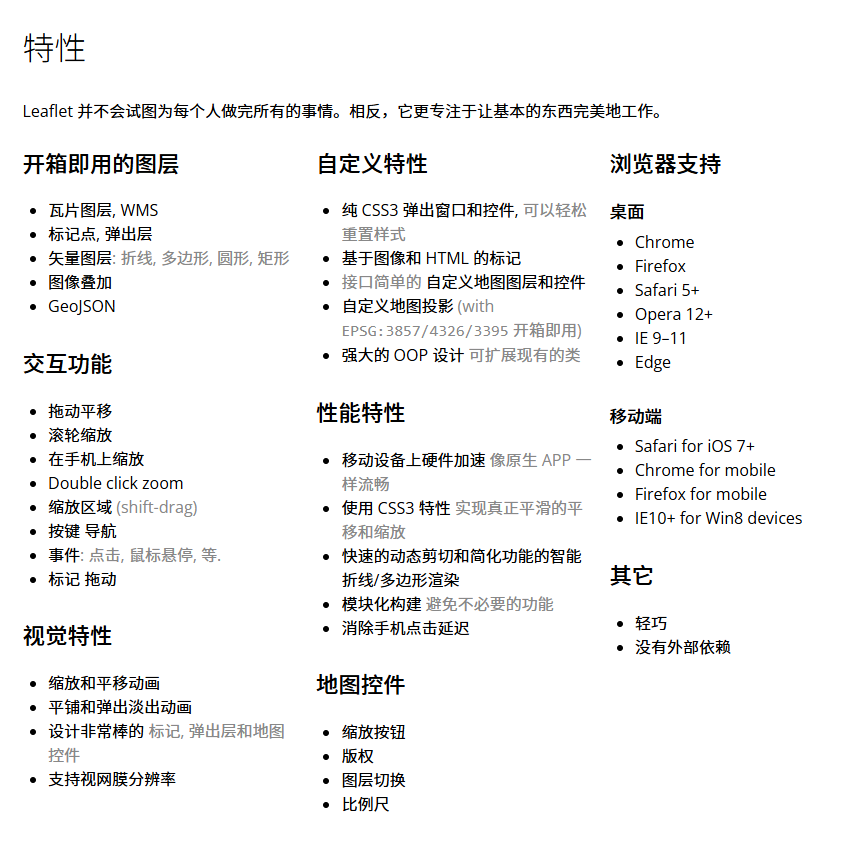
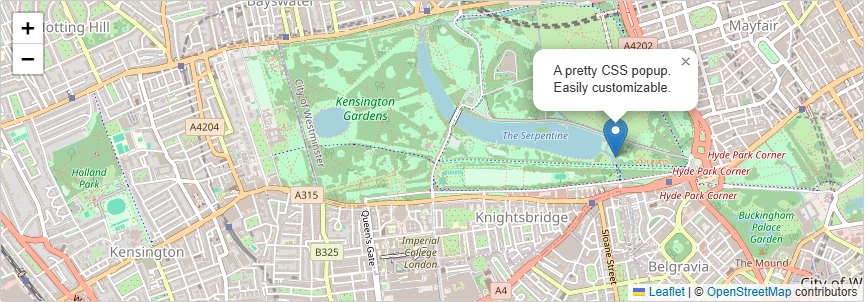

# Leaflet

:::info[Note]

Leaflet 是一个开源并且对移动端友好的交互式地图 JavaScript 库。

- [Leaflet官网](https://leafletjs.com/)
- [Leaflet中文网](https://leafletjs.cn/)

:::

## 特性



## 示例截图
              

               
## 基础使用

- 创建地图实例
  
```javascript
L.map(this.map_ref.el)
```
  
- `setView`: 将视图设置为我们选择的地理坐标和缩放级别
  
```javascript
this.map = L.map(this.map_ref.el).setView([51.505, -0.09], 13)
```
  
- `tileLayer`: 添加一个要添加到地图的图块层

此处用的`openstreetmap`作为地图图层源。

```javascript
L.tileLayer('https://tile.openstreetmap.org/{z}/{x}/{y}.png', {    
maxZoom: 19,    
attribution: '&copy; <a href="http://www.openstreetmap.org/copyright">OpenStreetMap</a>'
}).addTo(this.map);
```

- `L.marker`: 向地图添加标记
  
```javascript
const marker = L.marker([51.5, -0.09]).addTo(this.map);
```
  
- `L.circle`: 向地图添加圆

```javascript
var circle = L.circle([51.508, -0.11], {
color: 'red',
fillColor: '#f03',
fillOpacity: 0.5,
radius: 500
}).addTo(map);
```

- `L.polygon`: 向地图添加多边形

```javascript
var polygon = L.polygon([
    [51.509, -0.08],
    [51.503, -0.06],
    [51.51, -0.047]
]).addTo(map);
```

- 使用弹出窗口

当您想将一些信息附加到地图上的特定对象时，通常会使用弹出窗口。

```javascript
marker.bindPopup("<b>Hello world!</b><br>I am a popup.").openPopup();
circle.bindPopup("I am a circle.");
polygon.bindPopup("I am a polygon.");
```

`openPopup` 方法（仅适用于标记）会立即打开附加的弹出窗口。

还可以将弹出窗口用作图层（当您需要的不仅仅是将弹出窗口附加到对象时）

```javascript
var popup = L.popup()
    .setLatLng([51.513, -0.09])
    .setContent("I am a standalone popup.")
    .openOn(map);
```

在这里，我们使用 `openOn` 而不是 `addTo`，因为它可以在打开新弹出窗口时自动关闭以前打开的弹出窗口，这有利于可用性。

### 处理事件

[reference-evented](https://leafletjs.com/reference.html#evented)

每当 Leaflet 中发生某些事情时，例如用户点击标记或地图缩放更改，相应的对象都会发送一个事件，您可以通过函数订阅该事件。它允许您对用户交互做出反应：

```javascript
function onMapClick(e) {
    alert("You clicked the map at " + e.latlng);
}

map.on('click', onMapClick);
```

每个对象都有自己的事件集 — 有关详细信息，请参阅[文档](https://leafletjs.com/reference.html)。
                              
listener 函数的第一个参数是一个 event 对象 — 它包含有关所发生事件的有用信息。例如，地图点击事件对象（上例中的 e）具有 latlng 属性，该属性是发生点击的位置。

让我们通过使用弹出窗口而不是警报来改进我们的示例：

```javascript
var popup = L.popup();

function onMapClick(e) {
    popup
        .setLatLng(e.latlng)
        .setContent("You clicked the map at " + e.latlng.toString())
        .openOn(map);
}

map.on('click', onMapClick);
```
