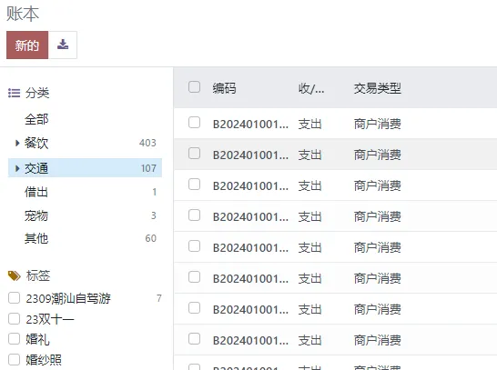

# Search View

## Searchpanel

先看效果图



使用示例：

```xml
<searchpanel>
  <field name="category_id" limit="20" select="one" icon="fa-list-ul" enable_counters="1" hierarchize="1"/>
  <field name="tag_ids" limit="20" select="multi" icon="fa-tags" enable_counters="1"/>
</searchpanel>
```

searchpanel编写在search视图。
- `<searchpanel>`: 筛选仪表盘标签
- `limit`: 筛选项的条数限制
- `select`: 可单选/多选，支持的值（one/multi）
- `icon`: 图标
- `enable_counters`: 是否计数
- `hierarchize`: 是否层级显示

## Search Filter筛选日期周期

```xml
<filter string="当天" name="today"  domain="[('create_date','>=', time.strftime('%Y-%m-%d 00:00:00')),('create_date', '<', context_today().strftime('%Y-%m-%d 23:59:59'))]"/>

<filter string="本周" name="last_week"  domain="[('create_date','>', (context_today() - datetime.timedelta(weeks=1)).strftime('%%Y-%%m-%%d 00:00:00'))]"/>

<filter string="本月" name="month" domain="[('create_date','>=', time.strftime('%Y-%m-01 00:00:00')),('create_date','<',  (context_today() + relativedelta(months=1)).strftime('%Y-%m-01 00:00:00'))]"/>

<filter string="上月" name="month2"  domain="[('create_date','<', time.strftime('%Y-%m-01 00:00:00')),('create_date','>=',  (context_today() - relativedelta(months=1)).strftime('%Y-%m-01 00:00:00'))]"/>

<filter string="本年" name="year"  domain="[('create_date','<=', time.strftime('%Y-12-31 23:59:59')),('create_date','>=', time.strftime('%Y-01-01 00:00:00'))]"/>


<separator/>

<filter name="过去24小时" string="Last 24h" domain="[('create_date','>', (context_today() - datetime.timedelta(days=1)).strftime('%Y-%m-%d 00:00:00') )]"/>

<filter name="上周" string="Last Week" domain="[('create_date','>', (context_today() - datetime.timedelta(weeks=1)).strftime('%Y-%m-%d 00:00:00'))]"/>

<!--另一种写法-->

<separator/>

<filter name="week" string="本周"

        domain="[

            '&',

            ('create_date', '>=', (context_today() + relativedelta(weeks=-1,days=1,weekday=0)).strftime('%Y-%m-%d')),

            ('create_date', '<=', (context_today() + relativedelta(weekday=6)).strftime('%Y-%m-%d')),

        ]"/>

<filter name="month" string="本月"

        domain="[

            '&',

            ('create_date', '>=', (context_today() + relativedelta(day=1)).strftime('%Y-%m-%d')),

            ('create_date', '<=', (context_today() + relativedelta(months=1, day=1, days=-1)).strftime('%Y-%m-%d')),

        ]"/>

```