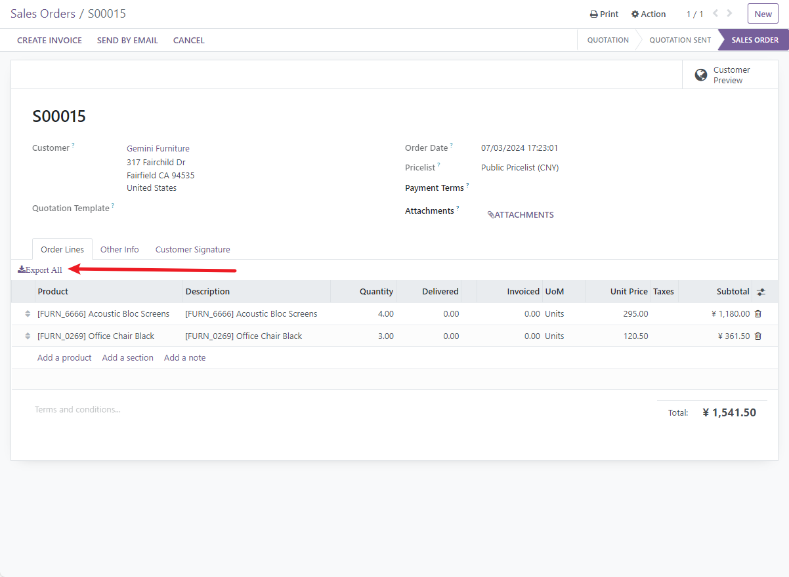
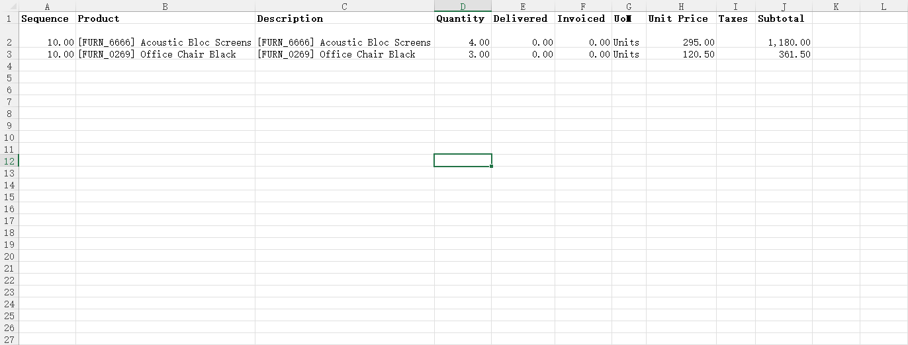

# X2ManyField list export all data

:::info[Note]
X2ManyField list export all data
You can quickly export the data from a list view in a one2many or many2many relationship using a button.
> [Github](https://github.com/LucasLiu09/x2many_list_export_all/tree/main)
:::

## 示意图




## 用法

**Set the widget**

Add attribute to the x2many field tag: `widget="x2many_export_all"`.

Enable this feature by setting `export_xlsx="True"` in the ```tree``` sub-tag of `X2ManyField`.

In Odoo, the `export_xlsx` option is set to `True` by default. If you want to disable this feature, you can either remove the `widget` or set `export_xlsx="False"`.

```xml
<field name="order_line" widget="x2many_export_all"/>
```