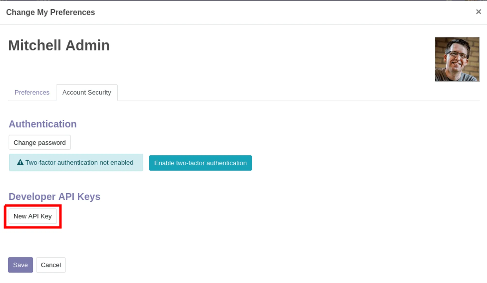
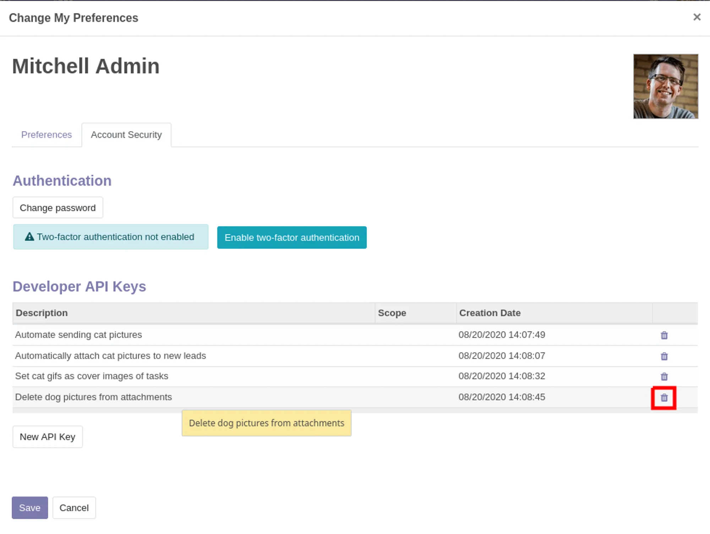

# xmlrpc

## 密钥管理

获取API秘钥：

我的账户 - 首选项 - 账户安全 - Developer API Keys


单击“生成密钥”，然后复制提供的密钥。请小心存储此密钥：它等同于您的密码，就像您的密码一样，系统以后将无法再次检索或显示该密钥。如果您丢失了此密钥，则必须创建一个新密钥（并可能删除丢失的密钥）。





## API

- xmlrpc/2/common
- xmlrpc/2/object

### xmlrpc/2/common

`xmlrpc/2/common`端点提供了一些不需要身份验证的元调用，例如身份验证本身或获取版本信息。在尝试进行身份验证之前，为了验证连接信息是否正确，最简单的调用是请求服务器的版本。身份验证本身是通过`authenticate`函数完成的，并返回一个用户标识符（`uid`），用于代替登录信息进行身份验证调用。

```python
import xmlrpc.client
url = "http://localhost:8069/"
common = xmlrpc.client.ServerProxy('{}/xmlrpc/2/common'.format(url))
```

登录账户

```python
uid = common.authenticate(db, username, password, {})
```


### xmlrpc/2/object

该端点通过`execute_kw`RPC函数调用odoo模型的方法。
```python
models = xmlrpc.client.ServerProxy('{}/xmlrpc/2/object'.format(url))
models.execute_kw(db, uid, password, model, method, [], {})
```

**execute_kw**
:::info
- `db(str)`: 数据库名
- `uid(int)` : 用户id（可指定或通过authenticate 返回）
- `password(str)`: 用户密码或API Key
- `model(str)`: 模型名称
- `method(str)`: 方法名称
- 按位置传递的参数数组/列表
- 要按关键字传递的参数的映射/字典（可选）
:::

## 使用实例及说明

```python
import xmlrpc.client
url = "http://localhost:8017/"
common = xmlrpc.client.ServerProxy('{}/xmlrpc/2/common'.format(url))
common.version()
"""
{'server_version': '17.0',
 'server_version_info': [17, 0, 0, 'final', 0, ''],
 'server_serie': '17.0',
 'protocol_version': 1}
"""

db = "odoo"
username = "admin"
password = "admin"
api_password = "980def31e270b825857f98fc3fed9e0f03e65594"
# uid = common.authenticate(db, username, password , {})
uid = common.authenticate(db, username, api_password, {})
print('user id :' + str(uid))
models = xmlrpc.client.ServerProxy('{}/xmlrpc/2/object'.format(url))

def execute(model, method, *args, **kwargs):
    return models.execute_kw(db, uid, password, model, method, *args, **kwargs)

def search(model, domain, **kwags):
    return execute(model, 'search', [domain], **kwags)
# e.g. start

# Search / Search count
models.execute_kw(db, uid, password, 'res.partner', 'search', [[['is_company', '=', True]]], {'offset': 10, 'limit': 5})

models.execute_kw(db, uid, password, 'res.partner', 'search_count', [[['is_company', '=', True]]])

# 需要读取记录一般都需要使用search与read搭配使用。或者直接使用search_read
# read 默认情况下返回当前用户可以读取的所有字段。

# Search / Read
ids = models.execute_kw(db, uid, password, 'res.partner', 'search', [[['is_company', '=', True]]], {'limit': 1})
[record] = models.execute_kw(db, uid, password, 'res.partner', 'read', [ids])
# count the number of fields fetched by default
len(record)
# 121

# Read
models.execute_kw(db, uid, password, 'res.partner', 'read', [ids], {'fields': ['name', 'country_id', 'comment']})
# result:
# [{"comment": false, "country_id": [21, "Belgium"], "id": 7, "name": "Agrolait"}]

# Create
id = models.execute_kw(db, uid, password, 'res.partner', 'create', [{'name': "New Partner"}])

# Write
models.execute_kw(db, uid, password, 'res.partner', 'write', [[id], {'name': "Newer partner"}])
# get record name after having changed it
models.execute_kw(db, uid, password, 'res.partner', 'read', [[id], ['display_name']])

# 也可通过xmlrpc对模型及字段进行自定义，详情见：https://www.odoo.com/documentation/17.0/developer/reference/external_api.html#inspection-and-introspection
```

## JSONRPC

:::note
以下内容摘自[Odoo官方文档](https://www.odoo.com/documentation/16.0/developer/howtos/web_services.html?highlight=rpc)
:::

以下示例是一个使用标准 Python 库 urllib.request 和 json 与 Odoo 服务器交互的 Python 3 程序。此示例假设已安装 Productivity 应用（ note ）：

```python
import json
import random
import urllib.request

HOST = 'localhost'
PORT = 8069
DB = 'openacademy'
USER = 'admin'
PASS = 'admin'

def json_rpc(url, method, params):
    data = {
        "jsonrpc": "2.0",
        "method": method,
        "params": params,
        "id": random.randint(0, 1000000000),
    }
    req = urllib.request.Request(url=url, data=json.dumps(data).encode(), headers={
        "Content-Type":"application/json",
    })
    reply = json.loads(urllib.request.urlopen(req).read().decode('UTF-8'))
    if reply.get("error"):
        raise Exception(reply["error"])
    return reply["result"]

def call(url, service, method, *args):
    return json_rpc(url, "call", {"service": service, "method": method, "args": args})

# log in the given database
url = "http://%s:%s/jsonrpc" % (HOST, PORT)
uid = call(url, "common", "login", DB, USER, PASS)

# create a new note
args = {
    'color': 8,
    'memo': 'This is another note',
    'create_uid': uid,
}
note_id = call(url, "object", "execute", DB, uid, PASS, 'note.note', 'create', args)
```

<details>
    <summary>odoo_rpc_client.py</summary>

```python title="odoo_rpc_client.py"
"""
Odoo 16 JSON-RPC 客户端
根据官方文档实现的完整 RPC 调用类
https://www.odoo.com/documentation/16.0/developer/howtos/web_services.html
"""

import json
import random
import requests
from typing import Dict, List, Any, Optional, Union
from urllib.parse import urljoin
import logging
from datetime import datetime

# 配置日志
logging.basicConfig(level=logging.INFO)
logger = logging.getLogger(__name__)


class OdooRPCClient:
    """
    Odoo JSON-RPC 客户端类
    提供与 Odoo 服务器进行 RPC 通信的完整功能
    """

    def __init__(self, url: str, database: str = None, timeout: int = 30):
        """
        初始化 Odoo RPC 客户端

        Args:
            url: Odoo 服务器 URL (例如: http://localhost:8069)
            database: Odoo 数据库名称
            timeout: 请求超时时间（秒）
        """
        self.url = url.rstrip('/')
        self.database = database
        self.timeout = timeout
        self.session = requests.Session()

        # 用户认证信息
        self.uid = None
        self.username = None
        self.password = None
        self.session_id = None
        self.context = {}

        # API 端点
        self.endpoints = {
            'common': '/jsonrpc',
            'object': '/jsonrpc',
            'authenticate': '/web/session/authenticate',
            'call': '/web/dataset/call_kw',
            'call_button': '/web/dataset/call_button',
            'search_read': '/web/dataset/search_read',
            'destroy': '/web/session/destroy',
            'get_session_info': '/web/session/get_session_info',
        }

    def _build_json_request(self, method: str, params: Dict = None, request_id: int = None) -> Dict:
        """
        构建 JSON-RPC 请求体

        Args:
            method: RPC 方法名
            params: 请求参数
            request_id: 请求 ID

        Returns:
            JSON-RPC 请求字典
        """
        return {
            "jsonrpc": "2.0",
            "method": method,
            "params": params or {},
            "id": request_id or random.randint(1, 1000000)
        }

    def _make_request(self, endpoint: str, data: Dict) -> Dict:
        """
        发送 HTTP 请求到 Odoo 服务器

        Args:
            endpoint: API 端点
            data: 请求数据

        Returns:
            响应数据

        Raises:
            Exception: 请求失败时抛出异常
        """
        url = urljoin(self.url, endpoint)

        try:
            response = self.session.post(
                url,
                json=data,
                timeout=self.timeout,
                headers={'Content-Type': 'application/json'}
            )
            response.raise_for_status()

            result = response.json()

            # 检查 JSON-RPC 错误
            if 'error' in result:
                error = result['error']
                error_message = error.get('message', 'Unknown error')
                error_data = error.get('data', {})
                logger.error(f"JSON-RPC Error: {error_message}")
                logger.debug(f"Error details: {error_data}")
                raise Exception(f"Odoo Error: {error_message}")

            return result.get('result')

        except requests.exceptions.RequestException as e:
            logger.error(f"HTTP Request failed: {e}")
            raise Exception(f"Request failed: {e}")

    def version(self) -> Dict:
        """
        获取 Odoo 服务器版本信息

        Returns:
            包含版本信息的字典
        """
        data = self._build_json_request(
            method="call",
            params={
                "service": "common",
                "method": "version",
                "args": []
            }
        )
        return self._make_request('/jsonrpc', data)

    def login(self, database: str = None, username: str = None,
              password: str = None) -> Union[int, bool]:
        """
        登录 Odoo (使用 authenticate 方法)

        Args:
            database: 数据库名称
            username: 用户名
            password: 密码

        Returns:
            用户 ID (uid) 或 False
        """
        db = database or self.database
        if not db:
            raise ValueError("Database name is required")

        login_data = self._build_json_request(
            method="call",
            params={
                "db": db,
                "login": username,
                "password": password,
                "context": {}
            }
        )

        result = self._make_request(self.endpoints['authenticate'], login_data)

        if result and result.get('uid'):
            self.uid = result['uid']
            self.username = result.get('username') or username
            self.password = password
            self.database = db
            self.session_id = result.get('session_id')
            self.context = result.get('user_context', {})

            # 保存 cookies
            if 'session_id' in self.session.cookies:
                self.session_id = self.session.cookies['session_id']

            logger.info(f"Successfully logged in as {self.username} (UID: {self.uid})")
            return self.uid
        else:
            logger.error("Login failed: Invalid credentials or database")
            return False

    def authenticate(self, database: str = None, username: str = None,
                    password: str = None) -> Union[int, bool]:
        """
        认证用户（authenticate 的别名方法）

        Args:
            database: 数据库名称
            username: 用户名
            password: 密码

        Returns:
            用户 ID (uid) 或 False
        """
        return self.login(database, username, password)

    def logout(self) -> bool:
        """
        登出当前用户会话

        Returns:
            True 如果成功登出，否则 False
        """
        if not self.uid:
            logger.warning("No active session to logout")
            return False

        try:
            logout_data = self._build_json_request(
                method="call",
                params={}
            )

            self._make_request(self.endpoints['destroy'], logout_data)

            # 清理会话信息
            self.uid = None
            self.username = None
            self.password = None
            self.session_id = None
            self.context = {}
            self.session = requests.Session()  # 重置 session

            logger.info("Successfully logged out")
            return True

        except Exception as e:
            logger.error(f"Logout failed: {e}")
            return False

    def call_kw(self, model: str, method: str, args: List = None,
                kwargs: Dict = None) -> Any:
        """
        调用 Odoo 模型方法 (call_kw)

        Args:
            model: 模型名称 (例如: 'res.partner')
            method: 方法名称 (例如: 'search_read')
            args: 位置参数列表
            kwargs: 关键字参数字典

        Returns:
            方法调用结果

        Raises:
            Exception: 未登录或调用失败
        """
        if not self.uid:
            raise Exception("Not logged in. Please login first.")

        request_data = self._build_json_request(
            method="call",
            params={
                "model": model,
                "method": method,
                "args": args or [],
                "kwargs": kwargs or {},
                "context": self.context
            }
        )

        return self._make_request(self.endpoints['call'], request_data)

    def execute(self, model: str, method: str, *args, **kwargs) -> Any:
        """
        执行模型方法（execute_kw 的简化版本）

        Args:
            model: 模型名称
            method: 方法名称
            *args: 位置参数
            **kwargs: 关键字参数

        Returns:
            方法执行结果
        """
        return self.call_kw(model, method, list(args), kwargs)

    def search(self, model: str, domain: List = None, **kwargs) -> List[int]:
        """
        搜索记录 IDs

        Args:
            model: 模型名称
            domain: 搜索域
            **kwargs: 其他参数 (limit, offset, order 等)

        Returns:
            记录 ID 列表
        """
        return self.call_kw(model, 'search', [domain or []], kwargs)

    def search_count(self, model: str, domain: List = None) -> int:
        """
        计算符合条件的记录数

        Args:
            model: 模型名称
            domain: 搜索域

        Returns:
            记录数量
        """
        return self.call_kw(model, 'search_count', [domain or []])

    def read(self, model: str, ids: List[int], fields: List[str] = None) -> List[Dict]:
        """
        读取记录数据

        Args:
            model: 模型名称
            ids: 记录 ID 列表
            fields: 要读取的字段列表

        Returns:
            记录数据列表
        """
        return self.call_kw(model, 'read', [ids, fields or []])

    def search_read(self, model: str, domain: List = None,
                   fields: List[str] = None, **kwargs) -> List[Dict]:
        """
        搜索并���取记录

        Args:
            model: 模型名称
            domain: 搜索域
            fields: 要读取的字段列表
            **kwargs: 其他参数 (limit, offset, order 等)

        Returns:
            记录数据列表
        """
        return self.call_kw(
            model,
            'search_read',
            [domain or [], fields or []],
            kwargs
        )

    def create(self, model: str, values: Union[Dict, List[Dict]]) -> Union[int, List[int]]:
        """
        创建记录

        Args:
            model: 模型名称
            values: 记录值字典或字典列表

        Returns:
            创建的记录 ID 或 ID 列表
        """
        if isinstance(values, list):
            return self.call_kw(model, 'create', [values])
        else:
            return self.call_kw(model, 'create', [values])

    def write(self, model: str, ids: Union[int, List[int]], values: Dict) -> bool:
        """
        更新记录

        Args:
            model: 模型名称
            ids: 记录 ID 或 ID 列表
            values: 要更新的值

        Returns:
            True 如果成功
        """
        if isinstance(ids, int):
            ids = [ids]
        return self.call_kw(model, 'write', [ids, values])

    def unlink(self, model: str, ids: Union[int, List[int]]) -> bool:
        """
        删除记录

        Args:
            model: 模型名称
            ids: 记录 ID 或 ID 列表

        Returns:
            True 如果成功
        """
        if isinstance(ids, int):
            ids = [ids]
        return self.call_kw(model, 'unlink', [ids])

    def fields_get(self, model: str, fields: List[str] = None,
                  attributes: List[str] = None) -> Dict:
        """
        获取模型字段信息

        Args:
            model: 模型名称
            fields: 字段列表（None 表示所有字段）
            attributes: 属性列表

        Returns:
            字段信息字典
        """
        args = []
        kwargs = {}

        if fields:
            kwargs['fields'] = fields
        if attributes:
            kwargs['attributes'] = attributes

        return self.call_kw(model, 'fields_get', args, kwargs)

    def name_get(self, model: str, ids: List[int]) -> List[tuple]:
        """
        获取记录的显示名称

        Args:
            model: 模型名称
            ids: 记录 ID 列表

        Returns:
            (id, name) 元组列表
        """
        return self.call_kw(model, 'name_get', [ids])

    def name_search(self, model: str, name: str = '',
                   domain: List = None, operator: str = 'ilike',
                   limit: int = 100) -> List[tuple]:
        """
        根据名称搜索记录

        Args:
            model: 模型名称
            name: 搜索名称
            domain: 额外的搜索域
            operator: 搜索操作符
            limit: 返回数量限制

        Returns:
            (id, name) 元组列表
        """
        return self.call_kw(
            model,
            'name_search',
            [name, domain or [], operator, limit]
        )

    def get_session_info(self) -> Dict:
        """
        获取当前会话信息

        Returns:
            会话信息字典
        """
        if not self.uid:
            raise Exception("Not logged in")

        request_data = self._build_json_request(
            method="call",
            params={}
        )

        return self._make_request(self.endpoints['get_session_info'], request_data)

    def call_button(self, model: str, method: str, ids: List[int],
                   context: Dict = None) -> Any:
        """
        调用记录的按钮方法

        Args:
            model: 模型名称
            method: 按钮方法名称
            ids: 记录 ID 列表
            context: 上下文

        Returns:
            方法返回值
        """
        if not self.uid:
            raise Exception("Not logged in")

        request_data = self._build_json_request(
            method="call",
            params={
                "model": model,
                "method": method,
                "args": [ids],
                "kwargs": {"context": context or self.context}
            }
        )

        return self._make_request(self.endpoints['call_button'], request_data)

    def with_context(self, **context) -> 'OdooRPCClient':
        """
        设置上下文（返回自身以支持链式调用）

        Args:
            **context: 上下文键值对

        Returns:
            self
        """
        self.context.update(context)
        return self

    def clear_context(self) -> 'OdooRPCClient':
        """
        清除上下文

        Returns:
            self
        """
        self.context = {}
        return self

    def create_odoo_user(self, login: str, password: str, name: str = None,
                        email: str = None, groups: List[int] = None,
                        company_ids: List[int] = None,
                        create_partner: bool = True,
                        partner_data: Dict = None,
                        **kwargs) -> Dict:
        """
        创建 Odoo 用户

        Args:
            login: 登录名（必须唯一）
            password: 用户密码
            name: 用户显示名称（默认使用 login）
            email: 用户邮箱
            groups: 用户组 ID 列表（权限组）
            company_ids: 公司 ID 列表
            create_partner: 是否自动创建关联的合作伙伴
            partner_data: 合作伙伴额外数据
            **kwargs: 其他用户字段

        Returns:
            包含用户信息的字典 {
                'user_id': 创建的用户 ID,
                'partner_id': 关联的合作伙伴 ID,
                'login': 登录名
            }

        Raises:
            Exception: 创建失败时抛出异常

        Example:
            # 创建基础用户
            user = client.create_odoo_user(
                login="test_user01",
                password="Test@123",
                name="测试用户01",
                email="test01@example.com"
            )

            # 创建具有特定权限的用户
            user = client.create_odoo_user(
                login="sales_user",
                password="Sales@123",
                name="销售员",
                groups=[
                    client.ref('sales_team.group_sale_salesman'),
                    client.ref('stock.group_stock_user')
                ]
            )
        """
        if not self.uid:
            raise Exception("Not logged in. Please login first.")

        # 默认名称
        if not name:
            name = login

        try:
            # 检查用户是否已存在
            existing_users = self.search(
                model="res.users",
                domain=[["login", "=", login]],
                limit=1
            )

            if existing_users:
                raise Exception(f"用户 '{login}' 已存在")

            # 准备用户数据
            user_values = {
                "login": login,
                "password": password,
                "name": name,
            }

            # 添加邮箱
            if email:
                user_values["email"] = email

            # 处理合作伙伴
            if create_partner:
                # 准备合作伙伴数据
                partner_vals = {
                    "name": name,
                    "email": email or f"{login}@example.com",
                    "is_company": False,
                }

                # 添加额外的合作伙伴数据
                if partner_data:
                    partner_vals.update(partner_data)

                # 创建合作伙伴
                partner_id = self.create(
                    model="res.partner",
                    values=partner_vals
                )
                user_values["partner_id"] = partner_id
                logger.info(f"创建合作伙伴 ID: {partner_id}")

            # 处理用户组
            if groups:
                # groups 应该是 [(6, 0, [group_ids])] 格式
                user_values["groups_id"] = [(6, 0, groups)]
            else:
                # 默认给予基础用户权限
                # 获取内部用户组
                internal_user_group = self.search(
                    model="res.groups",
                    domain=[["name", "=", "Internal User"]],
                    limit=1
                )
                if internal_user_group:
                    user_values["groups_id"] = [(6, 0, internal_user_group)]

            # 处理公司
            if company_ids:
                user_values["company_ids"] = [(6, 0, company_ids)]
                # 设置默认公司为第一个
                user_values["company_id"] = company_ids[0]
            else:
                # 获取默认公司
                default_company = self.search(
                    model="res.company",
                    domain=[],
                    limit=1
                )
                if default_company:
                    user_values["company_id"] = default_company[0]
                    user_values["company_ids"] = [(6, 0, default_company)]

            # 添加其他自定义字段
            for key, value in kwargs.items():
                if key not in user_values:
                    user_values[key] = value

            # 创建用户
            user_id = self.create(
                model="res.users",
                values=user_values
            )

            logger.info(f"成功创建用户: {login} (ID: {user_id})")

            # 读取创建的用户信息
            user_info = self.read(
                model="res.users",
                ids=[user_id],
                fields=["login", "name", "email", "partner_id", "company_id", "groups_id"]
            )[0]

            return {
                "user_id": user_id,
                "partner_id": user_info.get("partner_id")[0] if user_info.get("partner_id") else None,
                "login": login,
                "name": user_info.get("name"),
                "email": user_info.get("email"),
                "company": user_info.get("company_id")[1] if user_info.get("company_id") else None,
                "groups_count": len(user_info.get("groups_id", []))
            }

        except Exception as e:
            logger.error(f"创建用户失败: {e}")
            raise

    def create_batch_users(self, user_prefix: str, password: str,
                          count: int, start_index: int = 1,
                          groups: List[int] = None,
                          name_template: str = None) -> List[Dict]:
        """
        批量创建测试用户

        Args:
            user_prefix: 用户名前缀
            password: 所有用户的密码
            count: 创建用户数量
            start_index: 起始索引
            groups: 用户组 ID 列表
            name_template: 名称模板（使用 {index} 作为占位符）

        Returns:
            创建的用户信息列表

        Example:
            # 创建 10 个测试用户
            users = client.create_batch_users(
                user_prefix="test_user_",
                password="Test@123",
                count=10
            )
        """
        created_users = []

        for i in range(start_index, start_index + count):
            login = f"{user_prefix}{i:02d}"
            name = name_template.format(index=i) if name_template else f"测试用户 {i:02d}"

            try:
                user_info = self.create_odoo_user(
                    login=login,
                    password=password,
                    name=name,
                    email=f"{login}@test.com",
                    groups=groups
                )
                created_users.append(user_info)
                logger.info(f"创建用户 {i}/{count}: {login}")

            except Exception as e:
                logger.error(f"创建用户 {login} 失败: {e}")
                continue

        logger.info(f"批量创建完成: 成功创建 {len(created_users)} 个用户")
        return created_users

    def set_user_groups(self, user_id: int, group_ids: List[int],
                       replace: bool = True) -> bool:
        """
        设置用户权限组

        Args:
            user_id: 用户 ID
            group_ids: 权限组 ID 列表
            replace: True 替换所有组，False 添加到现有组

        Returns:
            True 如果成功

        Example:
            # 设置用户为销售经理
            client.set_user_groups(
                user_id=10,
                group_ids=[
                    client.ref('sales_team.group_sale_manager'),
                    client.ref('stock.group_stock_manager')
                ]
            )
        """
        if replace:
            # 替换所有组
            values = {"groups_id": [(6, 0, group_ids)]}
        else:
            # 添加到现有组
            values = {"groups_id": [(4, group_id, 0) for group_id in group_ids]}

        return self.write(
            model="res.users",
            ids=user_id,
            values=values
        )

    def ref(self, xml_id: str) -> int:
        """
        获取 XML ID 对应的数据库 ID

        Args:
            xml_id: XML ID (例如: 'base.group_user')

        Returns:
            数据库 ID

        Example:
            # 获取销售员组的 ID
            sales_group_id = client.ref('sales_team.group_sale_salesman')
        """
        try:
            module, name = xml_id.split('.')
            result = self.search_read(
                model="ir.model.data",
                domain=[
                    ["module", "=", module],
                    ["name", "=", name]
                ],
                fields=["res_id"],
                limit=1
            )
            if result:
                return result[0]["res_id"]
            else:
                raise Exception(f"XML ID '{xml_id}' not found")
        except ValueError:
            raise Exception(f"Invalid XML ID format: '{xml_id}'. Expected format: 'module.name'")


class OdooRPCError(Exception):
    """Odoo RPC 异常类"""
    pass


# 使用示例
if __name__ == "__main__":
    # 创建客户端实例
    client = OdooRPCClient(
        url="http://localhost:8069",
        database="odoo16"
    )

    # 获取版本信息
    version = client.version()
    print(f"Odoo Version: {version}")

    # 登录
    uid = client.login(
        database="odoo16",
        username="admin",
        password="admin"
    )

    if uid:
        print(f"Logged in successfully. UID: {uid}")

        # 搜索合作伙伴
        partners = client.search_read(
            model="res.partner",
            domain=[["is_company", "=", True]],
            fields=["name", "email", "phone"],
            limit=5
        )
        print(f"Partners: {partners}")

        # 创建新合作伙伴
        new_partner_id = client.create(
            model="res.partner",
            values={
                "name": "Test Company",
                "email": "test@example.com",
                "is_company": True
            }
        )
        print(f"Created partner ID: {new_partner_id}")

        # 更新合作伙伴
        client.write(
            model="res.partner",
            ids=new_partner_id,
            values={"phone": "123-456-7890"}
        )

        # 读取合作伙伴
        partner_data = client.read(
            model="res.partner",
            ids=[new_partner_id],
            fields=["name", "email", "phone"]
        )
        print(f"Partner data: {partner_data}")

        # 删除合作伙伴
        # client.unlink(model="res.partner", ids=new_partner_id)

        # ========== 用户管理示例 ==========
        print("\n" + "="*50)
        print("用户管理示例")
        print("="*50)

        # 1. 创建单个用户
        print("\n1. 创建单个用户:")
        try:
            new_user = client.create_odoo_user(
                login="demo_user01",
                password="Demo@123",
                name="演示用户 01",
                email="demo01@example.com"
            )
            print(f"   创建成功: {new_user}")
        except Exception as e:
            print(f"   用户可能已存在: {e}")

        # 2. 创建具有特定权限的用户
        print("\n2. 创建销售员用户:")
        try:
            # 获取销售员权限组 ID
            sales_group = client.search(
                model="res.groups",
                domain=[["name", "=", "User: Own Documents Only"]],
                limit=1
            )

            if sales_group:
                sales_user = client.create_odoo_user(
                    login="sales_demo01",
                    password="Sales@123",
                    name="销售演示用户",
                    email="sales01@example.com",
                    groups=sales_group
                )
                print(f"   创建销售用户成功: {sales_user}")
        except Exception as e:
            print(f"   创建失败: {e}")

        # 3. 批量创建测试用户
        print("\n3. 批量创建测试用户:")
        try:
            batch_users = client.create_batch_users(
                user_prefix="stress_test_",
                password="Test@123",
                count=3,
                start_index=1
            )
            print(f"   批量创建成功: 创建了 {len(batch_users)} 个用户")
            for user in batch_users:
                print(f"   - {user['login']} (ID: {user['user_id']})")
        except Exception as e:
            print(f"   批量创建失败: {e}")

        # 登出
        client.logout()
        print("\n登出成功")
```

</details>
