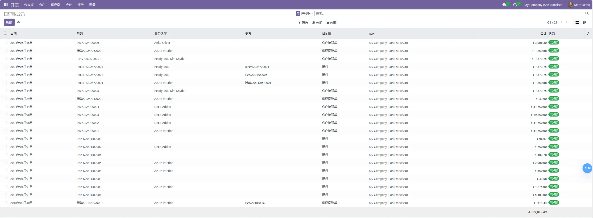
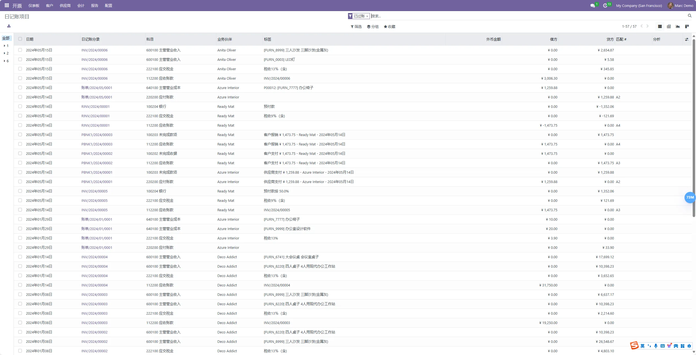
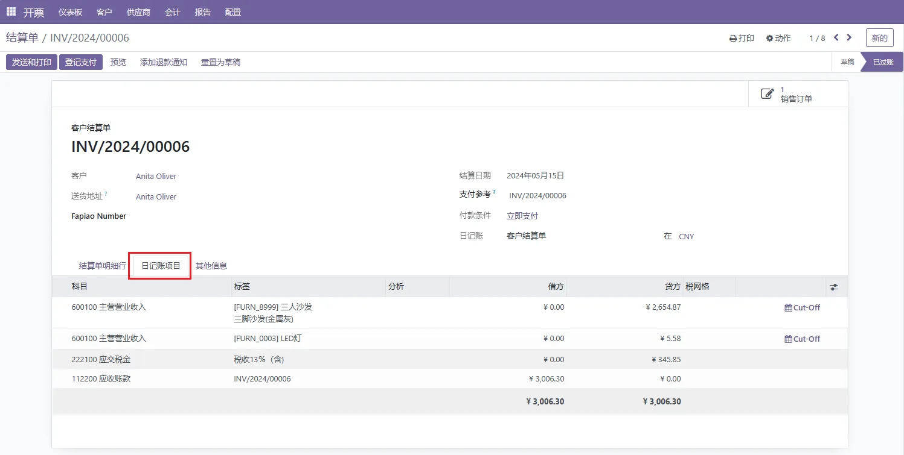

# 社区版启用会计功能
> Odoo的社区版默认无会计模块权限，修改系统设置以启用相应功能。

以下将用分析会计群组作为演示，后续可自行定义群组分配权限。

## 修改群组权限，继承会计功能权限组。

设置-》用户&公司-》用户组

选择分析会计群组，打开表单。

转至继承page页，添加明细行：

- 显示完整会计功能
- 显示会计功能 - 只读

> TODO：分析以上两个继承的群组的区别，加以区分，便于管理对应权限。

## 为用户分配权限

转至用户page页，添加用户。

##启用后效果展示 

