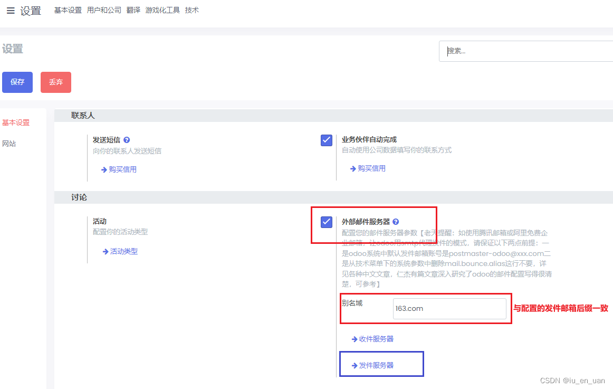
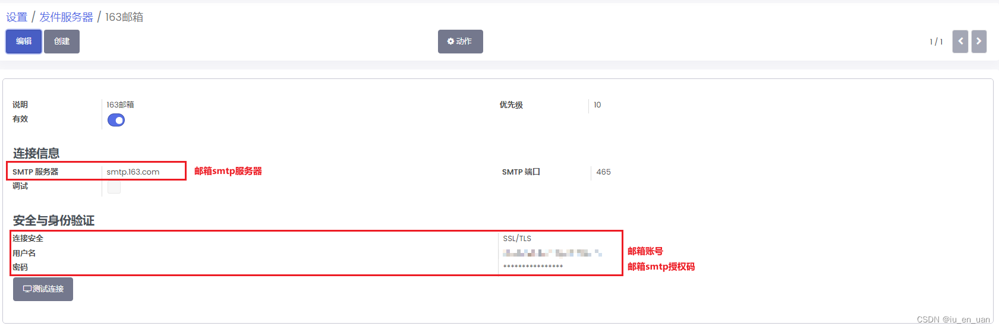
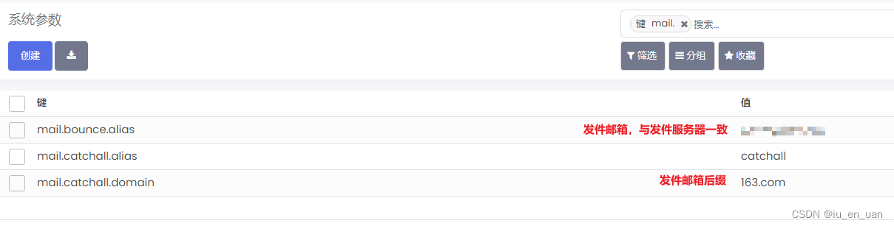

# 配置项
## 1、开启外部邮件服务器并配置相应信息
勾选外部邮件服务器，输入别名域，与配置的发件邮箱后缀保持一致。




## 2、配置发件服务器
创建一条新的发件服务器记录。  


## 3、配置系统参数


## 4、修改源码
路径：odoo/addons/base/models/ir_mail_server.py  

`IrMailServer.send_email()`  

将下方代码的第一行注释，插入第二行。

```python
# smtp_from = message['Return-Path'] or self._get_default_bounce_address() or message['From']
smtp_from = self._get_default_bounce_address() or message['From'] or message['Return-Path']
```
